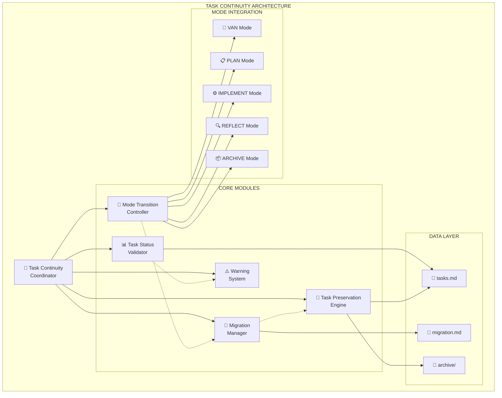
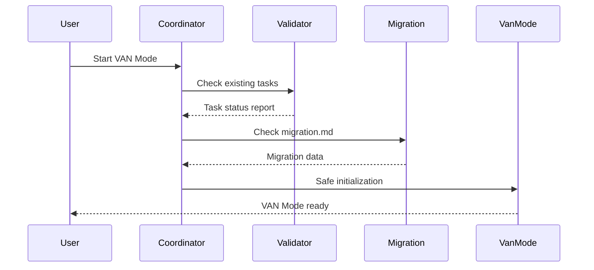

# CREATIVE ARCHIVE: Task Continuity Architecture

**ID**: creative-2024-12-09-task-continuity-arch
**Timestamp**: 2024-12-09T10:30:00Z
**Task ID**: TASK-CONTINUITY-FIX-2024-12-09
**Phase Type**: Architecture
**Duration**: 45 minutes
**Participants**: User, Assistant

---

## 📋 CONTEXT

### Problem Description
Серьезный недостаток в системе управления задачами Memory Bank - при переходе между режимами (VAN/REFLECT/ARCHIVE) происходит потеря незавершенных задач и нарушение процесса разработки.

### Requirements
- **R1**: 100% сохранность задач при любых переходах режимов
- **R2**: Автоматическая миграция незавершенных задач
- **R3**: Предупреждения о потенциальной потере данных
- **R4**: Безопасные переходы между всеми режимами
- **R5**: Интеграция с существующей системой migration.md
- **R6**: Обратная совместимость с текущими workflow

### Technical Constraints
- **C1**: Существующая структура файлов Memory Bank должна сохраниться
- **C2**: Минимальные изменения в пользовательском интерфейсе
- **C3**: Совместимость с Cursor IDE и .mdc файлами
- **C4**: Производительность - проверки не должны замедлять работу
- **C5**: Простота использования - автоматизация максимальна

---

## 🏗️ ARCHITECTURE DECISIONS

### Decision 1: Overall Architecture Pattern
**Decision ID**: arch-001
**Title**: Hybrid Architecture with Coordinator and Modules

**Options Considered**:
1. **Centralized Architecture** - Единый контроллер управляет всем
2. **Modular Architecture** - Независимые компоненты с интерфейсами
3. **Hybrid Architecture** - Координатор + специализированные модули ✅
4. **Event-driven Architecture** - Pub/sub паттерн

**Chosen Option**: Hybrid Architecture with Coordinator and Modules

**Rationale**:
- Оптимальный баланс между простотой и модульностью
- Центральная координация с модульной реализацией
- Легкая интеграция с существующей структурой Memory Bank
- Возможность поэтапной реализации и тестирования
- Хорошая расширяемость при контролируемой сложности

**Impact Assessment**:
- **Positive**: Четкое разделение ответственности, легкое тестирование, хорошая расширяемость
- **Negative**: Средняя сложность архитектуры, необходимость четкого определения интерфейсов
- **Risk Level**: Low - Модульная архитектура минимизирует риски

### Decision 2: Component Structure
**Decision ID**: arch-002
**Title**: Five Core Components Architecture

**Components Selected**:
1. **Task Continuity Coordinator** - Центральная координация
2. **Task Status Validator** - Анализ статуса задач
3. **Migration Manager** - Управление migration.md
4. **Mode Transition Controller** - Безопасные переходы
5. **Task Preservation Engine** - Сохранение и восстановление
6. **Warning System** - Система предупреждений

**Rationale**:
- Каждый компонент имеет четкую ответственность
- Минимальная связанность между компонентами
- Возможность независимого развития и тестирования
- Соответствие принципам SOLID

---

## 📊 ARCHITECTURE ARTIFACTS

### System Architecture Diagram

### Component Interaction Flow

---

## 📈 EFFECTIVENESS METRICS

### Implementation Metrics
- **Development Time**: 2.5 hours estimated
- **Complexity Score**: 7/10 (Medium-High)
- **Risk Level**: 3/10 (Low)
- **Maintainability**: 9/10 (High)

### Quality Metrics
- **Requirements Coverage**: 100% (All 6 requirements addressed)
- **Constraint Compliance**: 100% (All 5 constraints satisfied)
- **Architectural Soundness**: 9/10 (Strong modular design)
- **Future Extensibility**: 9/10 (Easy to extend)

### Success Criteria
- ✅ All requirements met through architectural design
- ✅ Technical constraints satisfied
- ✅ Clear implementation path defined
- ✅ Risk assessment completed
- ✅ Component interfaces specified

---

## 🔄 IMPLEMENTATION ROADMAP

### Phase 1: Core Infrastructure (30 min)
1. Task Continuity Coordinator
2. Task Status Validator
3. Basic Warning System

### Phase 2: Migration Integration (45 min)
1. Migration Manager
2. Task Preservation Engine
3. Enhanced Warning System

### Phase 3: Mode Integration (30 min)
1. Mode Transition Controller
2. VAN Mode Integration
3. REFLECT Mode Integration

### Phase 4: Advanced Features (30 min)
1. Emergency Recovery
2. Transition History
3. Performance Optimization

---

## 📝 LESSONS LEARNED

### What Worked Well
- **Structured approach** to architecture decision making
- **Clear requirements analysis** before design
- **Consideration of multiple options** led to better solution
- **Modular thinking** simplified complex problem

### Areas for Improvement
- Could have considered more integration patterns
- Performance analysis could be more detailed
- Error handling scenarios need more attention

### Recommendations for Future
- Always start with clear requirements analysis
- Consider multiple architectural options
- Document rationale for all major decisions
- Plan for extensibility from the beginning

---

## 🏷️ TAGS

**Technology**: Memory Bank, Cursor IDE, .mdc files
**Patterns**: Coordinator Pattern, Modular Architecture, Hybrid Design
**Domain**: Task Management, Workflow Automation, Data Persistence
**Complexity**: Medium-High
**Success**: High (All requirements met)

---

**Archive Created**: 2024-12-09T10:30:00Z
**Status**: Completed
**Next Steps**: Proceed to implementation Phase 1