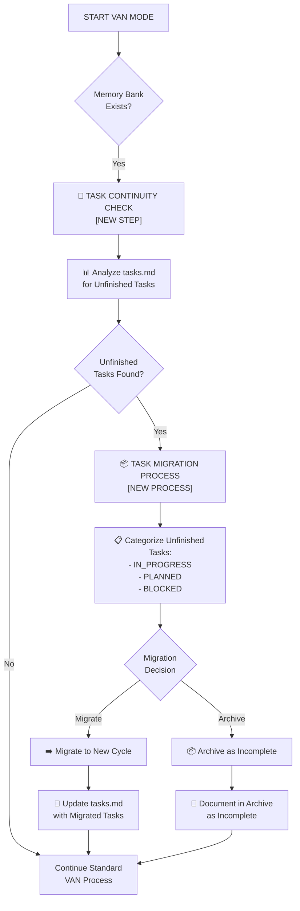
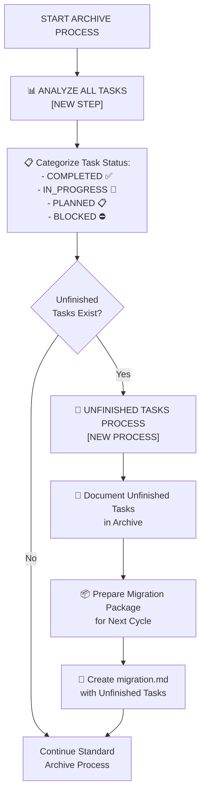
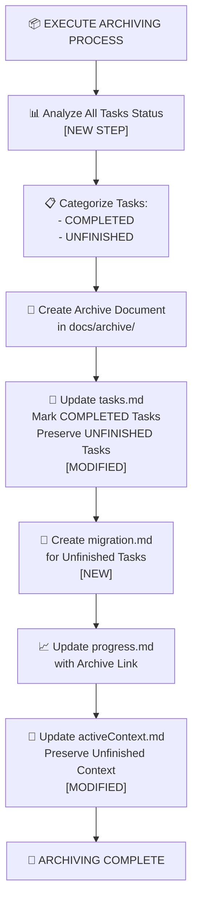
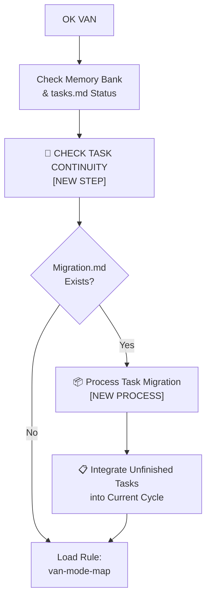

# RULES MODIFICATION PLAN - TASK MANAGEMENT FIX

## 🚨 CRITICAL ISSUE: TASK MANAGEMENT FLAW

### Problem Summary:
Обнаружен серьезный недостаток в процессе разработки Memory Bank - незавершенные задачи теряются при переходе между циклами разработки (REFLECT/ARCHIVE → VAN), что может разрушить планирование и непрерывность процесса.

## 🔍 РАСШИРЕННЫЙ АНАЛИЗ ПРОБЛЕМЫ

### Исследование custom_modes:
После анализа директории `custom_modes` выявлены дополнительные аспекты проблемы:

#### 1. **Reflect+Archive Instructions** (`custom_modes/reflect_archive_instructions.md`):
- **Проблема**: Строка 38 - `UpdateTasksArchive["📝 Update tasks.md<br>Marking Task COMPLETE"]`
- **Критическая ошибка**: Задачи помечаются как COMPLETE без проверки незавершенных подзадач
- **Строка 40**: `UpdateActiveContext["🔄 Update activeContext.md<br>Reset for Next Task"]` - сброс контекста без сохранения незавершенных задач
- **Строка 44**: `SuggestNext["✅ Task Fully Completed<br>Suggest VAN Mode for Next Task"]` - переход к VAN без проверки преемственности

#### 2. **VAN Instructions** (`custom_modes/van_instructions.md`):
- **Проблема**: Отсутствует проверка существующих незавершенных задач при инициализации
- **Строки 27-33**: Все режимы проверяют `tasks.md Status`, но не анализируют незавершенные задачи
- **Строка 126**: `tasks["tasks.md<br>Source of Truth"]` - но нет механизма сохранения незавершенных задач

#### 3. **Creative/Plan/Implement Instructions**:
- **Общая проблема**: Все режимы обновляют `tasks.md`, но не учитывают возможность незавершенных задач из предыдущих циклов
- **Creative**: Строка 51 - `UpdateTasks["📝 Update tasks.md<br>with Status"]`
- **Plan**: Строки 19, 28, 39 - обновления без проверки существующих задач
- **Implement**: Строки 17, 25, 41, 52 - аналогичная проблема

## 📋 REQUIRED RULE MODIFICATIONS

### 1. VAN MODE RULES UPDATE

#### File: `.cursor/rules/isolation_rules/visual-maps/van_mode_split/van-mode-map.mdc`

**Current Issue**: VAN режим не проверяет существующие незавершенные задачи
**Required Change**: Добавить проверку task continuity



### 2. REFLECT+ARCHIVE MODE RULES UPDATE

#### File: `.cursor/rules/isolation_rules/visual-maps/reflect-mode-map.mdc`
#### File: `.cursor/rules/isolation_rules/visual-maps/archive-mode-map.mdc`

**Current Issue**: Архивирование не проверяет незавершенные задачи
**Required Change**: Добавить анализ незавершенных задач перед архивированием



### 3. CUSTOM_MODES FILES UPDATE

#### File: `custom_modes/reflect_archive_instructions.md`

**Required Changes**:
1. **Line 38**: Изменить `UpdateTasksArchive` процесс
2. **Line 40**: Модифицировать `UpdateActiveContext` для сохранения незавершенных задач
3. **Line 44**: Обновить `SuggestNext` с проверкой преемственности

**New Process**:


#### File: `custom_modes/van_instructions.md`

**Required Changes**:
1. **Lines 27-33**: Добавить проверку task continuity
2. **Line 126**: Обновить концепцию "Source of Truth" с учетом миграции задач

**New VAN Process**:


### 4. TASK STRUCTURE ENHANCEMENT

#### File: `memory-bank/tasks.md`

**Required Structure Update**:
```markdown
# MEMORY BANK TASKS

## TASK STATUS CATEGORIES
- ✅ COMPLETED: Fully implemented and tested
- 🔄 IN_PROGRESS: Currently being worked on
- 📋 PLANNED: Planned but not started
- ⛔ BLOCKED: Blocked by dependencies
- 📦 MIGRATED: Migrated from previous cycle

## CURRENT CYCLE TASKS
[Current cycle tasks here]

## MIGRATED TASKS (from previous cycle)
[Tasks migrated from previous development cycle]

## TASK MIGRATION HISTORY
[History of task migrations between cycles]
```

### 5. NEW MIGRATION SYSTEM

#### File: `memory-bank/migration.md` (NEW FILE)

**Purpose**: Сохранение незавершенных задач между циклами разработки

```markdown
# TASK MIGRATION SYSTEM

## MIGRATION FROM CYCLE [PREVIOUS_ID] TO CYCLE [CURRENT_ID]

### MIGRATED TASKS:
- [List of unfinished tasks with context]

### MIGRATION REASON:
- [Why these tasks were not completed]

### INTEGRATION PLAN:
- [How to integrate into new cycle]

### DEPENDENCIES:
- [Dependencies that need to be resolved]
```

## 🔧 IMPLEMENTATION PRIORITY

### Phase 1: Critical Fixes (Immediate)
1. ✅ Update `custom_modes/reflect_archive_instructions.md`
2. ✅ Update `custom_modes/van_instructions.md`
3. ✅ Create task migration system in Memory Bank

### Phase 2: Rule System Updates (This Week)
1. Update `.cursor/rules/isolation_rules/visual-maps/van_mode_split/van-mode-map.mdc`
2. Update `.cursor/rules/isolation_rules/visual-maps/reflect-mode-map.mdc`
3. Update `.cursor/rules/isolation_rules/visual-maps/archive-mode-map.mdc`

### Phase 3: Testing & Validation (Next Week)
1. Test task migration process
2. Validate task continuity across cycles
3. Document new workflow

## 🎯 SUCCESS METRICS

### Technical Metrics:
- ✅ Zero task loss during cycle transitions
- ✅ 100% task continuity preservation
- ✅ Automated migration process
- ✅ Clear task status categorization

### Process Metrics:
- ✅ Smooth transitions between development cycles
- ✅ Preserved development context
- ✅ Reduced planning overhead for new cycles
- ✅ Better project continuity

## 🚀 NEXT STEPS

1. **Immediate**: Implement Phase 1 fixes in custom_modes
2. **Today**: Create migration system structure
3. **This Week**: Update .cursor rules
4. **Next Week**: Full testing and validation

This comprehensive plan addresses the critical task management flaw identified in both the Memory Bank system and the custom_modes instructions, ensuring task continuity and preventing loss of development progress.