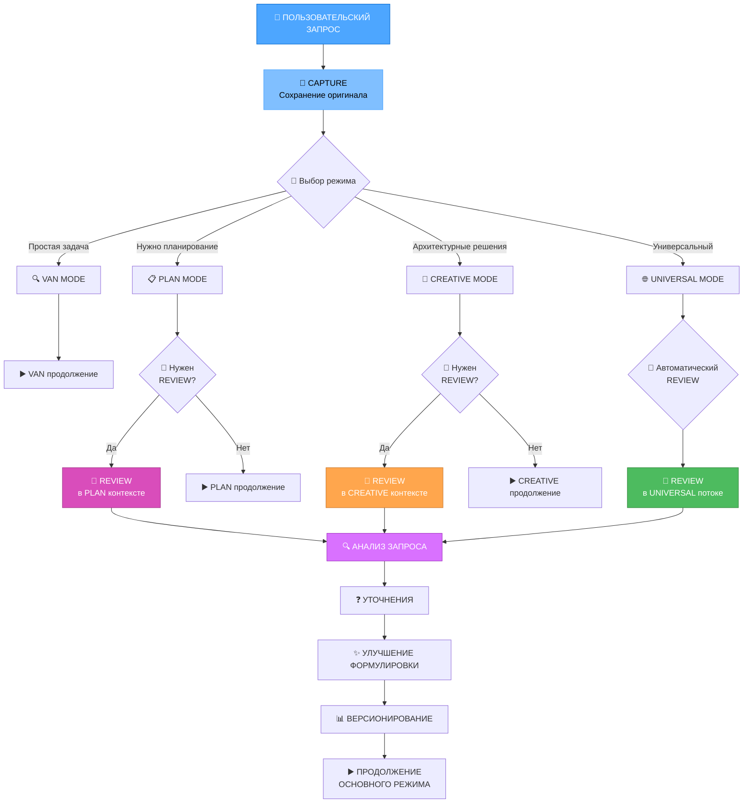

# REVIEW РЕЖИМ И СИСТЕМА СОХРАНЕНИЯ ЗАПРОСОВ

**Дата создания**: 2025-06-20
**Приоритет**: HIGH
**Интеграция с**: RULES-ENHANCEMENT-2025-06-20, UNIVERSAL MODE

---

## 📝 КОНЦЕПЦИЯ REVIEW РЕЖИМА

### Цель
Создание системы сохранения, анализа и улучшения изначальных запросов пользователя для обеспечения консистентной интерпретации разными моделями ИИ.

### Ключевые принципы
1. **Сохранение оригинала**: Все изначальные формулировки пользователя
2. **Версионирование**: Отслеживание изменений и уточнений
3. **Анализ эволюции**: Понимание развития запроса
4. **Кросс-модельная совместимость**: Формулировки понятные разным ИИ

---

## 🎯 АРХИТЕКТУРА REVIEW РЕЖИМА

### Интеграция с существующими режимами


---

## 📋 ДЕТАЛЬНЫЙ ПЛАН РЕАЛИЗАЦИИ

### 📝 Phase 10.1: Создание REVIEW режима

#### Структура review_instructions.md
**Файл**: `custom_modes/review_instructions.md`

```markdown
# REVIEW MODE INSTRUCTIONS

## Назначение режима
REVIEW режим предназначен для анализа, сохранения и улучшения пользовательских запросов для обеспечения консистентной интерпретации разными моделями ИИ.

## Режимы работы REVIEW

### 1. REVIEW в PLAN контексте
- **Цель**: Уточнение требований перед планированием
- **Процесс**: Анализ запроса → Уточнения → Улучшенная формулировка
- **Результат**: Четко сформулированные требования для планирования

### 2. REVIEW в CREATIVE контексте
- **Цель**: Прояснение архитектурных требований
- **Процесс**: Анализ творческих аспектов → Уточнения → Техническое задание
- **Результат**: Понятные требования для архитектурных решений

### 3. REVIEW в UNIVERSAL потоке
- **Цель**: Автоматическое улучшение запросов в процессе
- **Процесс**: Непрерывный анализ → Накопление уточнений → Финальная формулировка
- **Результат**: Оптимизированный запрос для всего цикла

## Алгоритм REVIEW процесса

### Шаг 1: Захват оригинального запроса
```bash
capture_original_request() {
  local user_request="$1"
  local timestamp=$(date +%Y-%m-%d_%H-%M-%S)
  local request_id="REQ-$timestamp"

  # Создание файла оригинального запроса
  local original_file="memory-bank/requests/original/$request_id.md"
  mkdir -p "memory-bank/requests/original"

  cat > "$original_file" << EOF
# ОРИГИНАЛЬНЫЙ ЗАПРОС: $request_id

**Дата**: $(date +%Y-%m-%d\ %H:%M:%S)
**Статус**: CAPTURED

## Изначальная формулировка пользователя:
$user_request

## Метаданные:
- ID: $request_id
- Длина: ${#user_request} символов
- Язык: $(detect_language "$user_request")
- Сложность: $(estimate_complexity "$user_request")
EOF

  echo "$request_id"
}
```

### Шаг 2: Анализ запроса
```bash
analyze_request() {
  local request_id="$1"
  local original_file="memory-bank/requests/original/$request_id.md"
  local analysis_file="memory-bank/requests/analysis/$request_id-analysis.md"

  mkdir -p "memory-bank/requests/analysis"

  # Извлечение оригинального текста
  local original_text=$(grep -A 100 "## Изначальная формулировка" "$original_file" | tail -n +2)

  cat > "$analysis_file" << EOF
# АНАЛИЗ ЗАПРОСА: $request_id

## Ключевые компоненты:
$(extract_key_components "$original_text")

## Неясные моменты:
$(identify_ambiguities "$original_text")

## Технические термины:
$(extract_technical_terms "$original_text")

## Предполагаемая сложность:
$(estimate_task_complexity "$original_text")

## Рекомендуемые уточнения:
$(suggest_clarifications "$original_text")
EOF
}
```

### Шаг 3: Сбор уточнений
```bash
collect_clarifications() {
  local request_id="$1"
  local clarifications_file="memory-bank/requests/clarifications/$request_id-clarifications.md"

  mkdir -p "memory-bank/requests/clarifications"

  echo "❓ СБОР УТОЧНЕНИЙ ДЛЯ ЗАПРОСА: $request_id"
  echo "============================================="

  # Показать анализ
  cat "memory-bank/requests/analysis/$request_id-analysis.md"

  echo ""
  echo "📝 Пожалуйста, предоставьте уточнения по следующим пунктам:"

  # Интерактивный сбор уточнений
  local clarification_count=1
  cat > "$clarifications_file" << EOF
# УТОЧНЕНИЯ ЗАПРОСА: $request_id

**Дата сбора**: $(date +%Y-%m-%d\ %H:%M:%S)

EOF

  # Здесь будет интерактивный процесс сбора уточнений
}
```
```

#### Правило review-mode-integration.mdc
**Файл**: `_cursor/rules/isolation_rules/Core/review-mode-integration.mdc.md`

```yaml
---
description: "Интеграция REVIEW режима с PLAN, CREATIVE и UNIVERSAL режимами"
globs: "**/REVIEW/**", "**/PLAN/**", "**/CREATIVE/**", "**/UNIVERSAL/**"
alwaysApply: true
---

# REVIEW MODE INTEGRATION

## Критерии активации REVIEW режима

### В PLAN режиме
```bash
plan_needs_review() {
  local user_request="$1"
  local task_complexity="$2"

  # Критерии для REVIEW в PLAN
  if [ "$task_complexity" = "Level3" ] || [ "$task_complexity" = "Level4" ]; then
    return 0  # Нужен REVIEW
  fi

  # Проверка на неясные формулировки
  if echo "$user_request" | grep -q "как-то\|что-то\|возможно\|может быть"; then
    return 0  # Нужен REVIEW
  fi

  # Проверка на технические термины без контекста
  if echo "$user_request" | grep -q "оптимизировать\|интегрировать\|реализовать" &&
     ! echo "$user_request" | grep -q "как\|что\|где\|когда"; then
    return 0  # Нужен REVIEW
  fi

  return 1  # REVIEW не нужен
}
```

### В CREATIVE режиме
```bash
creative_needs_review() {
  local user_request="$1"

  # Критерии для REVIEW в CREATIVE
  if echo "$user_request" | grep -q "архитектура\|дизайн\|подход\|решение"; then
    # Проверка на конкретность требований
    if ! echo "$user_request" | grep -q "должен\|требуется\|необходимо"; then
      return 0  # Нужен REVIEW для уточнения требований
    fi
  fi

  # Проверка на противоречивые требования
  if echo "$user_request" | grep -q "быстро.*качественно\|дешево.*надежно"; then
    return 0  # Нужен REVIEW для разрешения противоречий
  fi

  return 1  # REVIEW не нужен
}
```

### В UNIVERSAL режиме
```bash
universal_auto_review() {
  local user_request="$1"
  local current_phase="$2"

  # В UNIVERSAL режиме REVIEW выполняется автоматически
  echo "🔄 АВТОМАТИЧЕСКИЙ REVIEW В UNIVERSAL РЕЖИМЕ"

  # Сохранение оригинального запроса
  local request_id=$(capture_original_request "$user_request")

  # Быстрый анализ без остановки потока
  analyze_request_async "$request_id" &

  # Продолжение основного потока
  echo "▶️ Продолжение UNIVERSAL потока с ID запроса: $request_id"

  return 0
}
```
```

### 📊 Phase 10.2: Система сохранения и анализа запросов

#### Правило original-request-preservation.mdc
**Файл**: `_cursor/rules/isolation_rules/Core/original-request-preservation.mdc.md`

```yaml
---
description: "Система сохранения и версионирования изначальных запросов пользователя"
globs: "**/**"
alwaysApply: true
---

# ORIGINAL REQUEST PRESERVATION SYSTEM

## Структура хранения запросов

### Директории для запросов
```bash
# Создание структуры директорий
create_request_storage() {
  mkdir -p memory-bank/requests/{original,analysis,clarifications,versions,final}

  echo "📁 Структура хранения запросов создана:"
  echo "   original/        - Оригинальные запросы"
  echo "   analysis/        - Анализ запросов"
  echo "   clarifications/  - Уточнения пользователя"
  echo "   versions/        - Версии формулировок"
  echo "   final/           - Финальные формулировки"
}
```

### Система версионирования
```bash
# Создание новой версии запроса
create_request_version() {
  local request_id="$1"
  local new_formulation="$2"
  local change_reason="$3"

  local version_num=$(get_next_version_number "$request_id")
  local version_file="memory-bank/requests/versions/$request_id-v$version_num.md"

  cat > "$version_file" << EOF
# ВЕРСИЯ ЗАПРОСА: $request_id-v$version_num

**Дата**: $(date +%Y-%m-%d\ %H:%M:%S)
**Предыдущая версия**: v$((version_num-1))
**Причина изменения**: $change_reason

## Новая формулировка:
$new_formulation

## Изменения относительно предыдущей версии:
$(compare_with_previous_version "$request_id" "$new_formulation")

## Улучшения:
$(analyze_improvements "$request_id" "$new_formulation")
EOF

  echo "✅ Создана версия v$version_num для запроса $request_id"
}
```

### Анализ эволюции запроса
```bash
# Анализ изменений в запросе
analyze_request_evolution() {
  local request_id="$1"
  local evolution_file="memory-bank/requests/analysis/$request_id-evolution.md"

  cat > "$evolution_file" << EOF
# ЭВОЛЮЦИЯ ЗАПРОСА: $request_id

## Хронология изменений:
$(get_version_timeline "$request_id")

## Ключевые улучшения:
$(identify_key_improvements "$request_id")

## Проблемы, которые были решены:
$(identify_resolved_issues "$request_id")

## Рекомендации для будущих запросов:
$(generate_recommendations "$request_id")
EOF
}
```
```

### 🌐 Phase 10.3: Интеграция с UNIVERSAL режимом

#### Обновление universal_instructions.md
```markdown
## REVIEW интеграция в UNIVERSAL потоке

### Автоматическое сохранение запросов
Каждый пользовательский запрос в UNIVERSAL режиме автоматически:
1. Сохраняется как оригинальный запрос
2. Анализируется в фоновом режиме
3. Версионируется при каждом уточнении
4. Улучшается на основе накопленного опыта

### Непрерывное улучшение
В процессе выполнения UNIVERSAL цикла система:
- Собирает уточнения от пользователя
- Анализирует эффективность формулировок
- Предлагает улучшения для будущих запросов
- Обучается на успешных формулировках
```

#### Правило request-analysis-system.mdc
**Файл**: `_cursor/rules/isolation_rules/Core/request-analysis-system.mdc.md`

```yaml
---
description: "Система анализа и улучшения пользовательских запросов"
globs: "**/REVIEW/**", "**/**"
alwaysApply: true
---

# REQUEST ANALYSIS SYSTEM

## Анализ качества формулировок

### Метрики качества запроса
```bash
analyze_request_quality() {
  local request="$1"
  local quality_score=0

  # Ясность (0-25 баллов)
  local clarity=$(analyze_clarity "$request")
  quality_score=$((quality_score + clarity))

  # Конкретность (0-25 баллов)
  local specificity=$(analyze_specificity "$request")
  quality_score=$((quality_score + specificity))

  # Техническая точность (0-25 баллов)
  local technical_accuracy=$(analyze_technical_terms "$request")
  quality_score=$((quality_score + technical_accuracy))

  # Полнота (0-25 баллов)
  local completeness=$(analyze_completeness "$request")
  quality_score=$((quality_score + completeness))

  echo "Качество запроса: $quality_score/100"

  if [ $quality_score -lt 60 ]; then
    echo "❌ Запрос требует улучшения"
    return 1
  elif [ $quality_score -lt 80 ]; then
    echo "⚠️ Запрос можно улучшить"
    return 2
  else
    echo "✅ Запрос высокого качества"
    return 0
  fi
}
```

### Рекомендации по улучшению
```bash
generate_improvement_suggestions() {
  local request="$1"
  local quality_analysis="$2"

  echo "💡 РЕКОМЕНДАЦИИ ПО УЛУЧШЕНИЮ ЗАПРОСА:"
  echo "===================================="

  # Анализ ясности
  if echo "$quality_analysis" | grep -q "низкая ясность"; then
    echo "🔍 Ясность:"
    echo "   - Используйте более конкретные термины"
    echo "   - Избегайте двусмысленных формулировок"
    echo "   - Структурируйте запрос по пунктам"
  fi

  # Анализ конкретности
  if echo "$quality_analysis" | grep -q "низкая конкретность"; then
    echo "🎯 Конкретность:"
    echo "   - Укажите конкретные требования"
    echo "   - Добавьте примеры ожидаемого результата"
    echo "   - Определите критерии успеха"
  fi

  # Анализ технической точности
  if echo "$quality_analysis" | grep -q "низкая техническая точность"; then
    echo "⚙️ Техническая точность:"
    echo "   - Используйте правильную терминологию"
    echo "   - Укажите технические ограничения"
    echo "   - Определите технологический стек"
  fi
}
```

### Сравнение формулировок
```bash
compare_formulations() {
  local original="$1"
  local improved="$2"

  echo "📊 СРАВНЕНИЕ ФОРМУЛИРОВОК:"
  echo "========================="

  echo "📝 Оригинальная формулировка:"
  echo "$original"
  echo ""

  echo "✨ Улучшенная формулировка:"
  echo "$improved"
  echo ""

  echo "🔍 Ключевые улучшения:"
  analyze_improvements "$original" "$improved"

  echo "📈 Прогнозируемое улучшение понимания:"
  estimate_understanding_improvement "$original" "$improved"
}
```
```

---

## 🔄 ИНТЕГРАЦИЯ С CURSOR WORKAROUND ПРОЦЕССОМ

### Обновление списка файлов для создания
```bash
# Обновленный список новых правил (теперь 13 файлов)
cat > /tmp/new_rules_list.txt << EOF
1. deep-validation-system.mdc
2. timeout-protection.mdc
3. background-server-execution.mdc
4. working-directory-control.mdc
5. automatic-date-management.mdc
6. continue-command-handler.mdc
7. intelligent-model-switching.mdc
8. project-analysis-system.mdc
9. manual-mode-restriction.mdc
10. universal-mode-integration.mdc
11. qa-interrupt-handling.mdc
12. review-mode-integration.mdc          # НОВЫЙ
13. original-request-preservation.mdc    # НОВЫЙ
14. request-analysis-system.mdc          # НОВЫЙ
EOF
```

### Обновление custom_modes файлов
```bash
# Дополнительные файлы для создания
echo "📝 Дополнительные custom_modes файлы:"
echo "- review_instructions.md (новый)"
echo "- Обновление universal_instructions.md (интеграция REVIEW)"
echo "- Обновление plan_instructions.md (интеграция REVIEW)"
echo "- Обновление creative_instructions.md (интеграция REVIEW)"
```

---

## 📊 ОБНОВЛЕННЫЕ МЕТРИКИ

### Новая статистика проекта:
- **Всего правил**: 14 новых (было 11)
- **Custom modes**: 4 файла (1 новый + 3 обновления)
- **Фаз реализации**: 10 (было 9)
- **Время реализации**: 3.5-4 часа (добавлено 30 минут)

### Функциональные улучшения:
- **Сохранение оригиналов**: Все запросы пользователя
- **Версионирование**: Отслеживание изменений формулировок
- **Анализ качества**: Автоматическая оценка запросов
- **Кросс-модельная совместимость**: Улучшенная интерпретация
- **Обучение системы**: Накопление опыта успешных формулировок

---

## 🎯 КРИТЕРИИ УСПЕХА REVIEW РЕЖИМА

### Технические критерии:
- [ ] Все оригинальные запросы сохраняются
- [ ] Версионирование работает корректно
- [ ] Анализ качества дает адекватные оценки
- [ ] Интеграция с PLAN/CREATIVE/UNIVERSAL функционирует
- [ ] Рекомендации по улучшению релевантны

### Пользовательские критерии:
- [ ] Пользователь может легко изменить формулировку
- [ ] Система понимает уточнения и изменения
- [ ] Разные модели ИИ интерпретируют запросы консистентно
- [ ] Качество запросов улучшается со временем
- [ ] Процесс REVIEW не замедляет основной workflow

### Системные критерии:
- [ ] REVIEW интегрирован во все режимы
- [ ] Автоматическое сохранение работает
- [ ] Анализ выполняется в фоновом режиме
- [ ] Хранилище запросов организовано эффективно
- [ ] Система обучается на успешных формулировках

---

## 🚀 РЕВОЛЮЦИОННЫЕ ПРЕИМУЩЕСТВА

### Для пользователя:
- **Эволюция запросов**: Возможность улучшать формулировки
- **Консистентность**: Одинаковое понимание разными моделями
- **Обучение**: Система помогает формулировать запросы лучше
- **История**: Полная история изменений и улучшений

### Для системы:
- **Накопление знаний**: База успешных формулировок
- **Автоматическое улучшение**: Система учится на опыте
- **Кросс-модельная совместимость**: Универсальные формулировки
- **Аналитика**: Понимание того, как улучшать коммуникацию

REVIEW режим станет революционным инструментом для улучшения взаимодействия между пользователем и ИИ системами!