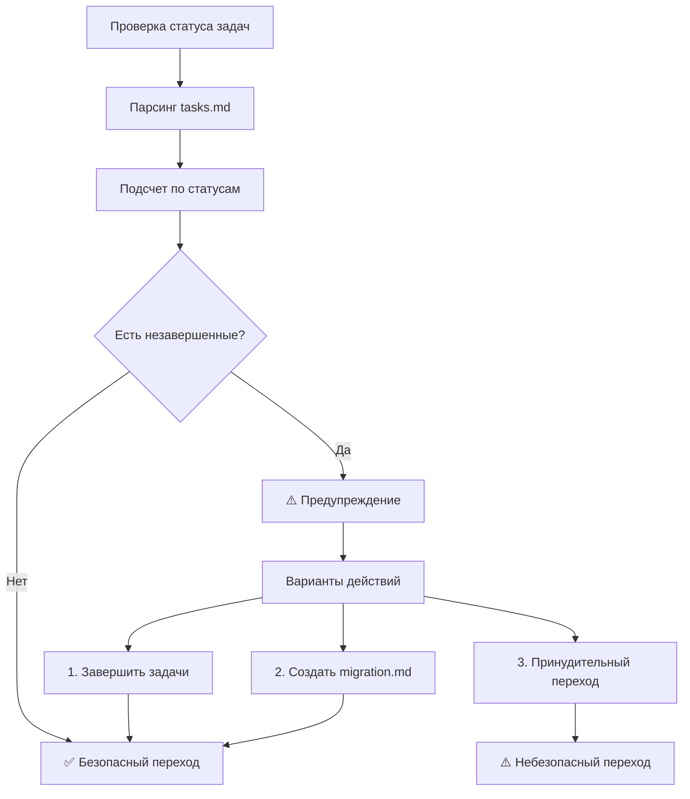

# ПЛАН ИСПРАВЛЕНИЯ TASK CONTINUITY

**Задача**: TASK-CONTINUITY-FIX-2024-12-09
**Дата создания**: 2024-12-09
**Приоритет**: CRITICAL
**Статус**: 📋 PLANNED

---

## 🚨 АНАЛИЗ ПРОБЛЕМЫ

### Текущие критические недостатки:

1. **VAN Mode Initialization**:
   - Удаляет существующий `tasks.md` при инициализации
   - Не проверяет наличие незавершенных задач
   - Не интегрирует `migration.md` в workflow

2. **REFLECT/ARCHIVE Transitions**:
   - Не проверяет статус задач перед архивированием
   - Может архивировать незавершенные задачи
   - Не создает `migration.md` для незавершенных задач

3. **Task Status Management**:
   - Нет системы валидации готовности к смене режима
   - Отсутствуют предупреждения о потенциальной потере данных
   - Нет автоматической миграции задач

4. **Migration System**:
   - `migration.md` существует но не интегрирован в workflow
   - VAN mode не обрабатывает migration.md при запуске
   - Нет автоматического создания migration.md

---

## 📋 ДЕТАЛЬНЫЙ ПЛАН ИСПРАВЛЕНИЙ

### Phase 1: Task Status Validation System (30 min)

#### 1.1 Создание системы проверки статуса задач
**Файл**: `.cursor/rules/isolation_rules/CustomWorkflow/workflow/task-status-validation.mdc`

**Содержание**:
- Функции проверки статуса всех задач в `tasks.md`
- Определение готовности к смене режима
- Блокировка опасных переходов

**Статусы задач для проверки**:
- `📋 PLANNED` - запланированные задачи
- `🔄 IN_PROGRESS` - задачи в процессе
- `⛔ BLOCKED` - заблокированные задачи
- `✅ COMPLETED` - завершенные задачи

#### 1.2 Интеграция в mode maps
**Файлы для изменения**:
- `.cursor/rules/isolation_rules/visual-maps/van-mode-map.mdc`
- `.cursor/rules/isolation_rules/visual-maps/reflect-mode-map.mdc`
- `.cursor/rules/isolation_rules/visual-maps/archive-mode-map.mdc`

**Изменения**:
- Добавить checkpoint для проверки статуса задач
- Блокировка перехода при незавершенных задачах
- Предупреждения о потенциальной потере данных

#### 1.3 Система предупреждений
**Формат предупреждений**:
```
⚠️  ПРЕДУПРЕЖДЕНИЕ: НЕЗАВЕРШЕННЫЕ ЗАДАЧИ
┌─────────────────────────────────────────┐
│ Обнаружены незавершенные задачи:        │
│ • TASK-ID-1: 🔄 IN_PROGRESS            │
│ • TASK-ID-2: 📋 PLANNED                │
│                                         │
│ Переход в REFLECT/ARCHIVE может         │
│ привести к потере данных!               │
│                                         │
│ Рекомендации:                           │
│ 1. Завершить задачи                     │
│ 2. Создать migration.md                 │
│ 3. Использовать безопасный переход      │
└─────────────────────────────────────────┘
```

### Phase 2: Migration System Integration (45 min)

#### 2.1 Автоматическое создание migration.md в REFLECT mode
**Файл**: `.cursor/rules/isolation_rules/visual-maps/reflect-mode-map.mdc`

**Логика создания migration.md**:
1. Анализ всех задач в `tasks.md`
2. Категоризация по статусам
3. Создание migration.md для незавершенных задач
4. Сохранение контекста и зависимостей

#### 2.2 Обработка migration.md в VAN mode
**Файл**: `.cursor/rules/isolation_rules/visual-maps/van-mode-map.mdc`

**Логика обработки**:
1. Проверка наличия `memory-bank/migration.md`
2. Парсинг незавершенных задач
3. Интеграция в новый `tasks.md`
4. Архивирование обработанного migration.md

#### 2.3 Улучшение структуры migration.md
**Файл**: `memory-bank/migration.md`

**Добавить секции**:
- Task dependency mapping
- Context preservation
- Integration instructions
- Validation checklist

### Phase 3: Safe Mode Transitions (30 min)

#### 3.1 Безопасный VAN → PLAN переход
**Изменения в van-mode-map.mdc**:
- Сохранение существующих задач
- Добавление новых задач (не замещение)
- Проверка конфликтов задач

#### 3.2 Безопасный IMPLEMENT → REFLECT переход
**Изменения в reflect-mode-map.mdc**:
- Проверка завершенности активных задач
- Анализ результатов implementation
- Создание migration.md для незавершенных

#### 3.3 Безопасный REFLECT → ARCHIVE переход
**Изменения в archive-mode-map.mdc**:
- Разделение завершенных и незавершенных задач
- Архивирование только завершенных
- Создание migration.md для незавершенных

### Phase 4: Task Preservation Rules (30 min)

#### 4.1 Правила добавления задач
**Файл**: `.cursor/rules/isolation_rules/CustomWorkflow/workflow/task-preservation.mdc`

**Правила**:
- Новые задачи добавляются к существующим
- Существующие задачи не удаляются без подтверждения
- Автоматическое обновление статусов

#### 4.2 Автоматическое архивирование
**Логика**:
- Завершенные задачи автоматически помечаются для архивирования
- Создание архивных записей с сохранением контекста
- Очистка активного списка от завершенных задач

#### 4.3 Перенос незавершенных задач
**Механизм**:
- Автоматический перенос задач через migration.md
- Сохранение всего контекста и зависимостей
- Обновление ссылок и связей

---

## 🔧 ТЕХНИЧЕСКИЕ ДЕТАЛИ РЕАЛИЗАЦИИ

### Новые файлы для создания:

1. **task-status-validation.mdc** - Система валидации статуса задач
2. **task-preservation.mdc** - Правила сохранения задач
3. **migration-integration.mdc** - Интеграция системы миграции
4. **safe-transitions.mdc** - Безопасные переходы между режимами

### Изменения в существующих файлах:

1. **van-mode-map.mdc**:
   - Добавить migration.md processing
   - Интегрировать task status validation
   - Безопасная инициализация

2. **reflect-mode-map.mdc**:
   - Автоматическое создание migration.md
   - Проверка готовности к архивированию
   - Анализ незавершенных задач

3. **archive-mode-map.mdc**:
   - Разделение завершенных/незавершенных
   - Безопасное архивирование
   - Создание migration packages

### Алгоритм проверки готовности к смене режима:



---

## 📊 ОЖИДАЕМЫЕ РЕЗУЛЬТАТЫ

### После реализации:

1. **100% сохранность задач** при любых переходах режимов
2. **Автоматическая миграция** незавершенных задач
3. **Предупреждения** о потенциальной потере данных
4. **Безопасные переходы** между всеми режимами
5. **Интегрированная система migration.md**

### Метрики успеха:

- ✅ 0% потери задач при смене режимов
- ✅ 100% автоматическая миграция незавершенных задач
- ✅ Предупреждения при всех опасных операциях
- ✅ Полная интеграция migration.md в workflow

---

## 🚀 ПЛАН ВЫПОЛНЕНИЯ

### Рекомендуемая последовательность:

1. **Phase 1** (30 min) - Создать систему валидации статуса
2. **Phase 2** (45 min) - Интегрировать migration.md в workflow
3. **Phase 3** (30 min) - Реализовать безопасные переходы
4. **Phase 4** (30 min) - Добавить правила сохранения задач

**Общее время**: ~2.5 часа
**Критичность**: МАКСИМАЛЬНАЯ (блокирует безопасное использование системы)

---

## ✅ КРИТЕРИИ ГОТОВНОСТИ

Задача считается завершенной когда:

- [ ] Все 4 фазы реализованы
- [ ] Система валидации статуса работает
- [ ] Migration.md интегрирован в workflow
- [ ] Безопасные переходы между режимами работают
- [ ] Правила сохранения задач активны
- [ ] Тестирование всех сценариев пройдено
- [ ] Документация обновлена

**СТАТУС**: 📋 ГОТОВ К РЕАЛИЗАЦИИ