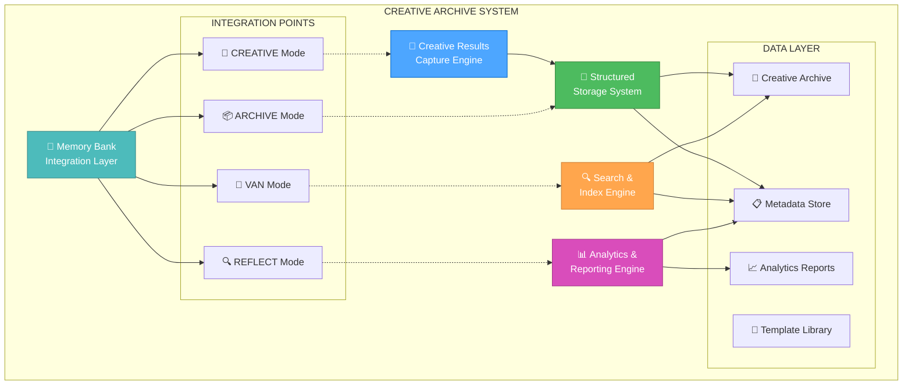

# ПЛАН СИСТЕМЫ АРХИВИРОВАНИЯ CREATIVE РЕЗУЛЬТАТОВ

**Задача**: CREATIVE-ARCHIVE-SYSTEM-2024-12-09
**Дата создания**: 2024-12-09
**Приоритет**: HIGH
**Статус**: 📋 PLANNED

---

## 🎯 ЦЕЛИ И ОБОСНОВАНИЕ

### Основные цели:
1. **Накопление знаний** - Создание базы архитектурных решений
2. **Анализ эффективности** - Отслеживание качества творческих решений
3. **Повторное использование** - Применение проверенных решений
4. **Обучение и развитие** - Изучение паттернов успешных решений
5. **Полная трассируемость** - Документирование процесса принятия решений

### Проблемы, которые решает:
- **Потеря знаний** - Архитектурные решения теряются после завершения проектов
- **Повторение ошибок** - Отсутствие анализа предыдущих решений
- **Неэффективность** - Переизобретение уже найденных решений
- **Отсутствие метрик** - Нет данных об эффективности творческих фаз
- **Изолированность решений** - Решения не связаны с контекстом и результатами

---

## 🏗️ АРХИТЕКТУРА СИСТЕМЫ

### Компоненты системы:



---

## 📋 ДЕТАЛЬНЫЙ ПЛАН РЕАЛИЗАЦИИ

### Phase 1: Creative Results Capture System (45 min)

#### 1.1 Автоматическое сохранение результатов (15 min)
**Файл**: `.cursor/rules/isolation_rules/CustomWorkflow/workflow/creative-results-capture.mdc`

**Функциональность**:
- Автоматическое обнаружение завершения CREATIVE фазы
- Извлечение структурированных данных из творческих документов
- Сохранение в стандартизированном формате
- Создание уникальных идентификаторов для каждого результата

**Структура данных**:
```json
{
  "id": "creative-2024-12-09-task-continuity-arch",
  "timestamp": "2024-12-09T10:30:00Z",
  "task_id": "TASK-CONTINUITY-FIX-2024-12-09",
  "phase_type": "architecture",
  "duration_minutes": 45,
  "participants": ["user", "assistant"],
  "context": {
    "problem_description": "...",
    "requirements": [...],
    "constraints": [...]
  },
  "decisions": [
    {
      "decision_id": "arch-001",
      "title": "Hybrid Architecture Selection",
      "options_considered": [...],
      "chosen_option": "...",
      "rationale": "...",
      "impact_assessment": "..."
    }
  ],
  "artifacts": [
    {
      "type": "mermaid_diagram",
      "content": "...",
      "description": "System architecture diagram"
    }
  ]
}
```

#### 1.2 Структурированное хранение (15 min)
**Файл**: `.cursor/rules/isolation_rules/CustomWorkflow/documentation/creative-storage-structure.mdc`

**Иерархия хранения**:
```
memory-bank/creative/
├── architecture/
│   ├── 2024/
│   │   ├── 12/
│   │   │   ├── 09-task-continuity-architecture.md
│   │   │   └── 09-task-continuity-metadata.json
│   │   └── index.md
│   └── templates/
│       └── architecture-template.md
├── algorithms/
├── ui-ux/
├── data-models/
├── reports/
│   ├── monthly/
│   ├── quarterly/
│   └── annual/
└── search-index/
    ├── by-technology.json
    ├── by-pattern.json
    └── by-effectiveness.json
```

#### 1.3 Метаданные и связывание (15 min)
**Файл**: `.cursor/rules/isolation_rules/CustomWorkflow/documentation/creative-metadata-system.mdc`

**Метаданные включают**:
- Связь с исходной задачей
- Технологический стек
- Архитектурные паттерны
- Уровень сложности
- Эффективность решения
- Время выполнения
- Участники процесса

### Phase 2: Creative Archive Structure (30 min)

#### 2.1 Иерархическая структура (10 min)
**Организация по**:
- Дата создания (год/месяц/день)
- Тип творческой фазы
- Проект/задача
- Технологический стек

#### 2.2 Категоризация и индексирование (10 min)
**Категории**:
- **Architecture** - Архитектурные решения
- **Algorithm** - Алгоритмические решения
- **UI/UX** - Пользовательский интерфейс
- **Data Model** - Модели данных
- **Integration** - Интеграционные решения
- **Performance** - Решения по производительности

#### 2.3 Версионирование решений (10 min)
**Система версий**:
- Семантическое версионирование решений
- Отслеживание эволюции архитектурных решений
- Связывание версий с результатами реализации

### Phase 3: Analysis and Reporting System (45 min)

#### 3.1 Метрики эффективности (15 min)
**Файл**: `.cursor/rules/isolation_rules/CustomWorkflow/documentation/creative-analytics-metrics.mdc`

**Ключевые метрики**:
- **Время на принятие решения** - Эффективность процесса
- **Качество решения** - Оценка по результатам реализации
- **Повторное использование** - Частота применения решений
- **Успешность реализации** - Процент успешно реализованных решений
- **Сложность решения** - Оценка архитектурной сложности

#### 3.2 Анализ паттернов (15 min)
**Анализируемые паттерны**:
- Наиболее успешные архитектурные подходы
- Часто используемые технологические решения
- Эффективные методы принятия решений
- Корреляция между временем и качеством решений

#### 3.3 Автоматические отчеты (15 min)
**Типы отчетов**:
- **Еженедельные** - Краткая сводка активности
- **Ежемесячные** - Анализ трендов и паттернов
- **Квартальные** - Глубокий анализ эффективности
- **Годовые** - Стратегический анализ развития

### Phase 4: Integration with Memory Bank (30 min)

#### 4.1 Интеграция с REFLECT mode (10 min)
**Файл**: `.cursor/rules/isolation_rules/visual-maps/reflect-mode-map.mdc`

**Добавляемая функциональность**:
- Автоматический анализ результатов творческих фаз
- Оценка эффективности принятых решений
- Создание отчетов по качеству архитектурных решений
- Рекомендации для улучшения процесса

#### 4.2 Интеграция с ARCHIVE mode (10 min)
**Файл**: `.cursor/rules/isolation_rules/visual-maps/archive-mode-map.mdc`

**Добавляемая функциональность**:
- Долгосрочное архивирование творческих результатов
- Создание сводных отчетов по проектам
- Экспорт данных для внешнего анализа
- Очистка устаревших данных

#### 4.3 Интеграция с VAN mode (10 min)
**Файл**: `.cursor/rules/isolation_rules/visual-maps/van-mode-map.mdc`

**Добавляемая функциональность**:
- Поиск похожих решений при планировании
- Рекомендации на основе предыдущего опыта
- Автоматическое предложение проверенных паттернов
- Оценка сложности на основе исторических данных

---

## 🔧 ТЕХНИЧЕСКИЕ ДЕТАЛИ

### Новые файлы для создания:

1. **creative-results-capture.mdc** - Система захвата результатов
2. **creative-storage-structure.mdc** - Структура хранения
3. **creative-metadata-system.mdc** - Система метаданных
4. **creative-analytics-metrics.mdc** - Метрики и аналитика
5. **creative-search-integration.mdc** - Интеграция поиска
6. **creative-archive-integration.mdc** - Интеграция с Memory Bank

### Шаблоны для создания:

1. **architecture-decision-template.md** - Шаблон архитектурных решений
2. **algorithm-design-template.md** - Шаблон алгоритмических решений
3. **creative-phase-report-template.md** - Шаблон отчета по творческой фазе
4. **effectiveness-analysis-template.md** - Шаблон анализа эффективности

### Структуры данных:

#### Creative Result Schema:
```json
{
  "$schema": "http://json-schema.org/draft-07/schema#",
  "type": "object",
  "properties": {
    "id": {"type": "string"},
    "timestamp": {"type": "string", "format": "date-time"},
    "task_id": {"type": "string"},
    "phase_type": {"enum": ["architecture", "algorithm", "ui-ux", "data-model"]},
    "duration_minutes": {"type": "integer"},
    "context": {"type": "object"},
    "decisions": {"type": "array"},
    "artifacts": {"type": "array"},
    "effectiveness_score": {"type": "number", "minimum": 0, "maximum": 10}
  }
}
```

---

## 📊 ОЖИДАЕМЫЕ РЕЗУЛЬТАТЫ

### Количественные метрики:
- **100% сохранение** всех результатов CREATIVE фаз
- **< 5 секунд** время поиска релевантных решений
- **80%+ повторное использование** проверенных решений
- **Автоматические отчеты** каждую неделю
- **Полная трассируемость** от проблемы до решения

### Качественные улучшения:
- **Накопление знаний** - База растет с каждым проектом
- **Улучшение качества** - Решения становятся лучше со временем
- **Ускорение разработки** - Меньше времени на поиск решений
- **Стандартизация процесса** - Единый подход к творческим фазам
- **Обучение команды** - Доступ к лучшим практикам

---

## 🚀 ПЛАН ВЫПОЛНЕНИЯ

### Рекомендуемая последовательность:

1. **Phase 1** (45 min) - Создать систему захвата результатов
2. **Phase 2** (30 min) - Организовать структуру архива
3. **Phase 3** (45 min) - Реализовать аналитику и отчеты
4. **Phase 4** (30 min) - Интегрировать с Memory Bank режимами

**Общее время**: 2.5 часа
**Критичность**: HIGH (основа для накопления знаний)

### Критерии готовности:
- [ ] Автоматическое сохранение результатов CREATIVE фаз
- [ ] Структурированное хранение с метаданными
- [ ] Поиск и индексирование работают
- [ ] Аналитические отчеты генерируются
- [ ] Интеграция с всеми режимами Memory Bank
- [ ] Шаблоны созданы и протестированы

---

## 🔍 ДОПОЛНИТЕЛЬНЫЕ ВОЗМОЖНОСТИ

### Будущие улучшения:
1. **AI-анализ решений** - Автоматическая оценка качества
2. **Визуализация данных** - Интерактивные дашборды
3. **Экспорт в внешние системы** - Интеграция с другими инструментами
4. **Коллаборативные функции** - Совместная работа над решениями
5. **Версионирование решений** - Отслеживание эволюции

### Интеграция с внешними системами:
- **Git** - Связывание с коммитами и ветками
- **Jira/Trello** - Связывание с задачами
- **Confluence** - Экспорт документации
- **Slack** - Уведомления о новых решениях

**СТАТУС**: �� ГОТОВ К РЕАЛИЗАЦИИ