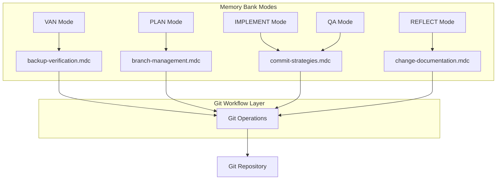
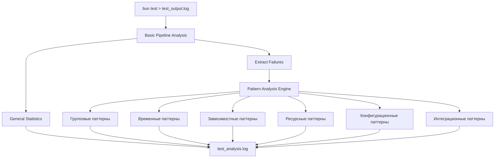
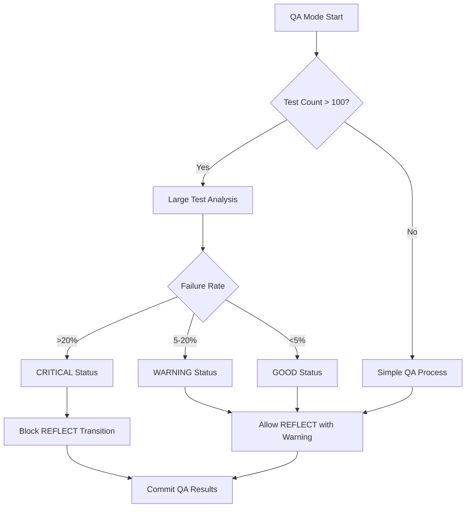
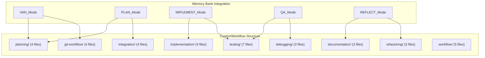

# CREATIVE PHASE: RULES INTEGRATION ARCHITECTURE

**Дата**: 2024-12-09
**Режим**: CREATIVE
**Задача**: RULES-INT-2024-12-09
**Статус**: ✅ ЗАВЕРШЕНА

---

## 🎨🎨🎨 ENTERING CREATIVE PHASE: ARCHITECTURE DESIGN 🎨🎨🎨

### Фокус: Интеграция правил разработки в Memory Bank
### Цель: Архитектурные решения для 4 ключевых компонентов
### Требования: 37 .mdc файлов, git workflow, анализ больших тестов, QA Mode

---

## 📋 ВЫЯВЛЕННЫЕ КОМПОНЕНТЫ ДЛЯ ТВОРЧЕСКИХ ФАЗ

### 1. Git Workflow Integration Architecture (НОВАЯ КАТЕГОРИЯ)
- **Сложность**: Высокая
- **Проблема**: Интеграция git workflow в Memory Bank систему
- **Компоненты**: 4 .mdc файла (commit-strategies, branch-management, change-documentation, backup-verification)

### 2. Large Test Analysis System (НОВЫЕ КОМПОНЕНТЫ)
- **Сложность**: Высокая
- **Проблема**: Анализ >100 тестов через файловый вывод
- **Компоненты**: 2 .mdc файла (large-test-analysis, test-failure-patterns)

### 3. QA Mode Enhancement Architecture
- **Сложность**: Средняя
- **Проблема**: Расширение QA режима с автоматическими статусами
- **Компоненты**: 1 .mdc файл (qa-mode-integration)

### 4. CustomWorkflow Rules Architecture
- **Сложность**: Средняя
- **Проблема**: Организация 37 .mdc файлов в 9 категориях
- **Компоненты**: Структурная организация

---

## 🎨 CREATIVE PHASE 1: GIT WORKFLOW INTEGRATION ARCHITECTURE

### Описание проблемы:
Интеграция git workflow в Memory Bank систему с автоматизацией коммитов по фазам и backup verification.

### Рассмотренные опции:

#### Опция 1: Фазово-ориентированная архитектура ⭐ ВЫБРАНА
- **Описание**: Каждый режим Memory Bank автоматически загружает соответствующие git правила
- **Pros**:
  - Автоматическая активация git правил по контексту
  - Четкая связь между фазами разработки и git операциями
  - Минимальное вмешательство пользователя
- **Cons**:
  - Сложность интеграции с существующими режимами
  - Потенциальные конфликты при переключении режимов
- **Техническая сложность**: Высокая
- **Время реализации**: 30 минут

#### Опция 2: Централизованный Git Manager
- **Описание**: Отдельный компонент управляет всеми git операциями
- **Pros**: Централизованное управление, легче тестировать
- **Cons**: Дополнительная сложность, точка отказа
- **Техническая сложность**: Средняя

#### Опция 3: Событийно-управляемая архитектура
- **Описание**: Git операции запускаются событиями изменения статуса
- **Pros**: Гибкость, слабая связанность
- **Cons**: Сложность отслеживания, пропуски событий
- **Техническая сложность**: Высокая

### 🎯 ПРИНЯТОЕ РЕШЕНИЕ: Фазово-ориентированная архитектура

**Обоснование**:
- Наилучшая интеграция с существующей Memory Bank системой
- Автоматизация соответствует принципам Memory Bank
- Пользователь получает git функциональность "из коробки"

### Архитектурная диаграмма:

### Реализационные детали:
1. **commit-strategies.mdc**: Автоматические коммиты при завершении фаз
2. **branch-management.mdc**: Создание backup веток перед крупными изменениями
3. **change-documentation.mdc**: Автоматическое обновление changelog
4. **backup-verification.mdc**: Проверка git статуса перед Cursor workaround

---

## 🎨 CREATIVE PHASE 2: LARGE TEST ANALYSIS SYSTEM

### Описание проблемы:
Система анализа больших тестовых наборов (>100 тестов) с файловым выводом и выявлением паттернов падений.

### Рассмотренные опции:

#### Опция 1: Pipeline-based Analysis
- **Описание**: Последовательная обработка через pipeline команд bash
- **Pros**: Простота реализации, легко отлаживать, стандартные Unix утилиты
- **Cons**: Потенциально медленная обработка, сложность сложных паттернов
- **Техническая сложность**: Низкая

#### Опция 2: Structured Data Analysis
- **Описание**: Парсинг вывода в структурированные данные для анализа
- **Pros**: Более точный анализ, сложная аналитика, лучшая производительность
- **Cons**: Сложность парсинга, больше кода для поддержки
- **Техническая сложность**: Высокая

#### Опция 3: Hybrid Approach ⭐ ВЫБРАНА
- **Описание**: Комбинация pipeline для базового анализа и структурированного анализа для паттернов
- **Pros**:
  - Баланс простоты и функциональности
  - Поэтапная реализация
  - Гибкость в расширении
- **Cons**:
  - Умеренная сложность
  - Два разных подхода в одной системе
- **Техническая сложность**: Средняя
- **Время реализации**: 20 минут

### 🎯 ПРИНЯТОЕ РЕШЕНИЕ: Hybrid Approach

**Обоснование**:
- Оптимальный баланс между простотой и функциональностью
- Позволяет поэтапную реализацию
- Легко расширяется в будущем

### Архитектурная диаграмма:

### Реализационные детали:
1. **large-test-analysis.mdc**: Pipeline анализ + структурированный анализ паттернов
2. **test-failure-patterns.mdc**: 6 типов паттернов с автоматической категоризацией

---

## 🎨 CREATIVE PHASE 3: QA MODE ENHANCEMENT ARCHITECTURE

### Описание проблемы:
Расширение QA Mode автоматическими статусами (CRITICAL/WARNING/GOOD) и интеграцией с анализом больших тестов.

### Рассмотренные опции:

#### Опция 1: State Machine Architecture
- **Описание**: QA Mode как конечный автомат с четкими переходами
- **Pros**: Четкая логика переходов, легко тестировать, предсказуемое поведение
- **Cons**: Сложность добавления состояний, жесткость архитектуры
- **Техническая сложность**: Средняя

#### Опция 2: Rule-based System
- **Описание**: Система правил определяет статус QA на основе результатов
- **Pros**: Гибкость в настройке, легко добавлять критерии, декларативный подход
- **Cons**: Сложность отладки правил, потенциальные конфликты
- **Техническая сложность**: Средняя

#### Опция 3: Threshold-based System ⭐ ВЫБРАНА
- **Описание**: Простая система порогов для определения статуса
- **Pros**:
  - Простота реализации и понимания
  - Быстрая настройка
  - Легко отлаживать
- **Cons**:
  - Ограниченная гибкость
  - Сложность обработки сложных сценариев
- **Техническая сложность**: Низкая
- **Время реализации**: 15 минут

### 🎯 ПРИНЯТОЕ РЕШЕНИЕ: Threshold-based System

**Обоснование**:
- Простота соответствует принципам Memory Bank
- Быстрая реализация и отладка
- Достаточная функциональность для текущих требований

### Архитектурная диаграмма:

### Реализационные детали:
1. **qa-mode-integration.mdc**: Threshold-based статусы с git интеграцией

---

## 🎨 CREATIVE PHASE 4: CUSTOMWORKFLOW RULES ARCHITECTURE

### Описание проблемы:
Организация 37 .mdc файлов в 9 категориях для оптимальной загрузки и использования.

### Рассмотренные опции:

#### Опция 1: Hierarchical Loading
- **Описание**: Иерархическая загрузка правил от общих к специфичным
- **Pros**: Четкая иерархия, предсказуемый порядок, легко отлаживать
- **Cons**: Избыточность загрузки, сложность определения иерархии
- **Техническая сложность**: Средняя

#### Опция 2: Context-aware Loading
- **Описание**: Загрузка правил на основе текущего контекста Memory Bank
- **Pros**: Оптимальная производительность, релевантные правила, минимизация конфликтов
- **Cons**: Сложность определения контекста, потенциальные пропуски
- **Техническая сложность**: Высокая

#### Опция 3: Category-based Organization ⭐ ВЫБРАНА
- **Описание**: Простая организация по категориям с четкими glob паттернами
- **Pros**:
  - Простота понимания и поддержки
  - Четкое разделение ответственности
  - Легко расширяется
- **Cons**:
  - Потенциальная избыточность
  - Менее оптимальная производительность
- **Техническая сложность**: Низкая
- **Время реализации**: 15 минут

### 🎯 ПРИНЯТОЕ РЕШЕНИЕ: Category-based Organization

**Обоснование**:
- Соответствует принципу простоты Memory Bank
- Легко поддерживать и расширять
- Четкая структура для пользователей

### Архитектурная диаграмма:

### Реализационные детали:
1. **9 категорий**: Четкое разделение по функциональности
2. **37 файлов**: Организованы по категориям с оптимизированными glob паттернами
3. **Интеграция**: Каждый режим Memory Bank загружает релевантные категории

---

## 🎨 CREATIVE CHECKPOINT: ВСЕ РЕШЕНИЯ ПРИНЯТЫ

### Прогресс:
- ✅ Git Workflow Integration Architecture: Фазово-ориентированная архитектура
- ✅ Large Test Analysis System: Hybrid approach
- ✅ QA Mode Enhancement Architecture: Threshold-based system
- ✅ CustomWorkflow Rules Architecture: Category-based organization

### Ключевые решения:
1. **Автоматизация git операций** по фазам Memory Bank
2. **Hybrid анализ тестов** для баланса простоты и функциональности
3. **Threshold-based QA статусы** для простоты и надежности
4. **Category-based организация** для ясности и поддерживаемости

### Следующие шаги:
- Переход к IMPLEMENT режиму для реализации Phase 2
- Создание 37 .mdc файлов с использованием принятых архитектурных решений

---

## 🎨🎨🎨 EXITING CREATIVE PHASE - ALL DECISIONS MADE 🎨🎨🎨

### Резюме:
Все 4 ключевых компонента получили архитектурные решения. Система готова к реализации с четкими техническими решениями, оптимизированными для простоты, производительности и интеграции с Memory Bank.

### Ключевые принципы принятых решений:
- **Простота**: Предпочтение простых решений сложным
- **Интеграция**: Тесная интеграция с существующей Memory Bank системой
- **Автоматизация**: Минимизация ручного вмешательства пользователя
- **Расширяемость**: Возможность легкого расширения в будущем

### Готовность к реализации: ✅ 100%