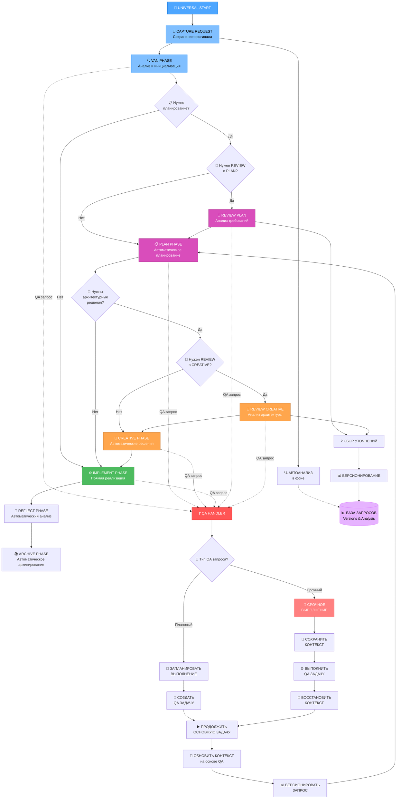

# UNIVERSAL РЕЖИМ И СИСТЕМА QA ОБРАБОТКИ

**Дата создания**: 2025-06-20
**Приоритет**: HIGH
**Интеграция с**: RULES-ENHANCEMENT-2025-06-20

---

## 🌐 UNIVERSAL РЕЖИМ - КОНЦЕПЦИЯ

### Цель
Создание универсального режима, который объединяет все существующие режимы Memory Bank в единый поток с автоматическими переходами между фазами без остановки для пользователя.

### Ключевые принципы
1. **Бесшовные переходы**: PLAN → CREATIVE без остановки
2. **Автоматическая фазовость**: Система сама определяет необходимость творческой фазы
3. **Контекстное сохранение**: Полное сохранение контекста между фазами
4. **QA интеграция**: Встроенная система обработки пользовательских запросов

---

## 🎯 АРХИТЕКТУРА UNIVERSAL РЕЖИМА

### Фазовая структура


---

## 📋 ДЕТАЛЬНЫЙ ПЛАН РЕАЛИЗАЦИИ

### 🌐 Phase 8: UNIVERSAL режим

#### 8.1 Создание universal_instructions.md
**Файл**: `custom_modes/universal_instructions.md`

**Структура:**
```markdown
# UNIVERSAL MODE INSTRUCTIONS

## Режим работы
- **Тип**: Объединенный поток всех режимов
- **Переходы**: Автоматические между фазами
- **Остановки**: Только при необходимости пользовательского выбора
- **QA интеграция**: Встроенная система обработки запросов

## Фазовый алгоритм
1. **VAN**: Анализ и инициализация
2. **PLAN**: Автоматическое планирование с уточняющими вопросами
3. **CREATIVE**: Автоматические архитектурные решения (при необходимости)
4. **IMPLEMENT**: Реализация по плану
5. **REFLECT**: Автоматический анализ результатов
6. **ARCHIVE**: Автоматическое архивирование

## QA обработка
- **Прерывание**: В любой момент
- **Анализ типа**: Срочный vs плановый
- **Сохранение контекста**: Автоматическое
- **Восстановление**: С обновлением на основе QA
```

#### 8.2 Правило universal-mode-integration.mdc
**Файл**: `_cursor/rules/isolation_rules/Core/universal-mode-integration.mdc.md`

**Содержание:**
```yaml
---
description: "Интеграция UNIVERSAL режима с автоматическими переходами между фазами"
globs: "**/UNIVERSAL/**", "**/**"
alwaysApply: true
---

# UNIVERSAL MODE INTEGRATION

## Автоматические переходы фаз

### PLAN → CREATIVE переходы
```bash
# Определение необходимости CREATIVE фазы
needs_creative_phase() {
  local task_complexity="$1"
  local architectural_decisions="$2"

  # Критерии для автоматического перехода в CREATIVE
  if [ "$task_complexity" = "Level3" ] || [ "$task_complexity" = "Level4" ]; then
    return 0  # Нужна CREATIVE фаза
  fi

  if echo "$architectural_decisions" | grep -q "архитектур\|паттерн\|дизайн"; then
    return 0  # Нужна CREATIVE фаза
  fi

  return 1  # CREATIVE фаза не нужна
}

# Автоматический переход PLAN → CREATIVE
auto_transition_to_creative() {
  echo "🎨 АВТОМАТИЧЕСКИЙ ПЕРЕХОД В CREATIVE ФАЗУ"
  echo "Причина: Обнаружены архитектурные решения"
  echo "Контекст: $(get_current_context)"

  # Сохранение контекста планирования
  save_planning_context

  # Переход в CREATIVE с контекстом
  initialize_creative_phase_with_context
}
```

### Бесшовные фазовые переходы
```bash
# Универсальный контроллер фаз
universal_phase_controller() {
  local current_phase="$1"
  local task_context="$2"

  case "$current_phase" in
    "VAN")
      echo "🔍 VAN фаза завершена"
      if needs_planning "$task_context"; then
        transition_to_plan
      else
        transition_to_implement
      fi
      ;;
    "PLAN")
      echo "📋 PLAN фаза завершена"
      if needs_creative_phase "$task_context"; then
        auto_transition_to_creative
      else
        transition_to_implement
      fi
      ;;
    "CREATIVE")
      echo "🎨 CREATIVE фаза завершена"
      transition_to_implement
      ;;
    "IMPLEMENT")
      echo "⚙️ IMPLEMENT фаза завершена"
      transition_to_reflect
      ;;
    "REFLECT")
      echo "🤔 REFLECT фаза завершена"
      transition_to_archive
      ;;
    "ARCHIVE")
      echo "📚 UNIVERSAL цикл завершен"
      ;;
  esac
}
```
```

### 🛠️ Phase 8.3: QA система обработки

#### QA Interrupt Handler
**Файл**: `_cursor/rules/isolation_rules/Core/qa-interrupt-handling.mdc.md`

**Содержание:**
```yaml
---
description: "Система обработки QA запросов с прерыванием основного потока"
globs: "**/QA/**", "**/**"
alwaysApply: true
---

# QA INTERRUPT HANDLING SYSTEM

## Обработка QA прерываний

### Детекция QA запросов
```bash
# Анализ пользовательского запроса
analyze_user_request() {
  local user_input="$1"

  # Ключевые слова для QA запросов
  local qa_keywords=("как" "почему" "что если" "можно ли" "объясни" "покажи")
  local urgent_keywords=("срочно" "сейчас" "немедленно" "прямо сейчас")

  local is_qa=false
  local is_urgent=false

  # Проверка на QA запрос
  for keyword in "${qa_keywords[@]}"; do
    if echo "$user_input" | grep -qi "$keyword"; then
      is_qa=true
      break
    fi
  done

  # Проверка на срочность
  for keyword in "${urgent_keywords[@]}"; do
    if echo "$user_input" | grep -qi "$keyword"; then
      is_urgent=true
      break
    fi
  done

  echo "QA_REQUEST:$is_qa,URGENT:$is_urgent"
}
```

### Создание QA задач
```bash
# Создание отдельной QA задачи
create_qa_task() {
  local qa_request="$1"
  local urgency="$2"
  local current_context="$3"

  local qa_id="QA-$(date +%Y-%m-%d-%H%M%S)"
  local qa_file="memory-bank/qa-tasks/$qa_id.md"

  mkdir -p "memory-bank/qa-tasks"

  cat > "$qa_file" << EOF
# QA ЗАДАЧА: $qa_id

**Создана**: $(date +%Y-%m-%d\ %H:%M:%S)
**Приоритет**: $urgency
**Статус**: PLANNED

## Запрос пользователя:
$qa_request

## Контекст основной задачи:
$current_context

## Планирование выполнения:
- [ ] Анализ запроса
- [ ] Определение необходимости CREATIVE фазы
- [ ] Выполнение QA
- [ ] Обновление основного контекста

## Когда выполнить:
EOF

  if [ "$urgency" = "URGENT" ]; then
    echo "🚨 СРОЧНО: Выполнить немедленно" >> "$qa_file"
  else
    echo "📅 Запланировать выполнение:" >> "$qa_file"
    echo "❓ Когда вы хотите это выполнить?" >> "$qa_file"
    echo "   [1] Сейчас (прервать основную задачу)" >> "$qa_file"
    echo "   [2] После завершения текущей фазы" >> "$qa_file"
    echo "   [3] После завершения основной задачи" >> "$qa_file"
  fi

  echo "✅ QA задача создана: $qa_file"
  return 0
}
```

### Сохранение и восстановление контекста
```bash
# Сохранение контекста при прерывании
save_current_context() {
  local context_file="memory-bank/context-backup/context-$(date +%Y%m%d-%H%M%S).md"

  mkdir -p "memory-bank/context-backup"

  cat > "$context_file" << EOF
# КОНТЕКСТ BACKUP

**Сохранен**: $(date +%Y-%m-%d\ %H:%M:%S)
**Текущая фаза**: $(get_current_phase)
**Активная задача**: $(get_active_task)

## Состояние задачи:
$(cat memory-bank/tasks.md | head -50)

## Прогресс:
$(cat memory-bank/progress.md | head -30)

## Рабочая директория:
$(pwd)

## Git статус:
$(git status --porcelain)

## Последние изменения:
$(git log --oneline -5)
EOF

  echo "$context_file"
}

# Восстановление контекста после QA
restore_context_after_qa() {
  local context_file="$1"
  local qa_results="$2"

  echo "🔄 ВОССТАНОВЛЕНИЕ КОНТЕКСТА ПОСЛЕ QA"
  echo "=================================="

  # Загрузка сохраненного контекста
  echo "📂 Загружаю контекст из: $context_file"

  # Анализ изменений после QA
  echo "📊 Анализ результатов QA:"
  echo "$qa_results"

  # Обновление основной задачи на основе QA
  update_main_task_from_qa "$qa_results"

  echo "✅ Контекст восстановлен и обновлен"
}
```

### Автоматическая CREATIVE фаза для QA
```bash
# Определение необходимости CREATIVE для QA
qa_needs_creative() {
  local qa_request="$1"

  # Ключевые слова, требующие архитектурных решений
  local creative_keywords=("архитектура" "дизайн" "паттерн" "структура" "подход")

  for keyword in "${creative_keywords[@]}"; do
    if echo "$qa_request" | grep -qi "$keyword"; then
      return 0  # Нужна CREATIVE фаза
    fi
  done

  return 1  # CREATIVE фаза не нужна
}

# Автоматическая CREATIVE фаза для QA в UNIVERSAL режиме
auto_creative_for_qa() {
  local qa_request="$1"
  local current_mode="$2"

  if [ "$current_mode" = "UNIVERSAL" ]; then
    echo "🎨 АВТОМАТИЧЕСКАЯ CREATIVE ФАЗА ДЛЯ QA"
    echo "Контекст QA: $qa_request"

    # Автоматический переход в CREATIVE с QA контекстом
    initialize_creative_with_qa_context "$qa_request"
  else
    echo "💡 РЕКОМЕНДАЦИЯ: ПЕРЕКЛЮЧЕНИЕ В CREATIVE РЕЖИМ"
    echo "QA запрос требует архитектурных решений"
    echo "Переключиться в CREATIVE режим? (y/n)"
  fi
}
```
```

---

## 🔄 ДЕТАЛЬНАЯ ПРОРАБОТКА ИЗМЕНЕНИЯ ПРАВИЛ

### Cursor Workaround процесс

#### Шаг 1: Подготовка
```bash
# Создание backup ветки
git checkout -b "backup-rules-enhancement-$(date +%Y%m%d)"
git push origin "backup-rules-enhancement-$(date +%Y%m%d)"

# Проверка статуса
git status
echo "✅ Backup ветка создана"
```

#### Шаг 2: Применение Cursor Workaround
```bash
# Переименование директории
mv .cursor _cursor
echo "✅ .cursor → _cursor"

# Переименование файлов для редактирования
find _cursor -name "*.mdc" -exec sh -c 'mv "$1" "$1.md"' _ {} \;
echo "✅ .mdc → .mdc.md для редактирования"

# Подсчет файлов для обработки
echo "📊 Файлов для редактирования: $(find _cursor -name "*.mdc.md" | wc -l)"
```

#### Шаг 3: Создание новых правил
**Последовательность создания:**

1. **deep-validation-system.mdc.md** - Система углубленной валидации
2. **timeout-protection.mdc.md** - Timeout защита
3. **background-server-execution.mdc.md** - Фоновое выполнение серверов
4. **working-directory-control.mdc.md** - Контроль рабочих директорий
5. **automatic-date-management.mdc.md** - Управление датами
6. **continue-command-handler.mdc.md** - Обработка команды ПРОДОЛЖАЙ
7. **intelligent-model-switching.mdc.md** - Переключение моделей
8. **project-analysis-system.mdc.md** - Анализ проекта
9. **manual-mode-restriction.mdc.md** - Ограничение MANUAL режима
10. **universal-mode-integration.mdc.md** - UNIVERSAL режим
11. **qa-interrupt-handling.mdc.md** - QA система

#### Шаг 4: Обновление существующих правил
**Файлы для обновления:**
- `interaction-mode-control.mdc.md` - Добавить UNIVERSAL режим
- `van-mode-map.mdc.md` - Интегрировать проверку дат и директорий
- `plan-mode-integration.mdc.md` - Добавить уточнение директорий
- `creative-decision-control.mdc.md` - Интегрировать с UNIVERSAL

#### Шаг 5: Восстановление структуры
```bash
# Восстановление расширений файлов
find _cursor -name "*.mdc.md" -exec sh -c 'mv "$1" "${1%.md}"' _ {} \;
echo "✅ .mdc.md → .mdc"

# Восстановление директории
mv _cursor .cursor
echo "✅ _cursor → .cursor"

# Проверка структуры
find .cursor -name "*.mdc" | wc -l
echo "✅ Структура восстановлена"
```

#### Шаг 6: Валидация и тестирование
```bash
# Проверка glob patterns
grep -r "globs:" .cursor/rules/ --include="*.mdc" | wc -l

# Проверка metadata headers
find .cursor/rules/ -name "*.mdc" -exec head -5 {} \; | grep -c "^---"

# Проверка новых функций
grep -r "timeout" .cursor/rules/ --include="*.mdc" | wc -l
grep -r "ПРОДОЛЖАЙ" .cursor/rules/ --include="*.mdc" | wc -l
grep -r "UNIVERSAL" .cursor/rules/ --include="*.mdc" | wc -l

echo "✅ Валидация завершена"
```

---

## 📊 ОЖИДАЕМЫЕ РЕЗУЛЬТАТЫ

### UNIVERSAL режим
- **Бесшовные переходы**: PLAN → CREATIVE без остановки
- **Автоматические решения**: Система принимает архитектурные решения
- **Контекстное сохранение**: Полное сохранение между фазами
- **QA интеграция**: Встроенная обработка пользовательских запросов

### QA система
- **Интеллектуальная обработка**: Анализ типа запроса (срочный/плановый)
- **Сохранение контекста**: Автоматическое при прерывании
- **Восстановление с обновлением**: Интеграция QA результатов в основную задачу
- **Автоматическая CREATIVE**: При необходимости архитектурных решений

### Технические улучшения
- **11 новых правил**: Комплексная система улучшений
- **Обновленные режимы**: Все custom_modes интегрированы
- **Проверенная методология**: Cursor workaround полностью отработан
- **Полная валидация**: Все правила протестированы

---

## 🎯 КРИТЕРИИ УСПЕХА

### UNIVERSAL режим
- [ ] Автоматические переходы PLAN → CREATIVE работают
- [ ] Контекст сохраняется между всеми фазами
- [ ] QA запросы обрабатываются корректно
- [ ] Система определяет необходимость CREATIVE фазы

### QA система
- [ ] Создаются отдельные QA задачи
- [ ] Контекст сохраняется при прерывании
- [ ] Восстановление обновляет основную задачу
- [ ] Автоматическая CREATIVE работает в UNIVERSAL режиме

### Техническая реализация
- [ ] Все 11 правил созданы и работают
- [ ] Cursor workaround выполнен без ошибок
- [ ] Валидация показывает 100% успех
- [ ] Системное тестирование проходит

Этот план обеспечивает создание мощного UNIVERSAL режима с интеллектуальной QA системой, значительно улучшая пользовательский опыт работы с Memory Bank.