# ПЛАН ОБЪЕДИНЕНИЯ PLAN И CREATIVE РЕЖИМОВ

**Дата создания**: 2025-06-20
**Сложность**: Level 3 (Intermediate Feature)
**Приоритет**: HIGH

## 🎯 ЦЕЛЬ ЗАДАЧИ

Создать единый интегрированный режим инструкций, который объединяет функциональность планирования (PLAN) и творческого решения проблем (CREATIVE) в seamless workflow.

## 📊 АНАЛИЗ СУЩЕСТВУЮЩИХ РЕЖИМОВ

### PLAN Mode - Структура и Функции
**Основные возможности**:
- ✅ Определение уровня сложности (Level 2-4)
- ✅ Создание детальных планов реализации
- ✅ Анализ требований и компонентов
- ✅ Идентификация зависимостей
- ✅ Документирование вызовов и решений
- ✅ Интеграция с Web Search
- ✅ Флагирование компонентов для CREATIVE фазы

**Workflow PLAN**:
1. Чтение tasks.md и определение сложности
2. Анализ структуры кода
3. Создание comprehensive implementation plan
4. Документирование challenges и solutions
5. Флагирование компонентов, требующих creative решений
6. Переход в CREATIVE или IMPLEMENT

### CREATIVE Mode - Структура и Функции
**Основные возможности**:
- ✅ Архитектурное проектирование
- ✅ Алгоритмическое проектирование
- ✅ UI/UX дизайн
- ✅ Генерация множественных опций
- ✅ Анализ pros/cons каждой опции
- ✅ Обоснованный выбор решения
- ✅ Создание implementation guidelines
- ✅ Интеграция с Web Search

**Workflow CREATIVE**:
1. Идентификация компонентов для creative work
2. Определение типа creative phase (Architecture/Algorithm/UI-UX)
3. Генерация 2-4 опций для каждого компонента
4. Анализ pros/cons каждой опции
5. Выбор и обоснование рекомендуемого подхода
6. Документирование implementation guidelines
7. Переход в IMPLEMENT

## 🔄 АРХИТЕКТУРА ОБЪЕДИНЕННОГО РЕЖИМА

### Концепция: PLAN-CREATIVE Integrated Mode

**Название**: `PLAN-CREATIVE` или `DESIGN` Mode
**Цель**: Seamless переход от планирования к творческому решению проблем

### Интегрированный Workflow

```mermaid
graph TD
    Start["🚀 START DESIGN MODE"] --> ReadTasks["📚 Read tasks.md &<br>context files"]
    ReadTasks --> CheckMigration["🔄 Check Migration<br>& Task Continuity"]
    CheckMigration --> DetermineComplexity["🧩 Determine<br>Complexity Level"]

    %% Planning Phase
    DetermineComplexity --> PlanningPhase["📋 PLANNING PHASE"]
    PlanningPhase --> AnalyzeRequirements["📋 Analyze Requirements"]
    AnalyzeRequirements --> IdentifyComponents["🧩 Identify Components"]
    IdentifyComponents --> CreateBasePlan["📝 Create Base Plan"]
    CreateBasePlan --> FlagCreativeComponents["🎨 Flag Components<br>Requiring Creative Work"]

    %% Creative Phase Integration
    FlagCreativeComponents --> HasCreativeWork{"🎨 Creative<br>Components<br>Found?"}
    HasCreativeWork -->|"Yes"| CreativePhase["🎨 CREATIVE PHASE"]
    HasCreativeWork -->|"No"| FinalizePlan["📝 Finalize<br>Implementation Plan"]

    %% Creative Sub-Workflow
    CreativePhase --> DetermineCreativeType["🔍 Determine Creative Type<br>(Architecture/Algorithm/UI-UX)"]
    DetermineCreativeType --> GenerateOptions["🔄 Generate Multiple<br>Options (2-4)"]
    GenerateOptions --> AnalyzeOptions["⚖️ Analyze Pros/Cons<br>of Each Option"]
    AnalyzeOptions --> SelectApproach["✅ Select & Justify<br>Recommended Approach"]
    SelectApproach --> CreateGuidelines["📝 Create Implementation<br>Guidelines"]
    CreateGuidelines --> MoreCreativeWork{"🔄 More Creative<br>Components?"}
    MoreCreativeWork -->|"Yes"| DetermineCreativeType
    MoreCreativeWork -->|"No"| IntegrateCreativeResults["🔗 Integrate Creative Results<br>into Implementation Plan"]

    %% Finalization
    IntegrateCreativeResults --> FinalizePlan
    FinalizePlan --> UpdateMemoryBank["📝 Update Memory Bank<br>& tasks.md"]
    UpdateMemoryBank --> VerifyCompleteness["✅ Verify Plan<br>Completeness"]
    VerifyCompleteness --> Transition["⏭️ NEXT MODE:<br>IMPLEMENT MODE"]

    %% Styling
    style Start fill:#4da6ff,stroke:#0066cc,color:white
    style PlanningPhase fill:#4dbb5f,stroke:#36873f,color:white
    style CreativePhase fill:#d971ff,stroke:#a33bc2,color:white
    style FinalizePlan fill:#ffa64d,stroke:#cc7a30,color:white
    style Transition fill:#5fd94d,stroke:#3da336,color:white
```



## 📋 ДЕТАЛЬНЫЙ ПЛАН РЕАЛИЗАЦИИ

### Фаза 1: Анализ и Проектирование Структуры

**Задачи**:
1. **Анализ пересечений функциональности**
   - Идентификация общих компонентов
   - Определение уникальных возможностей каждого режима
   - Анализ workflow пересечений

2. **Проектирование интегрированной структуры**
   - Создание unified command structure
   - Проектирование seamless transitions
   - Определение точек интеграции

3. **Создание архитектуры файла**
   - Структура mermaid диаграмм
   - Организация секций
   - Система навигации

### Фаза 2: Создание Объединенного Файла

**Задачи**:
1. **Создание основной структуры**
   - Header и описание режима
   - Unified mermaid workflow diagram
   - Implementation steps секция

2. **Интеграция Planning функциональности**
   - Complexity determination logic
   - Requirements analysis process
   - Component identification workflow

3. **Интеграция Creative функциональности**
   - Creative phase identification
   - Options generation process
   - Decision making framework

4. **Создание seamless transitions**
   - Automatic flow between planning and creative phases
   - Context preservation mechanisms
   - State management between phases

### Фаза 3: Интеграция с Memory Bank System

**Задачи**:
1. **Context Management Integration**
   - Update current-context.md template
   - Integration with task continuity system
   - Migration processing support

2. **Memory Bank Files Integration**
   - tasks.md update procedures
   - Creative phase documentation
   - Progress tracking integration

3. **Rules System Integration**
   - fetch_rules integration
   - Rule loading optimization
   - Error handling procedures

### Фаза 4: Testing и Verification

**Задачи**:
1. **Functional Testing**
   - Test planning phase workflow
   - Test creative phase workflow
   - Test seamless transitions

2. **Integration Testing**
   - Memory Bank integration
   - Context management
   - Task continuity

3. **Documentation и Examples**
   - Usage examples
   - Best practices
   - Troubleshooting guide

## 🎨 CREATIVE РЕШЕНИЯ ДЛЯ ИНТЕГРАЦИИ

### Проблема 1: Seamless Transition между Planning и Creative

**Опции**:
1. **Sequential Approach**: Полное завершение planning, затем creative
2. **Integrated Approach**: Динамические переходы по мере необходимости
3. **Hybrid Approach**: Planning с embedded creative checkpoints

**Рекомендация**: **Integrated Approach**
- Позволяет естественный flow между планированием и творчеством
- Сохраняет контекст между фазами
- Более эффективно для сложных задач

### Проблема 2: Управление State между фазами

**Опции**:
1. **Single State Object**: Один объект состояния для всего режима
2. **Phase-Specific States**: Отдельные состояния для каждой фазы
3. **Hierarchical State**: Иерархическая структура состояний

**Рекомендация**: **Hierarchical State**
- Лучшая организация данных
- Легче отладка и поддержка
- Естественное разделение ответственности

### Проблема 3: Naming Convention для объединенного режима

**Опции**:
1. **PLAN-CREATIVE**: Прямое объединение названий
2. **DESIGN**: Более короткое и емкое название
3. **ARCHITECT**: Фокус на архитектурном проектировании
4. **STRATEGY**: Фокус на стратегическом планировании

**Рекомендация**: **DESIGN**
- Короткое и понятное
- Охватывает и планирование, и творчество
- Соответствует software design principles

## 📁 СТРУКТУРА НОВОГО ФАЙЛА

### Предлагаемая структура: `custom_modes/design_instructions.md`

```
# MEMORY BANK DESIGN MODE

## Overview & Purpose
## Unified Workflow Diagram
## Implementation Steps
  - Step 1: Context & Tasks Reading
  - Step 2: Planning Phase
  - Step 3: Creative Phase Integration
  - Step 4: Finalization
## Planning Phase Details
## Creative Phase Details
## Integration Points
## Memory Bank Integration
## Verification
## Examples
```

## 🔧 ТЕХНИЧЕСКИЕ ДЕТАЛИ РЕАЛИЗАЦИИ

### Context Management Updates
```yaml
# memory-bank/system/current-context.md template
mode: DESIGN
phases:
  - PLANNING: { status: active/complete, progress: 0-100% }
  - CREATIVE: { status: pending/active/complete, components: [...] }
current_phase: PLANNING|CREATIVE
```

### Tasks.md Integration
```yaml
# Enhanced task tracking
creative_components:
  - component: "Authentication System"
    type: "Architecture"
    status: "planned|in_creative|designed|implemented"
    options_generated: 3
    selected_approach: "JWT with refresh tokens"
```

### Rules Loading Strategy
```javascript
// Unified rules loading
const rules = [
  "isolation_rules/visual-maps/plan-mode-map",
  "isolation_rules/visual-maps/creative-mode-map",
  "isolation_rules/Core/creative-phase-enforcement",
  "isolation_rules/Level3/planning-comprehensive"
];
```

## ✅ КРИТЕРИИ УСПЕХА

1. **Functional Integration**
   - ✅ Seamless переход между planning и creative фазами
   - ✅ Сохранение контекста между фазами
   - ✅ Unified command interface

2. **Memory Bank Integration**
   - ✅ Полная интеграция с task continuity system
   - ✅ Context management support
   - ✅ Migration processing

3. **User Experience**
   - ✅ Интуитивный workflow
   - ✅ Ясная документация
   - ✅ Примеры использования

4. **Technical Quality**
   - ✅ Consistent code style
   - ✅ Proper error handling
   - ✅ Performance optimization

## 🎯 СЛЕДУЮЩИЕ ШАГИ

1. **Immediate**: Создать unified design_instructions.md файл
2. **Short-term**: Интегрировать с Memory Bank system
3. **Medium-term**: Тестирование и оптимизация
4. **Long-term**: Расширение функциональности на основе feedback

## 📊 ОЖИДАЕМЫЕ РЕЗУЛЬТАТЫ

- ✅ Упрощение workflow для пользователей
- ✅ Повышение эффективности планирования и проектирования
- ✅ Лучшая интеграция между логическим планированием и творческим решением проблем
- ✅ Сохранение всех существующих возможностей обоих режимов
- ✅ Улучшенная user experience

**Рекомендуемый следующий режим**: CREATIVE (для проработки деталей архитектуры) или IMPLEMENT (для создания объединенного файла)