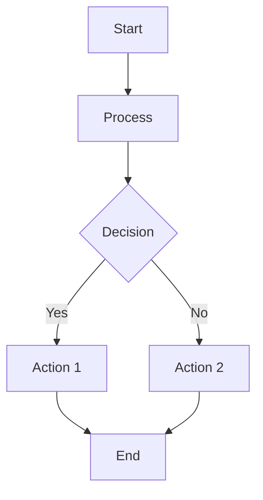
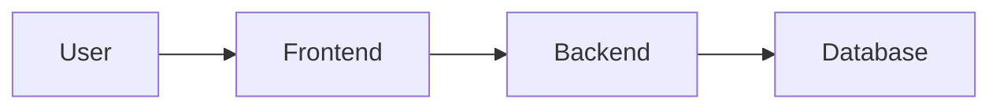

# Memory Bank Documentation Style Guide v1.0

## 🎨 Visual Identity

### Color Palette
- **Primary Blue**: `#4da6ff` - Основной цвет для заголовков и акцентов
- **Secondary Green**: `#4dbb5f` - Успешные операции, готовность
- **Warning Orange**: `#ffa64d` - Предупреждения, важная информация
- **Error Red**: `#ff5555` - Ошибки, критические моменты
- **Purple Accent**: `#d971ff` - Творческие фазы, специальные элементы
- **Neutral Gray**: `#6c7293` - Вспомогательный текст
- **Background Light**: `#f8f9fa` - Фоновые блоки
- **Text Dark**: `#2d3748` - Основной текст

### Typography Hierarchy

#### Заголовки
```markdown
# H1 - Название документа (используется один раз)
## H2 - Основные разделы
### H3 - Подразделы
#### H4 - Детальные подразделы
##### H5 - Специфические элементы
```

#### Текстовые стили
- **Жирный текст**: `**важная информация**`
- *Курсив*: `*акценты и термины*`
- `Код`: `inline code`
- ~~Зачеркнутый~~: `~~устаревшая информация~~`

### Emoji System

#### Статусы и индикаторы
- ✅ Завершено/Успешно
- 🔄 В процессе
- ❌ Не выполнено/Ошибка
- ⏳ Ожидает/Планируется
- ⚠️ Предупреждение
- 🚨 Критично/Важно
- 💡 Совет/Идея
- 📝 Заметка/Документация

#### Режимы работы
- 🔍 VAN Mode
- 📋 PLAN Mode
- 🎨 CREATIVE Mode
- 🔨 IMPLEMENT Mode
- ✅ QA Mode
- 📚 REFLECT Mode
- 📁 ARCHIVE Mode

#### Типы контента
- 📄 Документ
- 📁 Директория
- 🔗 Ссылка
- 📊 Диаграмма
- 🖼️ Изображение
- 💻 Код
- 🎯 Цель/Задача

## 📋 Document Templates

### README Template
```markdown
# Project Name v1.0

[Brief description with value proposition]

## 🚀 Quick Start

[5-minute setup instructions]

## 📖 Documentation

- [Installation Guide](docs/installation/)
- [User Guide](docs/user-guide/)
- [Examples](examples/)

## 🤝 Contributing

See [CONTRIBUTING.md](CONTRIBUTING.md)

## 📄 License

[License information]
```

### Installation Guide Template
```markdown
# Installation Guide

## Prerequisites

- [ ] Requirement 1
- [ ] Requirement 2

## Step-by-Step Installation

### Step 1: [Action]
```bash
command here
```

**Expected result**: [Description]

### Step 2: [Action]
[Instructions]

## Verification

To verify installation:
```bash
verification command
```

## Troubleshooting

### Issue: [Common problem]
**Solution**: [How to fix]

### Issue: [Another problem]
**Solution**: [How to fix]
```

### Example Scenario Template
```markdown
# Example: [Scenario Name]

## 📋 Scenario Overview

**Context**: [Brief context]
**Goal**: [What we want to achieve]
**Complexity**: Level [1-4]
**Time**: ~[X] minutes

## 🎯 Learning Objectives

After this example, you will understand:
- [Objective 1]
- [Objective 2]
- [Objective 3]

## 📝 Step-by-Step Walkthrough

### Step 1: [Action]
[Detailed instructions]

```bash
# Commands if applicable
```

**Result**: [What happens]

### Step 2: [Action]
[Instructions]

## 🔍 Key Takeaways

- [Takeaway 1]
- [Takeaway 2]

## 🔗 Related Resources

- [Link to related documentation]
- [Link to next example]
```

## 🌐 Bilingual Guidelines

### File Naming Convention
- English: `filename.md`
- Russian: `filename_ru.md`

### Content Synchronization
- Maintain parallel structure between languages
- Use same headings hierarchy
- Keep code examples identical
- Translate user-facing text, keep technical terms in English

### Language-Specific Considerations

#### Russian
- Use formal tone ("Вы" instead of "ты")
- Provide English terms in parentheses for technical concepts
- Use Russian punctuation rules

#### English
- Use clear, concise language
- Avoid idioms and colloquialisms
- Use active voice when possible

## 📊 Visual Elements

### Code Blocks
```markdown
```bash
# For shell commands
```

```javascript
// For JavaScript code
```

```markdown
// For markdown examples
```
```

### Callout Boxes
```markdown
> **💡 Tip**: Helpful information for users

> **⚠️ Warning**: Important caution

> **🚨 Critical**: Must-know information

> **📝 Note**: Additional context
```

### Tables
```markdown
| Column 1 | Column 2 | Column 3 |
|----------|----------|----------|
| Data 1   | Data 2   | Data 3   |
| Data 4   | Data 5   | Data 6   |
```

### Progress Indicators
```markdown
Progress: [████████░░] 80%

Checklist:
- [x] Completed item
- [ ] Pending item
- [x] Another completed item
```

## 🔄 Mermaid Diagrams

### Workflow Diagrams


### Architecture Diagrams


## 📱 Responsive Design Principles

### Mobile-First Approach
- Keep tables simple and scrollable
- Use collapsible sections for long content
- Ensure code blocks don't overflow

### Desktop Enhancement
- Use wider layouts for complex diagrams
- Multi-column layouts where appropriate
- Enhanced navigation elements

## ✅ Quality Checklist

### Content Quality
- [ ] Clear and concise writing
- [ ] Proper grammar and spelling
- [ ] Consistent terminology
- [ ] Accurate technical information

### Visual Quality
- [ ] Consistent formatting
- [ ] Proper emoji usage
- [ ] Working links
- [ ] Readable code blocks

### Accessibility
- [ ] Descriptive link text
- [ ] Alt text for images
- [ ] Proper heading hierarchy
- [ ] Color contrast considerations

### Bilingual Quality
- [ ] Content synchronized between languages
- [ ] Cultural appropriateness
- [ ] Technical accuracy in both languages
- [ ] Consistent file naming

## 🔧 Tools and Automation

### Recommended Tools
- **Markdown Editor**: Typora, Mark Text, or VS Code
- **Diagram Creation**: Mermaid Live Editor
- **Grammar Check**: Grammarly (English), LanguageTool (Russian)
- **Link Validation**: markdown-link-check

### Automation Scripts
- Content synchronization checker
- Link validation
- Style guide compliance checker
- Translation status tracker