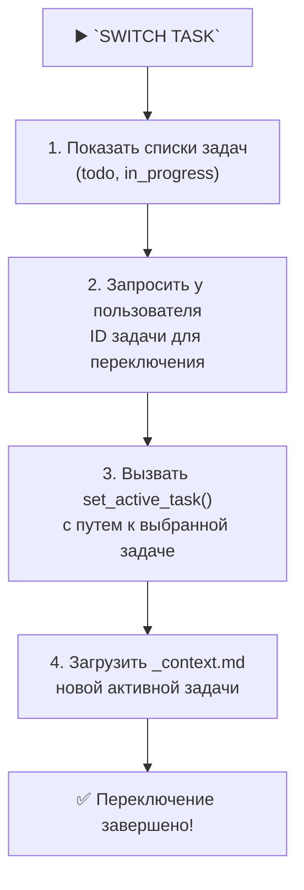

# MEMORY BANK TASK SWITCHING MODE

> **TL;DR:** Этот режим позволяет вам просматривать все задачи и переключаться на любую из них.

## 🚀 Процесс переключения задачи



## 🛠️ Команды

### 1. Показать все задачи
```bash
echo "--- TODO ---"
ls -1 memory-bank/tasks/todo/
echo "--- IN PROGRESS ---"
ls -1 memory-bank/tasks/in_progress/
```

### 2. Переключиться на задачу
```bash
# Псевдокод
user_input_id = prompt_user("Enter Task ID to switch to (e.g., ID-001):")
task_dir = find_directory_by_id(user_input_id)
if [ -n "$task_dir" ]; then
  set_active_task("$task_dir")
  load_file("$task_dir/_context.md")
else
  echo "❌ Задача с ID $user_input_id не найдена."
fi
```