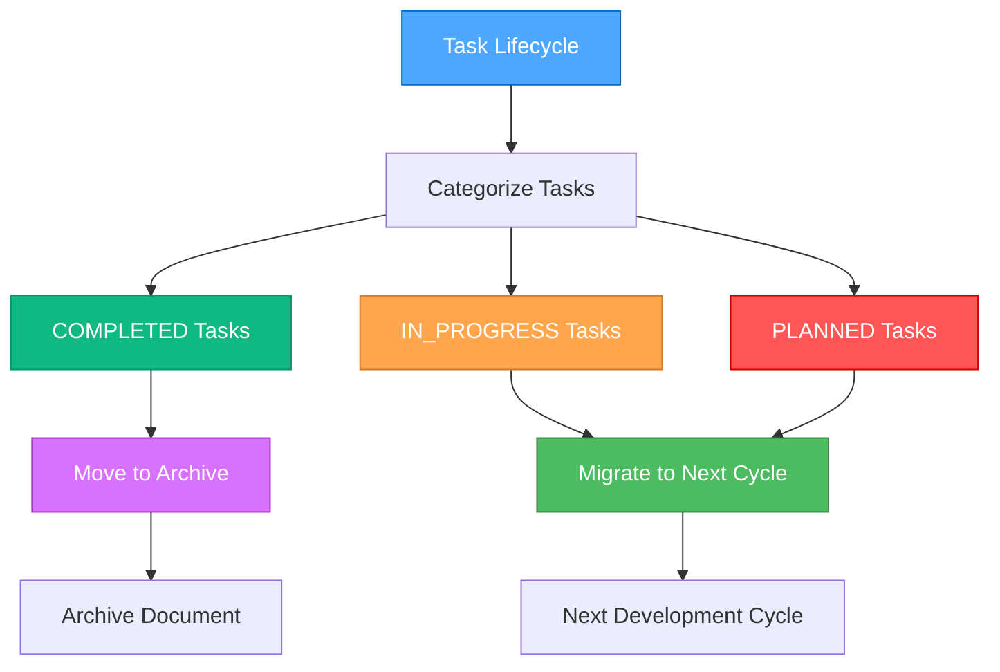
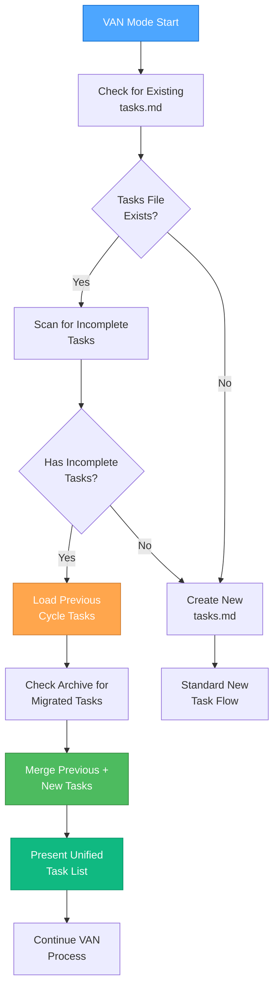
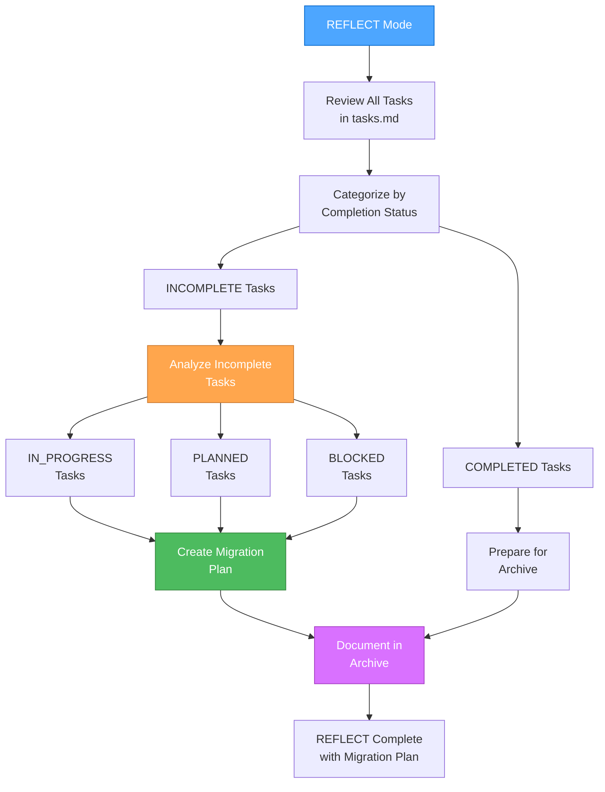
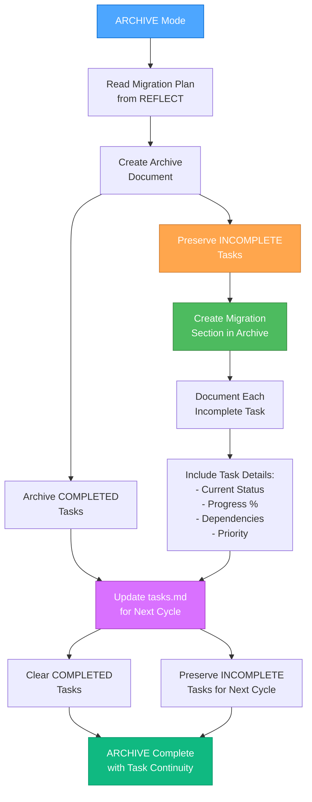

# Memory Bank: System Patterns

## Architecture Overview
File-based Memory Bank system для Cursor IDE с поддержкой многоуровневых задач и интегрированными правилами разработки

## Core Patterns

### 1. Memory Bank Structure
```
memory-bank/
├── projectbrief.md      # Основная информация о проекте
├── activeContext.md     # Текущий контекст и состояние
├── systemPatterns.md    # Архитектурные паттерны (этот файл)
├── techContext.md       # Технический контекст
├── progress.md          # Отслеживание прогресса (РАСШИРЕННЫЙ)
├── tasks.md            # Активные задачи
├── creative/           # Документы творческой фазы
├── reflection/         # Документы рефлексии
├── archive/           # Архив завершенных задач
└── development/       # НОВАЯ ДИРЕКТОРИЯ для правил разработки
    ├── phase-tracking.md    # Отслеживание фаз разработки
    ├── test-reports.md      # Отчеты по тестированию
    ├── debug-traces.md      # Трассировки отладки
    └── integration-maps.md  # Карты интеграции компонентов
```

### 2. Mode System (ОБНОВЛЕННЫЙ)
- **VAN**: Инициализация и определение сложности + Platform Detection
- **PLAN**: Планирование задач + Фазовый подход + Изолированное проектирование
- **CREATIVE**: Принятие дизайнерских решений + Архитектурное планирование
- **IMPLEMENT**: Реализация кода + Integrated Testing + Debugging + Refactoring
- **QA**: Техническая валидация + Comprehensive Testing + Performance Analysis
- **REFLECT**: Рефлексия и анализ + Documentation + Lessons Learned
- **ARCHIVE**: Архивирование результатов + Statistics + Examples

### 3. Complexity Levels (РАСШИРЕННЫЙ)
- **Level 1**: Quick Bug Fix (VAN → IMPLEMENT с встроенным тестированием)
- **Level 2**: Simple Enhancement (VAN → PLAN → CREATIVE → IMPLEMENT → QA)
- **Level 3**: Intermediate Feature (полный цикл + Integration Planning)
- **Level 4**: Complex System (полный цикл + Phased Implementation + Advanced Testing)

### 4. Development Rules Integration
- **Фазовый подход**: Интегрирован в PLAN режим
- **Тестирование**: Встроено в IMPLEMENT и QA режимы
- **Отладка**: Специальные процедуры в IMPLEMENT режиме
- **Интеграция**: Планирование в PLAN, выполнение в IMPLEMENT
- **Рефакторинг**: Специальные workflow в IMPLEMENT режиме
- **Документирование**: Расширенные возможности во всех режимах

### 5. Integration Patterns (НОВОЕ)
- Интеграция с .cursor/rules через VAN.RULES
- Синхронизация с существующими правилами
- Автоматическое обновление контекста
- **Фазовое планирование**: Изолированное проектирование → Интеграция
- **Test-Driven Development**: Bun-based testing workflow
- **Debugging Methodology**: Systematic trace → log → debug → fix
- **Quality Assurance**: Multi-level validation and performance testing

## Current Implementation Status
- [x] Basic Memory Bank structure
- [x] Core file creation
- [x] Mode transition logic
- [x] Complexity determination
- [ ] **Development Rules Integration** (В ПРОЦЕССЕ)
- [ ] **Extended Progress Tracking** (В ПРОЦЕССЕ)
- [ ] **Comprehensive Testing Framework** (В ПРОЦЕССЕ)
- [ ] **Advanced Debugging Support** (В ПРОЦЕССЕ)

## Development Rules Categories

### Category A: Planning & Organization (Rules #1-3)
- **Rule #1**: Фазовый подход к разработке
- **Rule #2**: Документирование прогресса с ✅/❌ маркерами
- **Rule #3**: Приоритизация проблем (CRITICAL → HIGH → MEDIUM → LOW)

### Category B: Implementation & Quality (Rules #4-7)
- **Rule #4**: Проверка зависимостей тестов
- **Rule #5**: Избегание заглушек в продакшене
- **Rule #6**: Robust поиск и навигация
- **Rule #7**: Координация между системами

### Category C: Testing & Validation (Rules #8-16)
- **Rule #8**: Высокогранулированные тесты
- **Rule #9**: Изоляция контекста между тестами
- **Rule #10**: Обязательное тестирование каждой фичи
- **Rule #11**: Проверка покрытия функционала на каждом этапе
- **Rule #12**: Тестирование edge cases
- **Rule #13**: Тестирование производительности
- **Rule #14**: Высокоточное измерение времени
- **Rule #15**: Устойчивая генерация ID
- **Rule #16**: Тестирование временных коллизий

### Category D: Integration & Architecture (Rules #17-20)
- **Rule #17**: Изолированное проектирование фаз
- **Rule #18**: Планирование интеграционных шагов
- **Rule #19**: Тестирование интеграционных точек
- **Rule #20**: Документирование интеграционных зависимостей

### Category E: Debugging & Analysis (Rules #21-23)
- **Rule #21**: Трассировка перед исправлением
- **Rule #22**: Детальное логирование
- **Rule #23**: Валидация инвариантов

### Category F: Documentation & Knowledge (Rules #24-26)
- **Rule #24**: Документирование решений
- **Rule #25**: Ведение статистики
- **Rule #26**: Создание примеров использования

### Category G: Refactoring & Maintenance (Rules #27-29)
- **Rule #27**: Постепенный рефакторинг
- **Rule #28**: Сохранение обратной совместимости
- **Rule #29**: Метрики качества кода

## TASK MANAGEMENT PATTERNS (CRITICAL UPDATE)

### 🚨 TASK PERSISTENCE PATTERN (IMPLEMENTED)

#### Problem Identified:
Текущая система не сохраняет незавершенные задачи при переходе между циклами разработки, что может привести к потере планирования и разрушению процесса разработки.

#### Solution Pattern (IMPLEMENTED):



### TASK STATE MANAGEMENT

#### Task Categories:
1. **COMPLETED** ✅ - Задачи полностью завершены и готовы к архивированию
2. **IN_PROGRESS** 🔄 - Задачи в процессе выполнения
3. **PLANNED** 📋 - Запланированные задачи, еще не начатые
4. **BLOCKED** ⛔ - Заблокированные задачи, ожидающие разрешения
5. **DEFERRED** ⏸️ - Отложенные задачи для будущих циклов

#### Task Migration Process:
```
REFLECT/ARCHIVE Phase:
1. Scan tasks.md for incomplete tasks
2. Categorize each task by status
3. Create migration section in archive
4. Preserve incomplete tasks for next cycle

VAN Mode Entry:
1. Check for existing incomplete tasks
2. Load previous cycle tasks if found
3. Merge with new task requirements
4. Present unified task list
```

### ENHANCED TASKS.MD STRUCTURE

```markdown
# PROJECT TASKS

## CURRENT CYCLE TASKS
### COMPLETED ✅
- [x] Task 1: Description
- [x] Task 2: Description

### IN_PROGRESS 🔄
- [ ] Task 3: Description (Started: Date, Progress: 60%)
- [ ] Task 4: Description (Started: Date, Progress: 30%)

### PLANNED 📋
- [ ] Task 5: Description (Priority: High)
- [ ] Task 6: Description (Priority: Medium)

### BLOCKED ⛔
- [ ] Task 7: Description (Blocked by: Issue description)

### DEFERRED ⏸️
- [ ] Task 8: Description (Deferred to: Next major release)

## MIGRATION HISTORY
### From Previous Cycle (Date)
- Migrated 3 IN_PROGRESS tasks
- Migrated 5 PLANNED tasks
- Archived 8 COMPLETED tasks

## ARCHIVE REFERENCES
- [Archive Link 1]: Completed tasks from Cycle 1
- [Archive Link 2]: Completed tasks from Cycle 2
```

### ARCHIVE INTEGRATION PATTERN

#### Enhanced Archive Structure:
```markdown
# TASK ARCHIVE: [Task Name]

## COMPLETED TASKS
[List of completed tasks with details]

## INCOMPLETE TASKS MIGRATION
### Tasks Migrated to Next Cycle:
- [ ] Task A: Description (Status: IN_PROGRESS, Progress: 40%)
- [ ] Task B: Description (Status: PLANNED, Priority: High)

### Tasks Deferred:
- [ ] Task C: Description (Reason: Dependency not ready)

### Tasks Blocked:
- [ ] Task D: Description (Blocker: External API not available)

## MIGRATION INSTRUCTIONS
For next development cycle:
1. Load migrated tasks into new tasks.md
2. Re-evaluate priorities based on current context
3. Update task descriptions if requirements changed
4. Merge with any new tasks for the cycle
```

### VAN MODE ENHANCEMENT PATTERN

#### Task Continuity Check:


### REFLECT MODE ENHANCEMENT PATTERN

#### Task Migration Process:


### ARCHIVE MODE ENHANCEMENT PATTERN

#### Task Preservation Process:


## IMPLEMENTATION PRIORITY

### Phase 1: Core Task Management (High Priority)
1. Update tasks.md structure with task categories
2. Implement task status tracking
3. Create task migration templates

### Phase 2: Mode Integration (High Priority)
1. Update VAN mode rules for task continuity
2. Update REFLECT mode rules for task analysis
3. Update ARCHIVE mode rules for task preservation

### Phase 3: Advanced Features (Medium Priority)
1. Task dependency tracking
2. Task priority management
3. Task progress metrics

### Phase 4: Optimization (Low Priority)
1. Automated task migration
2. Task analytics and reporting
3. Task template system

## VERIFICATION CHECKPOINTS

### VAN Mode Checkpoint:
```
✓ TASK CONTINUITY VERIFICATION
- Existing tasks.md checked? [YES/NO]
- Incomplete tasks identified? [YES/NO]
- Previous cycle tasks loaded? [YES/NO]
- Task priorities updated? [YES/NO]
- Unified task list created? [YES/NO]
```

### REFLECT Mode Checkpoint:
```
✓ TASK MIGRATION VERIFICATION
- All tasks categorized by status? [YES/NO]
- Incomplete tasks analyzed? [YES/NO]
- Migration plan created? [YES/NO]
- Task details preserved? [YES/NO]
- Migration documented? [YES/NO]
```

### ARCHIVE Mode Checkpoint:
```
✓ TASK PRESERVATION VERIFICATION
- Completed tasks archived? [YES/NO]
- Incomplete tasks preserved? [YES/NO]
- Migration section created? [YES/NO]
- Task details documented? [YES/NO]
- Next cycle tasks prepared? [YES/NO]
```

## BENEFITS OF ENHANCED TASK MANAGEMENT

1. **Continuity**: Незавершенные задачи не теряются между циклами
2. **Transparency**: Четкое понимание статуса всех задач
3. **Efficiency**: Быстрое возобновление работы в новом цикле
4. **Accountability**: Полная история выполнения задач
5. **Planning**: Лучшее планирование на основе исторических данных

## MIGRATION STRATEGY

### Immediate Actions:
1. Обновить текущий tasks.md с новой структурой
2. Создать правила для сохранения незавершенных задач
3. Обновить режимы REFLECT и ARCHIVE

### Gradual Implementation:
1. Тестировать новую систему на текущих задачах
2. Постепенно внедрять расширенные функции
3. Оптимизировать процессы на основе опыта использования

Эта система обеспечит непрерывность процесса разработки и предотвратит потерю важной информации о задачах.