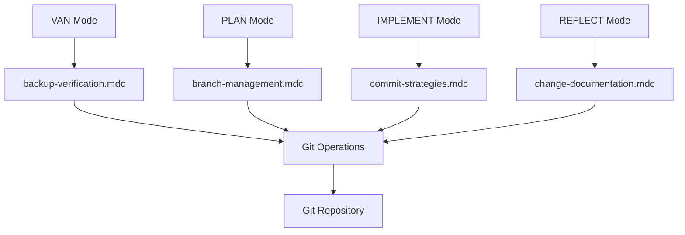
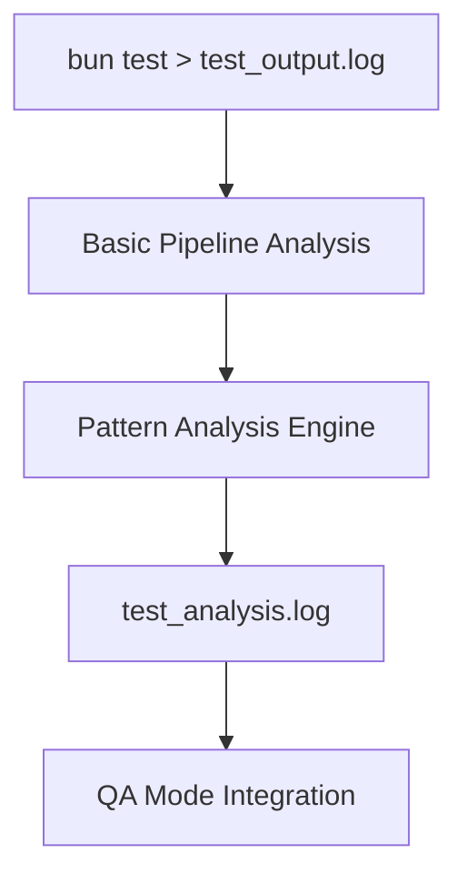
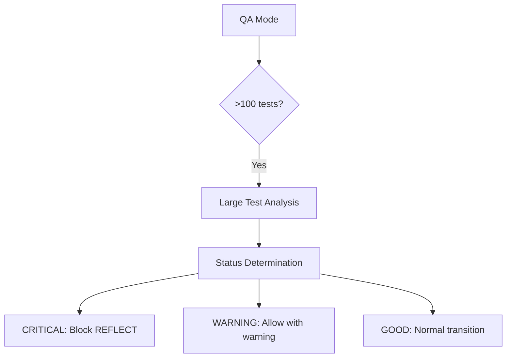

# MEMORY BANK TASKS

**Последнее обновление**: 2024-12-09
**Текущий режим**: CREATIVE
**Активная задача**: RULES-INT-2024-12-09

---

## 🎯 АКТИВНАЯ ЗАДАЧА: RULES-INT-2024-12-09

**Название**: Интеграция правил разработки в Memory Bank
**Тип**: Level 3 (Intermediate Feature)
**Приоритет**: HIGH
**Статус**: 🔄 IN_PROGRESS
**Обновление**: ✅ ТВОРЧЕСКИЕ ФАЗЫ ЗАВЕРШЕНЫ

### Описание задачи:
Интеграция пользовательских правил разработки в систему Memory Bank через создание модульных .mdc файлов с поддержкой git workflow и анализа больших тестовых наборов.

### Фазы выполнения:

#### ✅ Phase 1: Планирование (COMPLETED - 100%)
- [x] Анализ исходных файлов правил (3,678 строк)
- [x] Создание архитектуры интеграции (37 .mdc файлов)
- [x] Планирование Cursor workaround процесса
- [x] Интеграция git workflow из changing_the_rules.md
- [x] Добавление правил анализа больших тестовых наборов
- [x] Создание детального плана Phase 1

**Результаты Phase 1:**
- 📋 rules-integration-plan.md - Общий план интеграции
- 📋 rules-integration-phase1-plan.md - Детальный план Phase 1
- 🎯 37 .mdc файлов специфицированы (было 31)
- 🔧 Git workflow правила интегрированы
- 🧪 Правила анализа больших тестов добавлены

#### ✅ Phase 1.5: Творческие фазы (COMPLETED - 100%)
**Цель**: Архитектурные решения для ключевых компонентов
**Время**: 30 минут
**Статус**: ✅ ВСЕ РЕШЕНИЯ ПРИНЯТЫ

## 🎨 РЕЗУЛЬТАТЫ ТВОРЧЕСКИХ ФАЗ

### ✅ Creative Phase 1: Git Workflow Integration Architecture
**Решение**: Фазово-ориентированная архитектура
- **VAN Mode** → backup-verification.mdc
- **PLAN Mode** → branch-management.mdc
- **IMPLEMENT Mode** → commit-strategies.mdc
- **REFLECT Mode** → change-documentation.mdc
- **Автоматизация**: Коммиты по завершению фаз
- **Backup**: Автоматические backup ветки перед изменениями

### ✅ Creative Phase 2: Large Test Analysis System
**Решение**: Hybrid approach (pipeline + structured analysis)
- **Базовый анализ**: Pipeline bash команд для статистики
- **Паттерн анализ**: Структурированный анализ для 6 типов паттернов
- **Выход**: test_output.log → test_analysis.log
- **Интеграция**: Автоматическая активация при >100 тестах

### ✅ Creative Phase 3: QA Mode Enhancement Architecture
**Решение**: Threshold-based system
- **CRITICAL**: >20% падений → блокировка REFLECT
- **WARNING**: 5-20% падений → предупреждение
- **GOOD**: <5% падений → нормальный переход
- **Автоматизация**: Коммиты результатов QA в git

### ✅ Creative Phase 4: CustomWorkflow Rules Architecture
**Решение**: Category-based organization
- **9 категорий**: Четкое разделение по функциональности
- **37 файлов**: Организованы по категориям
- **Glob паттерны**: Оптимизированы для контекстной загрузки
- **Интеграция**: Каждый режим Memory Bank загружает релевантные категории

## 🏗️ АРХИТЕКТУРНЫЕ ДИАГРАММЫ

### Git Workflow Integration:


### Large Test Analysis System:


### QA Mode Enhancement:


#### 🔄 Phase 2: Cursor Workaround Implementation (READY - 0%)
**Цель**: Создать все 37 .mdc файлов используя Cursor workaround
**Время**: 45 минут
**Статус**: ✅ ГОТОВ К РЕАЛИЗАЦИИ (творческие фазы завершены)

## ДЕТАЛЬНЫЙ ПЛАН PHASE 2 IMPLEMENTATION

### Технологический стек:
- **Файловая система**: .cursor/rules/isolation_rules/CustomWorkflow/
- **Workaround метод**: Cursor directory renaming technique
- **Формат файлов**: .mdc с YAML frontmatter
- **Структура**: 9 категорий, 37 файлов

### Технологическая валидация:
- [x] Существующая структура .cursor/rules/isolation_rules проверена
- [x] Workaround процесс из changing_the_rules.md изучен
- [x] Шаблон .mdc файлов подготовлен
- [x] Все 37 файлов специфицированы
- [x] Категории и glob паттерны определены

### Подробный план реализации:

#### **Этап 2.1: Подготовка Cursor Workaround (5 мин)**
```bash
# Шаг 1: Проверка git статуса
git status
# Ожидаемый результат: clean working tree

# Шаг 2: Создание backup точки
git tag -a "backup-rules-integration-$(date +%Y%m%d-%H%M)" -m "Backup before rules integration"
# Ожидаемый результат: тег создан

# Шаг 3: Переименование .cursor → _cursor
mv .cursor _cursor
# Ожидаемый результат: директория переименована

# Шаг 4: Переименование существующих .mdc файлов
find _cursor -name "*.mdc" -exec sh -c 'mv "$1" "$1.md"' _ {} \;
# Ожидаемый результат: все .mdc файлы стали .mdc.md

# Шаг 5: Создание структуры CustomWorkflow
mkdir -p _cursor/rules/isolation_rules/CustomWorkflow/{planning,implementation,testing,debugging,documentation,integration,refactoring,git-workflow,workflow}
# Ожидаемый результат: 9 директорий созданы
```

#### **Этап 2.2: Создание .mdc.md файлов (30 мин)**

##### **Группа 1: Planning + Git Workflow (8 файлов) - 10 мин**
- [ ] `_cursor/rules/isolation_rules/CustomWorkflow/planning/phased-approach.mdc.md`
- [ ] `_cursor/rules/isolation_rules/CustomWorkflow/planning/progress-documentation.mdc.md`
- [ ] `_cursor/rules/isolation_rules/CustomWorkflow/planning/problem-prioritization.mdc.md`
- [ ] `_cursor/rules/isolation_rules/CustomWorkflow/planning/isolated-design.mdc.md`
- [ ] `_cursor/rules/isolation_rules/CustomWorkflow/git-workflow/commit-strategies.mdc.md` (НОВЫЙ)
- [ ] `_cursor/rules/isolation_rules/CustomWorkflow/git-workflow/branch-management.mdc.md` (НОВЫЙ)
- [ ] `_cursor/rules/isolation_rules/CustomWorkflow/git-workflow/change-documentation.mdc.md` (НОВЫЙ)
- [ ] `_cursor/rules/isolation_rules/CustomWorkflow/git-workflow/backup-verification.mdc.md` (НОВЫЙ)

##### **Группа 2: Implementation + Testing (11 файлов) - 10 мин**
- [ ] `_cursor/rules/isolation_rules/CustomWorkflow/implementation/stub-avoidance.mdc.md`
- [ ] `_cursor/rules/isolation_rules/CustomWorkflow/implementation/robust-search.mdc.md`
- [ ] `_cursor/rules/isolation_rules/CustomWorkflow/implementation/system-coordination.mdc.md`
- [ ] `_cursor/rules/isolation_rules/CustomWorkflow/implementation/dependency-checking.mdc.md`
- [ ] `_cursor/rules/isolation_rules/CustomWorkflow/testing/bun-core-rules.mdc.md`
- [ ] `_cursor/rules/isolation_rules/CustomWorkflow/testing/bun-features.mdc.md`
- [ ] `_cursor/rules/isolation_rules/CustomWorkflow/testing/performance-testing.mdc.md`
- [ ] `_cursor/rules/isolation_rules/CustomWorkflow/testing/edge-cases.mdc.md`
- [ ] `_cursor/rules/isolation_rules/CustomWorkflow/testing/test-organization.mdc.md`
- [ ] `_cursor/rules/isolation_rules/CustomWorkflow/testing/large-test-analysis.mdc.md` (НОВЫЙ)
- [ ] `_cursor/rules/isolation_rules/CustomWorkflow/testing/test-failure-patterns.mdc.md` (НОВЫЙ)

##### **Группа 3: Остальные категории (18 файлов) - 10 мин**

**Debugging (3 файла):**
- [ ] `_cursor/rules/isolation_rules/CustomWorkflow/debugging/tracing-methodology.mdc.md`
- [ ] `_cursor/rules/isolation_rules/CustomWorkflow/debugging/detailed-logging.mdc.md`
- [ ] `_cursor/rules/isolation_rules/CustomWorkflow/debugging/invariant-validation.mdc.md`

**Documentation (3 файла):**
- [ ] `_cursor/rules/isolation_rules/CustomWorkflow/documentation/decision-recording.mdc.md`
- [ ] `_cursor/rules/isolation_rules/CustomWorkflow/documentation/statistics-tracking.mdc.md`
- [ ] `_cursor/rules/isolation_rules/CustomWorkflow/documentation/usage-examples.mdc.md`

**Integration (4 файла):**
- [ ] `_cursor/rules/isolation_rules/CustomWorkflow/integration/isolated-design-rules.mdc.md`
- [ ] `_cursor/rules/isolation_rules/CustomWorkflow/integration/integration-planning.mdc.md`
- [ ] `_cursor/rules/isolation_rules/CustomWorkflow/integration/integration-testing.mdc.md`
- [ ] `_cursor/rules/isolation_rules/CustomWorkflow/integration/dependency-documentation.mdc.md`

**Refactoring (3 файла):**
- [ ] `_cursor/rules/isolation_rules/CustomWorkflow/refactoring/gradual-refactoring.mdc.md`
- [ ] `_cursor/rules/isolation_rules/CustomWorkflow/refactoring/backward-compatibility.mdc.md`
- [ ] `_cursor/rules/isolation_rules/CustomWorkflow/refactoring/quality-metrics.mdc.md`

**Workflow (5 файлов):**
- [ ] `_cursor/rules/isolation_rules/CustomWorkflow/workflow/van-mode-integration.mdc.md`
- [ ] `_cursor/rules/isolation_rules/CustomWorkflow/workflow/plan-mode-integration.mdc.md`
- [ ] `_cursor/rules/isolation_rules/CustomWorkflow/workflow/implement-mode-integration.mdc.md`
- [ ] `_cursor/rules/isolation_rules/CustomWorkflow/workflow/qa-mode-integration.mdc.md` (НОВЫЙ)
- [ ] `_cursor/rules/isolation_rules/CustomWorkflow/workflow/reflect-archive-integration.mdc.md`

#### **Этап 2.3: Восстановление структуры (5 мин)**
```bash
# Шаг 1: Переименование .mdc.md → .mdc
find _cursor -name "*.mdc.md" -exec sh -c 'mv "$1" "${1%.md}"' _ {} \;
# Ожидаемый результат: все .mdc.md файлы стали .mdc

# Шаг 2: Восстановление директории _cursor → .cursor
mv _cursor .cursor
# Ожидаемый результат: директория восстановлена
```

#### **Этап 2.4: Верификация (5 мин)**
```bash
# Проверка 1: Количество созданных файлов
find .cursor/rules/isolation_rules/CustomWorkflow -name "*.mdc" | wc -l
# Ожидаемый результат: 37

# Проверка 2: Структура директорий
ls .cursor/rules/isolation_rules/CustomWorkflow/
# Ожидаемый результат: 9 директорий

# Проверка 3: Отсутствие временных файлов
find .cursor -name "*.mdc.md" | wc -l
# Ожидаемый результат: 0

# Проверка 4: Корректность YAML frontmatter
head -5 .cursor/rules/isolation_rules/CustomWorkflow/planning/phased-approach.mdc
# Ожидаемый результат: YAML заголовок с description, globs, alwaysApply
```

### Критерии завершения Phase 2:
- [ ] Все 37 .mdc файлов созданы
- [ ] Cursor workaround выполнен успешно
- [ ] Структура .cursor восстановлена
- [ ] Git workflow правила интегрированы
- [ ] Анализ больших тестов реализован
- [ ] QA Mode интеграция завершена
- [ ] Все файлы имеют корректные метаданные
- [ ] Glob паттерны настроены правильно

### Потенциальные проблемы и решения:
1. **Проблема**: Cursor блокирует редактирование .mdc файлов
   **Решение**: Использовать workaround с переименованием директории

2. **Проблема**: Неправильные права доступа к файлам
   **Решение**: Проверить права доступа перед началом

3. **Проблема**: Git конфликты при создании backup
   **Решение**: Убедиться в чистом git статусе

4. **Проблема**: Неправильная структура YAML frontmatter
   **Решение**: Использовать стандартный шаблон для всех файлов

#### 📋 Phase 3: Memory Bank Integration (PLANNED)
**Цель**: Интегрировать правила с режимами Memory Bank
**Время**: 30 минут

**Подзадачи Phase 3:**
- [ ] Обновление custom_modes файлов
- [ ] Добавление fetch_rules вызовов
- [ ] Интеграция QA Mode с новыми правилами
- [ ] Тестирование загрузки правил в каждом режиме

#### 📋 Phase 4: Git Integration (PLANNED - НОВАЯ ФАЗА)
**Цель**: Интегрировать git workflow в процесс разработки
**Время**: 15 минут

**Подзадачи Phase 4:**
- [ ] Фиксация всех изменений с фазовыми коммитами
- [ ] Создание тегов версий
- [ ] Документирование в changelog
- [ ] Backup verification

#### 📋 Phase 5: Testing & Validation (PLANNED)
**Цель**: Полное тестирование интеграции
**Время**: 30 минут

#### 📋 Phase 6: Documentation & Archive (PLANNED)
**Цель**: Финализация и архивирование
**Время**: 15 минут

### Новые компоненты (добавлены):

#### 🔧 Git Workflow Integration
- **commit-strategies.mdc**: Стратегии коммитов для разных фаз
- **branch-management.mdc**: Управление ветками в Memory Bank
- **change-documentation.mdc**: Документирование изменений
- **backup-verification.mdc**: Верификация резервных копий

#### 🧪 Large Test Analysis
- **large-test-analysis.mdc**: Анализ больших тестовых наборов (>100 тестов)
- **test-failure-patterns.mdc**: Выявление паттернов падения тестов
- **qa-mode-integration.mdc**: Интеграция QA режима с анализом тестов

#### 📊 Enhanced QA Mode
- Автоматический анализ при >100 тестах
- Сохранение результатов в файлы для анализа
- Выявление паттернов падений
- Интеграция с git workflow

### Критерии успеха:
- ✅ Все 37 .mdc файлов интегрированы (обновлено с 31)
- ✅ Git workflow интегрирован в процесс разработки
- ✅ Анализ больших тестовых наборов работает
- ✅ QA Mode поддерживает расширенный анализ
- ✅ Все режимы Memory Bank загружают соответствующие правила
- ✅ 0 ошибок при загрузке правил
- ✅ Система остается производительной

### Технические детали:
- **Общее количество файлов**: 37 .mdc файлов (было 31)
- **Новые категории**: Git Workflow (4 файла), Enhanced Testing (2 файла)
- **Обновленные категории**: Workflow (+1 файл для QA Mode)
- **Cursor workaround**: Обязательный для создания файлов
- **Git integration**: Фазовые коммиты и backup verification
- **Test analysis**: Файловый анализ для больших тестовых наборов

---

## 📊 ОБЩИЙ ПРОГРЕСС

### Завершенные задачи:
- ✅ **RULES-INT-2024-12-09 Phase 1**: Планирование интеграции правил (100%)

### Активные задачи:
- 🔄 **RULES-INT-2024-12-09 Phase 2**: Cursor Workaround Implementation (0%)

### Запланированные задачи:
- 📋 **RULES-INT-2024-12-09 Phase 3**: Memory Bank Integration
- 📋 **RULES-INT-2024-12-09 Phase 4**: Git Integration (НОВАЯ)
- 📋 **RULES-INT-2024-12-09 Phase 5**: Testing & Validation
- 📋 **RULES-INT-2024-12-09 Phase 6**: Documentation & Archive

---

## 🎯 СЛЕДУЮЩИЕ ШАГИ

1. **Немедленно**: Начать Phase 2 - Cursor Workaround Implementation
2. **После Phase 2**: Перейти к Memory Bank Integration
3. **После Phase 3**: Выполнить Git Integration (новая фаза)
4. **Финал**: Тестирование и документирование

---

**Статус обновления**: ✅ PHASE 2 ДЕТАЛЬНЫЙ ПЛАН СОЗДАН
**Готовность к реализации**: 📋 ГОТОВ К ВЫПОЛНЕНИЮ