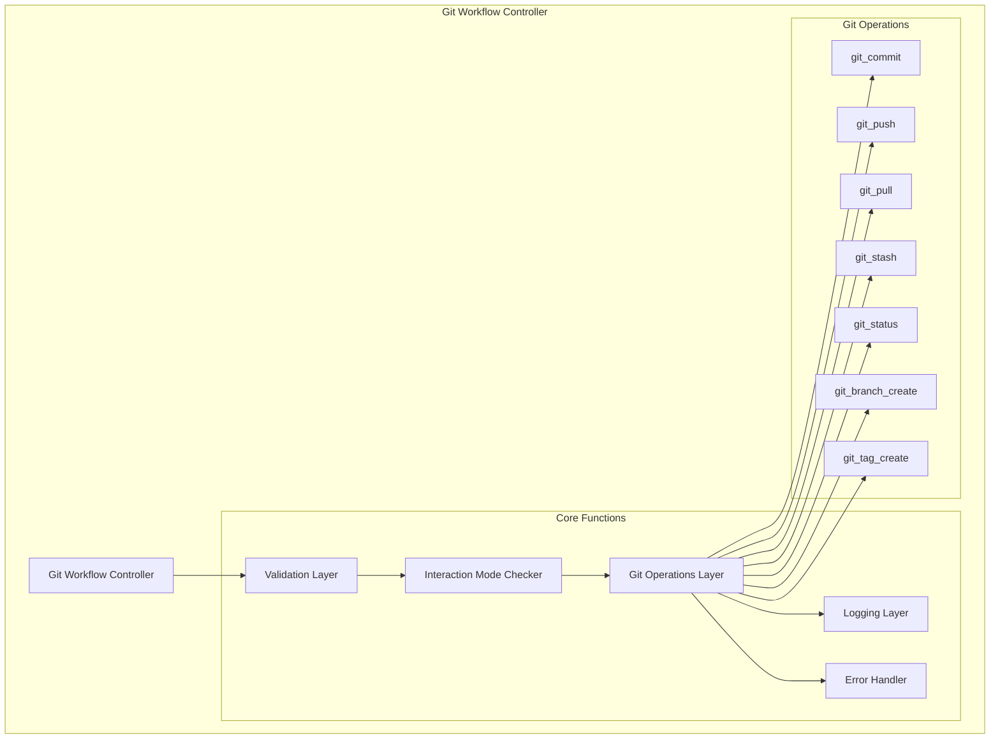
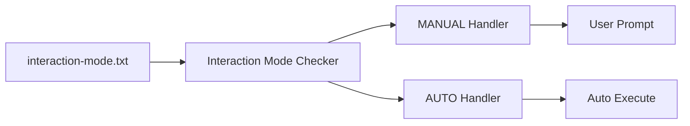
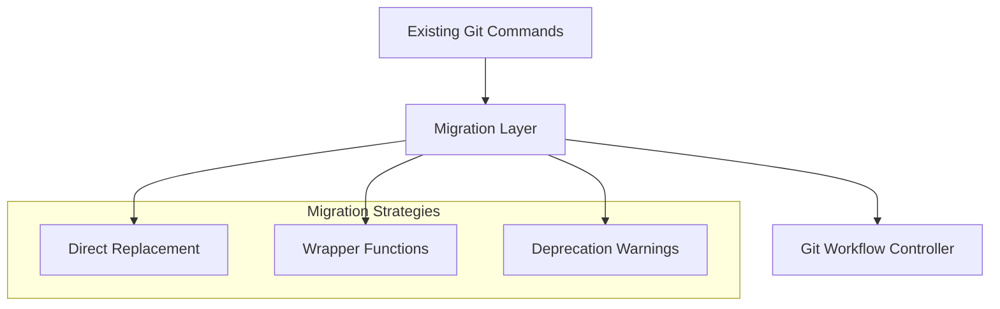
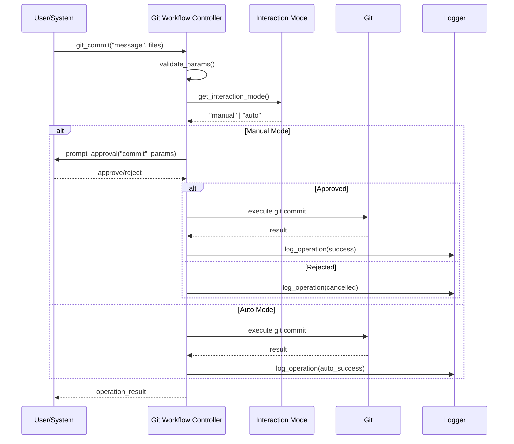
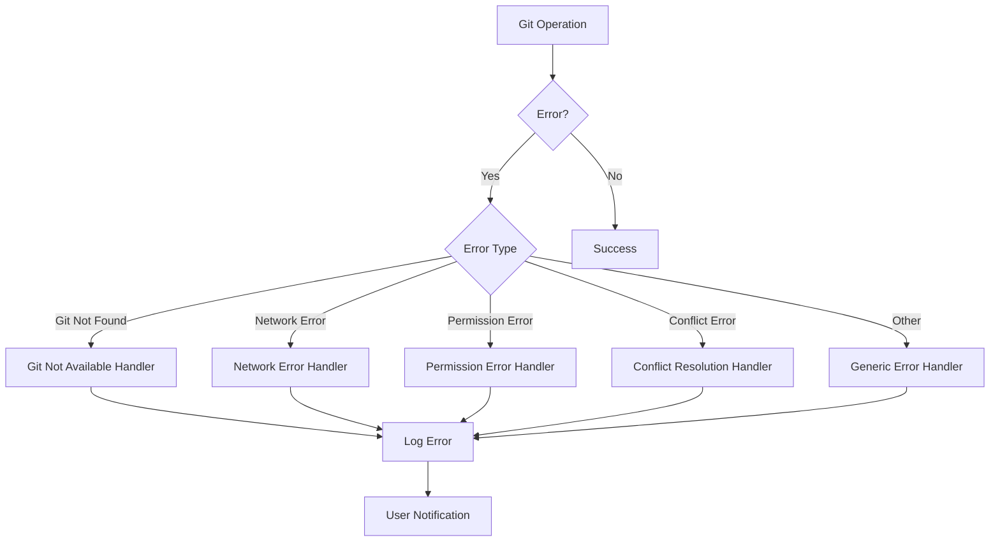

# АРХИТЕКТУРА: Git Workflow Unification

**Задача**: 2025-06-25_ID-003_git-workflow-unification
**Дата**: 2025-06-25
**Режим**: PLAN

## 🏗️ АРХИТЕКТУРНЫЙ ОБЗОР

### Принципы проектирования
- **Single Responsibility**: Один контроллер для всех git операций
- **Separation of Concerns**: Разделение логики git операций и interaction mode
- **Fail-Safe**: Graceful fallback к MANUAL режиму при ошибках
- **Backward Compatibility**: Сохранение совместимости с существующими правилами

## 📋 КОМПОНЕНТЫ СИСТЕМЫ

### 1. Git Workflow Controller (Core)
**Файл**: `_cursor/rules/isolation_rules/Core/git-workflow-controller.mdc.md`



#### Основные функции контроллера:

```bash
# Инициализация контроллера
git_controller_init() {
    # Проверка доступности git
    # Валидация репозитория
    # Инициализация логирования
}

# Основной интерфейс
git_execute_operation(operation, params...) {
    # 1. Валидация входных параметров
    # 2. Проверка interaction-mode
    # 3. Запрос подтверждения (если MANUAL)
    # 4. Выполнение операции
    # 5. Логирование результата
}
```

### 2. Interaction Mode Manager
**Интеграция**: Встроен в Git Workflow Controller



#### Логика проверки режима:

```bash
get_interaction_mode() {
    local mode_file="memory-bank/system/interaction-mode.txt"
    if [[ -f "$mode_file" ]]; then
        cat "$mode_file" | tr '[:upper:]' '[:lower:]'
    else
        echo "manual"  # Default fallback
    fi
}

check_user_approval(operation, params) {
    if [[ "$(get_interaction_mode)" == "manual" ]]; then
        prompt_user_approval "$operation" "$params"
    else
        return 0  # Auto approve
    fi
}
```

### 3. Migration Layer
**Цель**: Обеспечить плавный переход существующих правил



## 🔄 WORKFLOW ДИАГРАММЫ

### Git Operation Flow



### Error Handling Flow



## 📁 СТРУКТУРА ФАЙЛОВ

### Новые файлы
```
_cursor/rules/isolation_rules/Core/
├── git-workflow-controller.mdc.md       # Основной контроллер
├── git-interaction-mode.mdc.md          # Interaction mode интеграция
└── git-migration-helpers.mdc.md         # Помощники миграции
```

### Обновляемые файлы
```
_cursor/rules/isolation_rules/CustomWorkflow/
├── workflow/
│   └── backup-system.mdc.md             # Миграция git операций
├── git-workflow/
│   ├── commit-strategies.mdc.md         # Интеграция с контроллером
│   ├── branch-management.mdc.md         # Замена прямых команд
│   ├── backup-verification.mdc.md       # Добавление interaction-mode
│   └── change-documentation.mdc.md      # Обновление workflow

custom_modes/
├── universal_instructions.md            # Загрузка git-controller
├── plan_instructions.md                 # Интеграция git workflow
├── creative_instructions.md             # Git операции через controller
├── implement_instructions.md            # Миграция git команд
├── qa_instructions.md                   # Обновление git workflow
├── reflect_archive_instructions.md      # Git интеграция
└── van_instructions.md                  # Добавление git support
```

## 🔧 ТЕХНИЧЕСКИЕ ДЕТАЛИ

### API Контроллера

```bash
# === ОСНОВНЫЕ ФУНКЦИИ ===

# Инициализация
git_controller_init()
git_controller_validate_environment()

# Операции с коммитами
git_commit(message, files=[], interactive=false)
git_amend_commit(message="", files=[])

# Операции с ветками
git_push(remote="origin", branch="", force=false)
git_pull(remote="origin", branch="")
git_fetch(remote="origin")

# Управление ветками
git_branch_create(name, from_branch="main")
git_branch_delete(name, force=false)
git_checkout(branch)

# Stash операции
git_stash(message="", include_untracked=false)
git_stash_pop(index=0)
git_stash_list()

# Утилиты
git_status(porcelain=false)
git_log(count=10, oneline=true)
git_diff(cached=false)

# === INTERACTION MODE ===

get_interaction_mode()
set_interaction_mode(mode)  # "auto" | "manual"
prompt_user_approval(operation, details)

# === ЛОГИРОВАНИЕ ===

log_git_operation(operation, params, result, mode)
get_git_operation_history(count=50)
```

### Конфигурация

```bash
# memory-bank/system/git-config.txt
GIT_CONTROLLER_ENABLED=true
GIT_INTERACTION_MODE=manual
GIT_LOG_LEVEL=info
GIT_TIMEOUT=30
GIT_RETRY_COUNT=3
```

## 🚀 ПЛАН МИГРАЦИИ

### Фаза 1: Создание контроллера
1. Создать `git-workflow-controller.mdc.md`
2. Реализовать базовые git операции
3. Интегрировать interaction-mode проверки
4. Добавить логирование и error handling

### Фаза 2: Миграция правил
1. Обновить файлы в `CustomWorkflow/git-workflow/`
2. Заменить прямые git команды на вызовы контроллера
3. Добавить interaction-mode поддержку
4. Обновить `backup-system.mdc.md`

### Фаза 3: Интеграция режимов
1. Обновить все файлы в `custom_modes/`
2. Добавить загрузку git-workflow-controller
3. Документировать новый git workflow
4. Добавить примеры использования

### Фаза 4: Тестирование и валидация
1. Протестировать MANUAL режим
2. Протестировать AUTO режим
3. Проверить обратную совместимость
4. Провести интеграционные тесты

## 📊 MAPPING ТАБЛИЦА

### Миграция git команд

| Старая команда | Новый вызов | Режим |
|----------------|-------------|-------|
| `git commit -m "msg"` | `git_commit("msg")` | interaction-aware |
| `git push origin main` | `git_push("origin", "main")` | interaction-aware |
| `git stash` | `git_stash()` | interaction-aware |
| `git pull origin main` | `git_pull("origin", "main")` | interaction-aware |
| `git checkout -b branch` | `git_branch_create("branch")` | interaction-aware |

### Файлы для обновления

| Файл | Количество git команд | Приоритет |
|------|----------------------|-----------|
| `backup-system.mdc.md` | 7 команд | CRITICAL |
| `commit-strategies.mdc.md` | 5 команд | HIGH |
| `branch-management.mdc.md` | 12 команд | HIGH |
| `backup-verification.mdc.md` | 4 команды | MEDIUM |
| `change-documentation.mdc.md` | 2 команды | LOW |

## 🔍 ВАЛИДАЦИЯ И ТЕСТИРОВАНИЕ

### Unit Tests
- Тестирование каждой git операции
- Проверка interaction-mode логики
- Валидация error handling
- Тестирование логирования

### Integration Tests
- Тестирование полного workflow
- Проверка совместимости с существующими правилами
- Тестирование в различных git состояниях
- Проверка производительности

### User Acceptance Tests
- Тестирование MANUAL режима пользователем
- Проверка AUTO режима
- Валидация user experience
- Тестирование переключения режимов

---

**Статус**: ARCHITECTURE COMPLETE
**Следующий шаг**: Создание детального плана реализации
**Готовность к IMPLEMENT**: 85%