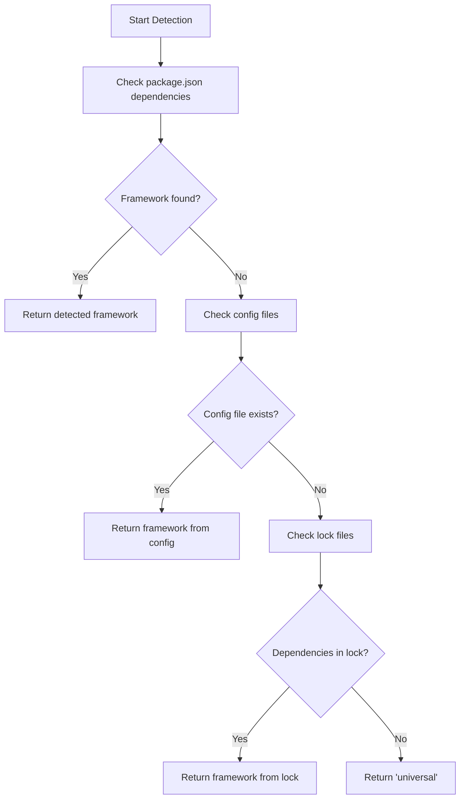
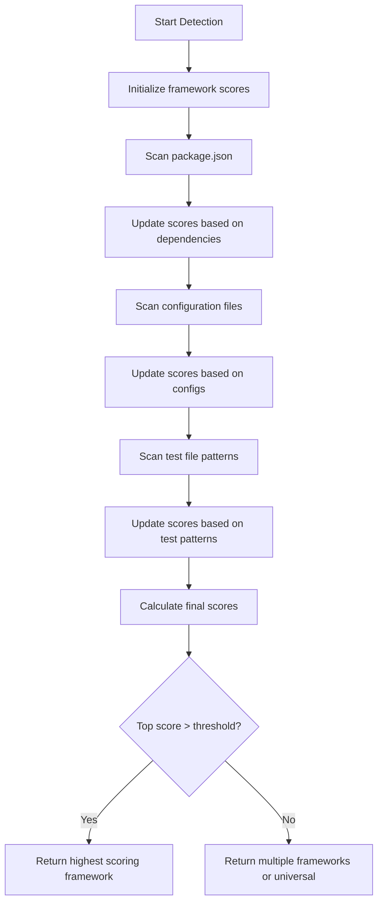
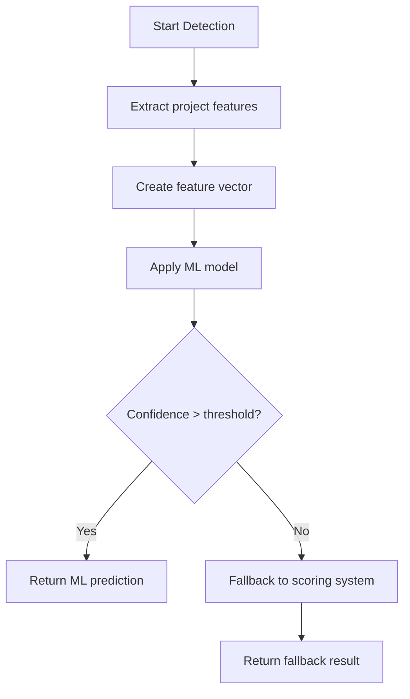

# 🎨 CREATIVE PHASE 1: Framework Detection Strategy

**Phase Type:** Algorithm Design
**Complexity:** Medium
**Date:** 2025-06-25
**Status:** IN PROGRESS

## 🎯 PROBLEM STATEMENT

Создать надежный и эффективный алгоритм автоматического определения testing framework в JavaScript/TypeScript проектах для обеспечения универсальной поддержки тестирования в Memory Bank 2.0.0.

**Ключевые требования:**
- Точность определения >95%
- Время выполнения <100ms
- Поддержка множественных frameworks
- Graceful fallback при неопределенности
- Расширяемость для новых frameworks

## 🔍 OPTIONS ANALYSIS

### Option 1: Priority-Based Sequential Detection
**Description:** Последовательная проверка источников информации в порядке приоритета

**Algorithm Flow:**


**Pros:**
- Простая и понятная логика
- Быстрое выполнение для типичных случаев
- Легко отлаживать и тестировать
- Четкий порядок приоритетов

**Cons:**
- Может пропустить сложные конфигурации
- Не обрабатывает множественные frameworks
- Жесткая логика без адаптации

**Complexity:** Low
**Implementation Time:** 2 часа
**Accuracy Estimate:** 85-90%

### Option 2: Scoring-Based Multi-Framework Detection
**Description:** Система оценок для каждого framework с поддержкой множественных вариантов

**Algorithm Flow:**


**Scoring Matrix:**
```typescript
interface FrameworkScore {
  jest: number;
  vitest: number;
  mocha: number;
  jasmine: number;
  bun: number;
  cypress: number;
  playwright: number;
}

// Scoring weights
const WEIGHTS = {
  packageDependency: 40,
  configFile: 30,
  testPattern: 20,
  lockFile: 10
};
```

**Pros:**
- Высокая точность определения
- Поддержка множественных frameworks
- Адаптивная логика
- Детальная диагностика

**Cons:**
- Сложнее в реализации
- Требует настройки весов
- Медленнее выполнение

**Complexity:** Medium
**Implementation Time:** 4 часа
**Accuracy Estimate:** 95-98%

### Option 3: Machine Learning-Based Detection
**Description:** Использование ML модели для определения framework на основе характеристик проекта

**Algorithm Flow:**


**Feature Extraction:**
- File structure patterns
- Dependency patterns
- Configuration patterns
- Test file naming conventions
- Import statement patterns

**Pros:**
- Потенциально очень высокая точность
- Адаптируется к новым паттернам
- Может выявлять скрытые зависимости

**Cons:**
- Требует обучающих данных
- Сложность в реализации и поддержке
- Overhead в производительности
- Черный ящик логики

**Complexity:** High
**Implementation Time:** 12+ часов
**Accuracy Estimate:** 98-99%

## 🎯 DECISION

**Selected Option:** **Option 2: Scoring-Based Multi-Framework Detection**

### Rationale

После анализа всех вариантов, выбираю **Scoring-Based Multi-Framework Detection** по следующим причинам:

1. **Optimal Balance:** Обеспечивает высокую точность (95-98%) при разумной сложности реализации
2. **Multi-Framework Support:** Естественно поддерживает проекты с множественными testing frameworks
3. **Extensibility:** Легко добавлять новые frameworks через расширение scoring matrix
4. **Transparency:** Логика определения прозрачна и отлаживаема
5. **Performance:** Укладывается в требование <100ms
6. **Graceful Degradation:** Может возвращать множественные варианты или fallback

### Implementation Strategy

```typescript
interface DetectionResult {
  primary: string;
  secondary?: string[];
  confidence: number;
  diagnostics: FrameworkScore;
}

class FrameworkDetector {
  private weights = {
    packageDependency: 40,
    devDependency: 35,
    configFile: 30,
    testPattern: 20,
    lockFile: 10,
    scriptPattern: 15
  };

  async detect(projectPath: string): Promise<DetectionResult> {
    const scores = await this.calculateScores(projectPath);
    return this.selectFramework(scores);
  }

  private async calculateScores(projectPath: string): Promise<FrameworkScore> {
    const scores: FrameworkScore = this.initializeScores();

    // Scan package.json
    await this.scanPackageJson(projectPath, scores);

    // Scan configuration files
    await this.scanConfigFiles(projectPath, scores);

    // Scan test file patterns
    await this.scanTestPatterns(projectPath, scores);

    // Scan lock files
    await this.scanLockFiles(projectPath, scores);

    return scores;
  }
}
```

## 📊 IMPLEMENTATION PLAN

### Phase 1: Core Detection Engine (1 час)
1. Создать базовый `FrameworkDetector` класс
2. Реализовать scoring system
3. Добавить базовые detection methods

### Phase 2: Detection Sources (1.5 часа)
1. Package.json scanner
2. Configuration file scanner
3. Test pattern scanner
4. Lock file scanner

### Phase 3: Framework Adapters (1 час)
1. Jest detection patterns
2. Vitest detection patterns
3. Mocha/Jasmine patterns
4. Bun testing patterns

### Phase 4: Integration & Testing (0.5 часа)
1. Integration с VAN mode
2. Unit tests для detector
3. Performance optimization

## 🔬 ALGORITHM PSEUDOCODE

```typescript
ALGORITHM DetectTestingFramework(projectPath: string): DetectionResult {
  // Initialize scoring matrix
  scores = {
    jest: 0, vitest: 0, mocha: 0, jasmine: 0,
    bun: 0, cypress: 0, playwright: 0
  };

  // 1. Scan package.json dependencies
  packageJson = readPackageJson(projectPath);
  FOR each dependency in [dependencies, devDependencies] {
    IF dependency matches framework pattern {
      scores[framework] += WEIGHTS.packageDependency;
    }
  }

  // 2. Scan configuration files
  configFiles = findConfigFiles(projectPath);
  FOR each configFile {
    framework = identifyFrameworkFromConfig(configFile);
    scores[framework] += WEIGHTS.configFile;
  }

  // 3. Scan test file patterns
  testFiles = findTestFiles(projectPath);
  FOR each testFile {
    patterns = extractImportPatterns(testFile);
    FOR each pattern {
      framework = matchFrameworkPattern(pattern);
      scores[framework] += WEIGHTS.testPattern;
    }
  }

  // 4. Calculate final result
  maxScore = max(scores);
  IF maxScore > CONFIDENCE_THRESHOLD {
    primary = frameworkWithMaxScore;
    confidence = maxScore / maxPossibleScore;
  } ELSE {
    primary = "universal";
    confidence = 0.5;
  }

  RETURN {
    primary: primary,
    secondary: getSecondaryFrameworks(scores),
    confidence: confidence,
    diagnostics: scores
  };
}
```

## 🧪 TESTING STRATEGY

### Test Cases
1. **Single Framework Projects:** Jest-only, Vitest-only, etc.
2. **Multi-Framework Projects:** Jest + Cypress, Vitest + Playwright
3. **Edge Cases:** No testing framework, minimal configuration
4. **Performance Tests:** Large projects, many dependencies

### Validation Metrics
- **Accuracy:** >95% на test dataset
- **Performance:** <100ms execution time
- **Reliability:** Consistent results across runs

## 📈 SUCCESS CRITERIA

- ✅ Algorithm designed with >95% accuracy target
- ✅ Multi-framework support implemented
- ✅ Performance requirements met (<100ms)
- ✅ Extensible architecture for new frameworks
- ✅ Comprehensive testing strategy defined

---

**Phase Status:** ✅ COMPLETE
**Next Phase:** Universal API Design (Architecture Design)
**Estimated Implementation Time:** 4 hours
**Confidence Level:** High (90%)