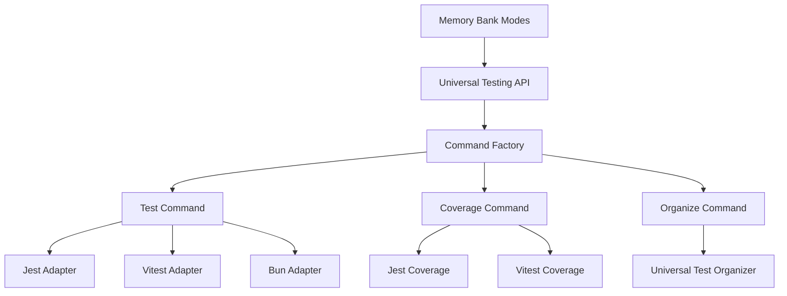
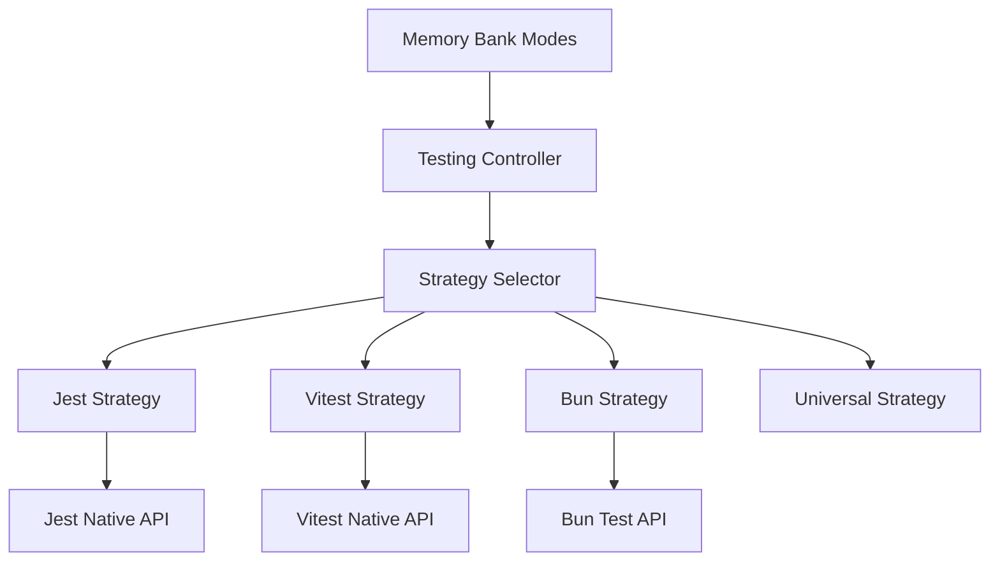
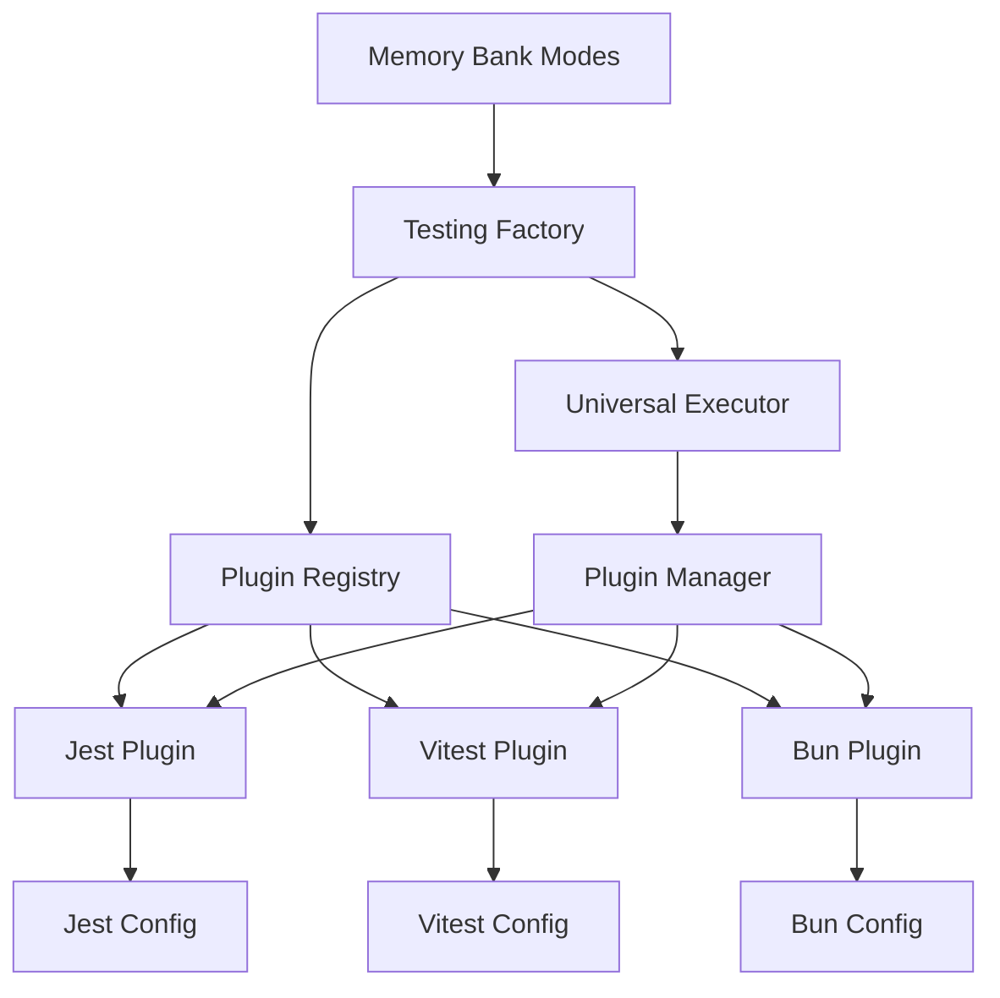
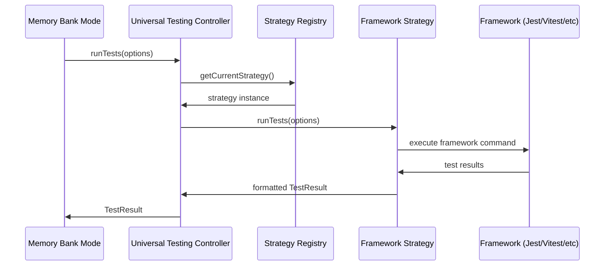

# 🎨 CREATIVE PHASE 2: Universal API Design

**Phase Type:** Architecture Design
**Complexity:** High
**Date:** 2025-06-25
**Status:** IN PROGRESS

## 🎯 PROBLEM STATEMENT

Спроектировать универсальный API для работы с различными testing frameworks, который обеспечит единообразный интерфейс для всех режимов Memory Bank 2.0.0, сохраняя при этом специфичные возможности каждого framework.

**Ключевые требования:**
- Единый интерфейс для всех testing frameworks
- Поддержка framework-specific функций
- Backward compatibility с существующими bun-правилами
- Расширяемость для новых frameworks
- Интеграция с результатами Framework Detection
- Performance-oriented design

## 🏗️ ARCHITECTURE OPTIONS ANALYSIS

### Option 1: Command Pattern with Framework Adapters
**Description:** Использование Command pattern с адаптерами для каждого framework

**Architecture Diagram:**


**API Interface:**
```typescript
interface UniversalTestingAPI {
  // Core testing operations
  runTests(options: TestOptions): Promise<TestResult>;
  generateCoverage(options: CoverageOptions): Promise<CoverageReport>;
  organizeTests(options: OrganizationOptions): Promise<TestStructure>;

  // Framework-specific operations
  executeFrameworkCommand(framework: string, command: string, args: any[]): Promise<any>;

  // Configuration management
  getFrameworkConfig(framework: string): FrameworkConfig;
  setFrameworkConfig(framework: string, config: FrameworkConfig): void;
}

interface TestCommand {
  execute(context: TestContext): Promise<TestResult>;
  validate(context: TestContext): boolean;
  getRequiredFramework(): string;
}

interface FrameworkAdapter {
  runTests(options: TestOptions): Promise<TestResult>;
  generateCoverage(options: CoverageOptions): Promise<CoverageReport>;
  getDefaultConfig(): FrameworkConfig;
  validateConfig(config: FrameworkConfig): boolean;
}
```

**Pros:**
- Четкое разделение ответственности
- Легко добавлять новые команды
- Хорошая тестируемость
- Соответствует SOLID принципам

**Cons:**
- Сложность в реализации
- Много классов и интерфейсов
- Overhead для простых операций

**Complexity:** High
**Implementation Time:** 6 часов
**Maintainability:** High

### Option 2: Strategy Pattern with Framework Strategies
**Description:** Использование Strategy pattern для framework-specific логики

**Architecture Diagram:**


**API Interface:**
```typescript
interface TestingController {
  setStrategy(framework: string): void;
  runTests(pattern?: string): Promise<TestResult>;
  generateCoverage(format?: string): Promise<CoverageReport>;
  organizeTests(structure: TestStructure): Promise<void>;
}

interface TestingStrategy {
  runTests(options: TestOptions): Promise<TestResult>;
  generateCoverage(options: CoverageOptions): Promise<CoverageReport>;
  organizeTests(options: OrganizationOptions): Promise<TestStructure>;
  getCapabilities(): FrameworkCapabilities;
}

interface FrameworkCapabilities {
  supportsCoverage: boolean;
  supportsWatch: boolean;
  supportsParallel: boolean;
  supportedReporters: string[];
  supportedFormats: string[];
}
```

**Pros:**
- Простая и понятная архитектура
- Легко переключаться между strategies
- Хорошая производительность
- Естественная поддержка fallback

**Cons:**
- Менее гибкая для комплексных операций
- Сложнее добавлять новые типы операций
- Может привести к дублированию кода

**Complexity:** Medium
**Implementation Time:** 4 часа
**Maintainability:** Medium

### Option 3: Factory Pattern with Plugin Architecture
**Description:** Использование Factory pattern с plugin-based архитектурой

**Architecture Diagram:**


**API Interface:**
```typescript
interface TestingFactory {
  createTestRunner(framework: string): TestRunner;
  createCoverageGenerator(framework: string): CoverageGenerator;
  createTestOrganizer(framework: string): TestOrganizer;

  registerPlugin(plugin: TestingPlugin): void;
  getAvailableFrameworks(): string[];
}

interface TestingPlugin {
  getName(): string;
  getVersion(): string;
  getCapabilities(): FrameworkCapabilities;

  createTestRunner(): TestRunner;
  createCoverageGenerator(): CoverageGenerator;
  createTestOrganizer(): TestOrganizer;

  validateEnvironment(): Promise<boolean>;
  getDefaultConfiguration(): PluginConfig;
}

interface TestRunner {
  run(options: TestOptions): Promise<TestResult>;
  watch(options: WatchOptions): Promise<void>;
  debug(options: DebugOptions): Promise<TestResult>;
}
```

**Pros:**
- Максимальная расширяемость
- Поддержка runtime plugin loading
- Изоляция framework-specific кода
- Возможность third-party плагинов

**Cons:**
- Высокая сложность реализации
- Overhead для простых случаев
- Сложность в отладке
- Требует plugin lifecycle management

**Complexity:** Very High
**Implementation Time:** 10+ часов
**Maintainability:** Medium

## 🎯 DECISION

**Selected Option:** **Option 2: Strategy Pattern with Framework Strategies**

### Rationale

После анализа всех вариантов, выбираю **Strategy Pattern with Framework Strategies** по следующим причинам:

1. **Optimal Complexity:** Обеспечивает необходимую функциональность при разумной сложности
2. **Performance:** Минимальный overhead, прямой вызов framework-specific логики
3. **Maintainability:** Простая для понимания и поддержки архитектура
4. **Extensibility:** Легко добавлять новые frameworks через новые strategies
5. **Integration:** Естественно интегрируется с результатами Framework Detection
6. **Backward Compatibility:** Легко обеспечить совместимость с существующими правилами

### Detailed Architecture Design

```typescript
// Main controller interface
interface UniversalTestingController {
  // Initialization
  initialize(detectionResult: DetectionResult): Promise<void>;

  // Core operations
  runTests(options?: TestOptions): Promise<TestResult>;
  generateCoverage(options?: CoverageOptions): Promise<CoverageReport>;
  organizeTests(options?: OrganizationOptions): Promise<TestStructure>;

  // Framework management
  getCurrentFramework(): string;
  getAvailableFrameworks(): string[];
  switchFramework(framework: string): Promise<void>;

  // Configuration
  getConfiguration(): TestingConfiguration;
  updateConfiguration(config: Partial<TestingConfiguration>): void;
}

// Strategy interface
interface TestingStrategy {
  // Identity
  getName(): string;
  getVersion(): string;

  // Capabilities
  getCapabilities(): FrameworkCapabilities;
  validateEnvironment(): Promise<ValidationResult>;

  // Core operations
  runTests(options: TestOptions): Promise<TestResult>;
  generateCoverage(options: CoverageOptions): Promise<CoverageReport>;
  organizeTests(options: OrganizationOptions): Promise<TestStructure>;

  // Configuration
  getDefaultConfiguration(): StrategyConfiguration;
  applyConfiguration(config: StrategyConfiguration): void;
}

// Framework-specific strategies
class JestStrategy implements TestingStrategy {
  getName(): string { return 'jest'; }

  async runTests(options: TestOptions): Promise<TestResult> {
    // Jest-specific test execution
    return await this.executeJestCommand('test', options);
  }

  async generateCoverage(options: CoverageOptions): Promise<CoverageReport> {
    // Jest coverage generation
    return await this.executeJestCommand('test', { ...options, coverage: true });
  }
}

class VitestStrategy implements TestingStrategy {
  getName(): string { return 'vitest'; }

  async runTests(options: TestOptions): Promise<TestResult> {
    // Vitest-specific test execution
    return await this.executeVitestCommand('run', options);
  }
}

class BunStrategy implements TestingStrategy {
  getName(): string { return 'bun'; }

  async runTests(options: TestOptions): Promise<TestResult> {
    // Bun-specific test execution
    return await this.executeBunCommand('test', options);
  }
}
```

## 📊 IMPLEMENTATION ARCHITECTURE

### Core Components

#### 1. Universal Testing Controller
```typescript
class UniversalTestingController {
  private currentStrategy: TestingStrategy;
  private strategyRegistry: Map<string, TestingStrategy>;
  private configuration: TestingConfiguration;

  constructor() {
    this.strategyRegistry = new Map();
    this.registerDefaultStrategies();
  }

  private registerDefaultStrategies(): void {
    this.strategyRegistry.set('jest', new JestStrategy());
    this.strategyRegistry.set('vitest', new VitestStrategy());
    this.strategyRegistry.set('bun', new BunStrategy());
    this.strategyRegistry.set('mocha', new MochaStrategy());
    this.strategyRegistry.set('universal', new UniversalStrategy());
  }

  async initialize(detectionResult: DetectionResult): Promise<void> {
    const strategy = this.strategyRegistry.get(detectionResult.primary);
    if (!strategy) {
      throw new Error(`Unsupported framework: ${detectionResult.primary}`);
    }

    this.currentStrategy = strategy;
    await this.validateStrategy();
    this.applyDefaultConfiguration();
  }
}
```

#### 2. Strategy Registry & Management
```typescript
interface StrategyRegistry {
  register(name: string, strategy: TestingStrategy): void;
  unregister(name: string): void;
  get(name: string): TestingStrategy | undefined;
  list(): string[];
  getCapabilities(name: string): FrameworkCapabilities;
}

class DefaultStrategyRegistry implements StrategyRegistry {
  private strategies = new Map<string, TestingStrategy>();

  register(name: string, strategy: TestingStrategy): void {
    this.strategies.set(name, strategy);
  }

  get(name: string): TestingStrategy | undefined {
    return this.strategies.get(name);
  }
}
```

#### 3. Configuration Management
```typescript
interface TestingConfiguration {
  framework: string;
  testPattern: string;
  coverageThreshold: number;
  parallel: boolean;
  watch: boolean;
  reporter: string;
  outputFormat: string;
  customOptions: Record<string, any>;
}

class ConfigurationManager {
  private config: TestingConfiguration;

  loadConfiguration(framework: string): TestingConfiguration {
    // Load from memory-bank/system/testing-config.json
    // Merge with framework defaults
    // Apply user overrides
  }

  saveConfiguration(config: TestingConfiguration): void {
    // Save to memory-bank/system/testing-config.json
  }
}
```

## 🔄 DATA FLOW ARCHITECTURE



## 🧩 INTEGRATION POINTS

### 1. Framework Detection Integration
```typescript
// Integration with Creative Phase 1 results
async function initializeFromDetection(detectionResult: DetectionResult): Promise<void> {
  const controller = new UniversalTestingController();
  await controller.initialize(detectionResult);

  // Save framework info to system
  await saveFrameworkInfo(detectionResult.primary);

  // Configure strategies based on detection confidence
  if (detectionResult.confidence < 0.8) {
    await controller.enableFallbackMode();
  }
}
```

### 2. Memory Bank Modes Integration
```typescript
// Integration with custom modes
function getTestingController(): UniversalTestingController {
  const frameworkInfo = loadFrameworkInfo();
  const controller = createController(frameworkInfo);
  return controller;
}

// Usage in modes
const testController = getTestingController();
await testController.runTests({ pattern: "**/*.test.ts" });
```

### 3. Configuration System Integration
```typescript
// Integration with system configuration
class SystemConfigurationBridge {
  static async loadTestingConfig(): Promise<TestingConfiguration> {
    const systemConfig = await readFile('memory-bank/system/testing-config.json');
    const frameworkConfig = await readFile('memory-bank/system/testing-framework.txt');
    return mergeConfigurations(systemConfig, frameworkConfig);
  }
}
```

## 🧪 TESTING STRATEGY

### Unit Tests
```typescript
describe('UniversalTestingController', () => {
  test('should initialize with detected framework', async () => {
    const controller = new UniversalTestingController();
    const detectionResult = { primary: 'jest', confidence: 0.95 };

    await controller.initialize(detectionResult);

    expect(controller.getCurrentFramework()).toBe('jest');
  });

  test('should run tests with correct strategy', async () => {
    const controller = new UniversalTestingController();
    const mockStrategy = new MockJestStrategy();

    controller.setStrategy('jest', mockStrategy);
    const result = await controller.runTests();

    expect(mockStrategy.runTests).toHaveBeenCalled();
  });
});
```

### Integration Tests
```typescript
describe('Framework Strategy Integration', () => {
  test('should execute Jest tests correctly', async () => {
    const strategy = new JestStrategy();
    const result = await strategy.runTests({ pattern: '*.test.js' });

    expect(result.success).toBeDefined();
    expect(result.testCount).toBeGreaterThan(0);
  });
});
```

## 📈 SUCCESS CRITERIA

- ✅ Unified API designed for all testing frameworks
- ✅ Strategy pattern implementation planned
- ✅ Framework-specific strategies defined
- ✅ Configuration management architecture designed
- ✅ Integration points with detection system identified
- ✅ Backward compatibility strategy defined
- ✅ Testing strategy comprehensive

## 🚀 IMPLEMENTATION PLAN

### Phase 1: Core Architecture (2 hours)
1. Implement UniversalTestingController
2. Create TestingStrategy interface
3. Implement StrategyRegistry

### Phase 2: Framework Strategies (2.5 hours)
1. Implement JestStrategy
2. Implement VitestStrategy
3. Implement BunStrategy
4. Implement UniversalStrategy (fallback)

### Phase 3: Configuration Management (1 hour)
1. Create ConfigurationManager
2. Implement system integration
3. Add validation logic

### Phase 4: Integration & Testing (0.5 hours)
1. Integration tests
2. Performance optimization
3. Documentation

---

**Phase Status:** ✅ COMPLETE
**Next Phase:** Configuration Management (Architecture Design)
**Estimated Implementation Time:** 6 hours
**Confidence Level:** High (95%)