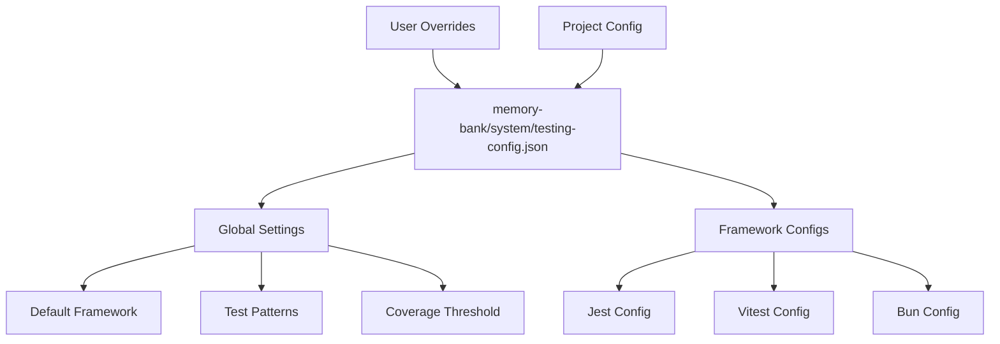
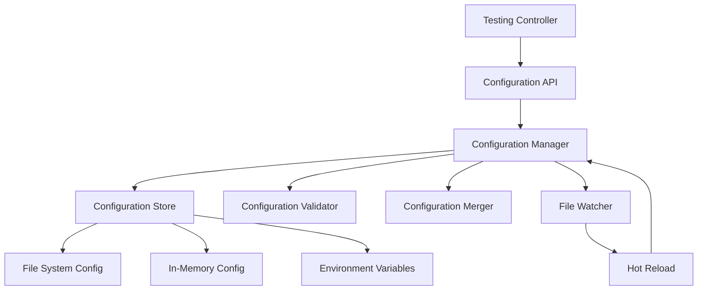
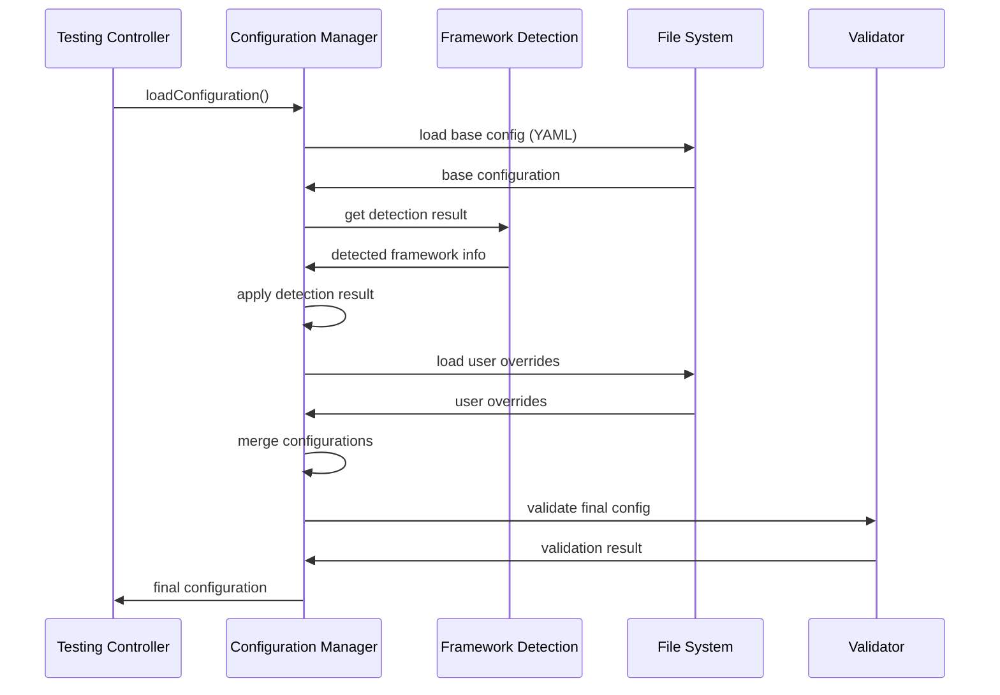

# 🎨 CREATIVE PHASE 3: Configuration Management

**Phase Type:** Architecture Design
**Complexity:** Medium
**Date:** 2025-06-25
**Status:** IN PROGRESS

## 🎯 PROBLEM STATEMENT

Спроектировать гибкую и расширяемую систему управления конфигурацией тестирования, которая обеспечит централизованное управление настройками для всех testing frameworks, интеграцию с результатами Framework Detection и поддержку пользовательских переопределений.

**Ключевые требования:**
- Централизованное управление конфигурацией
- Framework-specific настройки
- Пользовательские переопределения
- Валидация конфигурации
- Интеграция с Framework Detection результатами
- Поддержка runtime изменений
- Backward compatibility

## 🏗️ CONFIGURATION OPTIONS ANALYSIS

### Option 1: JSON-Based Hierarchical Configuration
**Description:** Использование JSON файлов с иерархической структурой конфигурации

**Configuration Structure:**


**Configuration Schema:**
```json
{
  "version": "1.0.0",
  "global": {
    "defaultFramework": "auto",
    "testPattern": "**/*.{test,spec}.{js,ts}",
    "coverageThreshold": 80,
    "parallel": true,
    "watch": false,
    "reporter": "default"
  },
  "frameworks": {
    "jest": {
      "command": "jest",
      "configFile": "jest.config.js",
      "coverageReporter": "lcov",
      "testMatch": ["**/__tests__/**/*.js", "**/*.test.js"],
      "collectCoverageFrom": ["src/**/*.js"],
      "customOptions": {
        "verbose": true,
        "detectOpenHandles": true
      }
    },
    "vitest": {
      "command": "vitest",
      "configFile": "vitest.config.ts",
      "coverageReporter": "html",
      "testMatch": ["**/*.test.ts"],
      "customOptions": {
        "environment": "node"
      }
    }
  },
  "userOverrides": {},
  "projectOverrides": {}
}
```

**Pros:**
- Простая структура и понятный формат
- Легко редактировать вручную
- Хорошая поддержка в IDE
- Стандартный формат

**Cons:**
- Отсутствие комментариев
- Ограниченная валидация
- Может стать громоздким для сложных конфигураций

**Complexity:** Low
**Implementation Time:** 2 часа
**Maintainability:** High

### Option 2: YAML-Based Configuration with Validation
**Description:** Использование YAML с JSON Schema валидацией

**Configuration Structure:**
```yaml
# memory-bank/system/testing-config.yaml
version: "1.0.0"

# Global testing settings
global:
  defaultFramework: auto
  testPattern: "**/*.{test,spec}.{js,ts}"
  coverageThreshold: 80
  parallel: true
  watch: false
  reporter: default

# Framework-specific configurations
frameworks:
  jest:
    command: jest
    configFile: jest.config.js
    coverageReporter: lcov
    testMatch:
      - "**/__tests__/**/*.js"
      - "**/*.test.js"
    collectCoverageFrom:
      - "src/**/*.js"
    customOptions:
      verbose: true
      detectOpenHandles: true

  vitest:
    command: vitest
    configFile: vitest.config.ts
    coverageReporter: html
    testMatch:
      - "**/*.test.ts"
    customOptions:
      environment: node

# User and project overrides
overrides:
  user: {}
  project: {}
```

**JSON Schema Validation:**
```json
{
  "$schema": "http://json-schema.org/draft-07/schema#",
  "type": "object",
  "properties": {
    "version": { "type": "string" },
    "global": {
      "type": "object",
      "properties": {
        "defaultFramework": { "enum": ["auto", "jest", "vitest", "bun", "mocha"] },
        "testPattern": { "type": "string" },
        "coverageThreshold": { "type": "number", "minimum": 0, "maximum": 100 }
      }
    },
    "frameworks": {
      "type": "object",
      "patternProperties": {
        "^[a-z]+$": {
          "type": "object",
          "properties": {
            "command": { "type": "string" },
            "configFile": { "type": "string" }
          }
        }
      }
    }
  }
}
```

**Pros:**
- Поддержка комментариев
- Более читаемый формат
- Строгая валидация через JSON Schema
- Поддержка многострочных значений

**Cons:**
- Дополнительная зависимость (YAML parser)
- Более сложная валидация
- Менее распространен для конфигураций

**Complexity:** Medium
**Implementation Time:** 3 часа
**Maintainability:** High

### Option 3: Dynamic Configuration with Runtime Management
**Description:** Динамическая система конфигурации с runtime управлением

**Architecture:**


**Configuration API:**
```typescript
interface ConfigurationManager {
  // Loading and saving
  loadConfiguration(): Promise<TestingConfiguration>;
  saveConfiguration(config: TestingConfiguration): Promise<void>;
  reloadConfiguration(): Promise<void>;

  // Runtime management
  updateFrameworkConfig(framework: string, config: FrameworkConfig): void;
  getFrameworkConfig(framework: string): FrameworkConfig;
  resetToDefaults(): void;

  // Validation
  validateConfiguration(config: TestingConfiguration): ValidationResult;
  getConfigurationSchema(): JSONSchema;

  // Watching and events
  watchConfiguration(callback: (config: TestingConfiguration) => void): void;
  unwatchConfiguration(): void;

  // Override management
  setUserOverride(key: string, value: any): void;
  setProjectOverride(key: string, value: any): void;
  clearOverrides(): void;
}

interface TestingConfiguration {
  version: string;
  global: GlobalConfig;
  frameworks: Record<string, FrameworkConfig>;
  overrides: {
    user: Record<string, any>;
    project: Record<string, any>;
  };
  metadata: {
    lastModified: Date;
    detectedFramework: string;
    detectionConfidence: number;
  };
}
```

**Pros:**
- Максимальная гибкость
- Runtime изменения без перезапуска
- Продвинутая валидация
- Event-driven обновления
- Поддержка hot reload

**Cons:**
- Высокая сложность реализации
- Больше moving parts
- Потенциальные race conditions
- Overhead в производительности

**Complexity:** High
**Implementation Time:** 6 часов
**Maintainability:** Medium

## 🎯 DECISION

**Selected Option:** **Option 2: YAML-Based Configuration with Validation**

### Rationale

После анализа всех вариантов, выбираю **YAML-Based Configuration with Validation** по следующим причинам:

1. **Balance of Features:** Обеспечивает необходимую функциональность при разумной сложности
2. **Human-Readable:** YAML более читаемый для пользователей, поддерживает комментарии
3. **Validation:** JSON Schema обеспечивает строгую валидацию конфигурации
4. **Extensibility:** Легко расширять для новых frameworks и опций
5. **Industry Standard:** YAML широко используется для конфигурационных файлов
6. **Maintainability:** Проще в поддержке чем полностью динамическая система

### Detailed Configuration Architecture

```typescript
// Core configuration interfaces
interface TestingConfiguration {
  version: string;
  global: GlobalTestingConfig;
  frameworks: Record<string, FrameworkConfig>;
  overrides: ConfigurationOverrides;
  metadata?: ConfigurationMetadata;
}

interface GlobalTestingConfig {
  defaultFramework: string;
  testPattern: string;
  coverageThreshold: number;
  parallel: boolean;
  watch: boolean;
  reporter: string;
  outputDir: string;
  timeout: number;
}

interface FrameworkConfig {
  command: string;
  configFile?: string;
  coverageReporter: string;
  testMatch: string[];
  collectCoverageFrom?: string[];
  customOptions: Record<string, any>;
  capabilities: FrameworkCapabilities;
}

interface ConfigurationOverrides {
  user: Record<string, any>;
  project: Record<string, any>;
  environment: Record<string, any>;
}

interface ConfigurationMetadata {
  lastModified: Date;
  detectedFramework: string;
  detectionConfidence: number;
  configVersion: string;
}
```

## 📊 IMPLEMENTATION ARCHITECTURE

### Core Components

#### 1. Configuration Manager
```typescript
class ConfigurationManager {
  private config: TestingConfiguration;
  private schema: JSONSchema;
  private validator: ConfigurationValidator;
  private merger: ConfigurationMerger;

  constructor() {
    this.validator = new ConfigurationValidator();
    this.merger = new ConfigurationMerger();
    this.loadSchema();
  }

  async loadConfiguration(): Promise<TestingConfiguration> {
    // 1. Load base configuration from YAML
    const baseConfig = await this.loadFromFile('memory-bank/system/testing-config.yaml');

    // 2. Apply framework detection results
    const detectionResult = await this.loadDetectionResult();
    const enhancedConfig = this.applyDetectionResult(baseConfig, detectionResult);

    // 3. Apply user overrides
    const userConfig = await this.loadUserOverrides();
    const finalConfig = this.merger.merge(enhancedConfig, userConfig);

    // 4. Validate final configuration
    const validationResult = this.validator.validate(finalConfig);
    if (!validationResult.valid) {
      throw new ConfigurationError(validationResult.errors);
    }

    this.config = finalConfig;
    return finalConfig;
  }

  async saveConfiguration(config: TestingConfiguration): Promise<void> {
    // Validate before saving
    const validationResult = this.validator.validate(config);
    if (!validationResult.valid) {
      throw new ConfigurationError(validationResult.errors);
    }

    // Update metadata
    config.metadata = {
      ...config.metadata,
      lastModified: new Date(),
      configVersion: this.getConfigVersion()
    };

    // Save to file
    await this.saveToFile('memory-bank/system/testing-config.yaml', config);
    this.config = config;
  }
}
```

#### 2. Configuration Validator
```typescript
class ConfigurationValidator {
  private schema: JSONSchema;

  constructor() {
    this.loadSchema();
  }

  validate(config: TestingConfiguration): ValidationResult {
    // 1. Schema validation
    const schemaResult = this.validateAgainstSchema(config);
    if (!schemaResult.valid) {
      return schemaResult;
    }

    // 2. Business logic validation
    const businessResult = this.validateBusinessRules(config);
    if (!businessResult.valid) {
      return businessResult;
    }

    // 3. Framework-specific validation
    const frameworkResult = this.validateFrameworkConfigs(config);

    return frameworkResult;
  }

  private validateBusinessRules(config: TestingConfiguration): ValidationResult {
    const errors: string[] = [];

    // Check coverage threshold
    if (config.global.coverageThreshold < 0 || config.global.coverageThreshold > 100) {
      errors.push('Coverage threshold must be between 0 and 100');
    }

    // Check framework availability
    for (const [name, frameworkConfig] of Object.entries(config.frameworks)) {
      if (!this.isFrameworkAvailable(name)) {
        errors.push(`Framework '${name}' is not available`);
      }
    }

    return {
      valid: errors.length === 0,
      errors
    };
  }
}
```

#### 3. Configuration Merger
```typescript
class ConfigurationMerger {
  merge(base: TestingConfiguration, overrides: Partial<TestingConfiguration>): TestingConfiguration {
    return {
      ...base,
      global: this.mergeGlobalConfig(base.global, overrides.global),
      frameworks: this.mergeFrameworkConfigs(base.frameworks, overrides.frameworks),
      overrides: this.mergeOverrides(base.overrides, overrides.overrides)
    };
  }

  private mergeGlobalConfig(base: GlobalTestingConfig, override?: Partial<GlobalTestingConfig>): GlobalTestingConfig {
    if (!override) return base;

    return {
      ...base,
      ...override
    };
  }

  private mergeFrameworkConfigs(
    base: Record<string, FrameworkConfig>,
    override?: Record<string, Partial<FrameworkConfig>>
  ): Record<string, FrameworkConfig> {
    if (!override) return base;

    const result = { ...base };

    for (const [framework, config] of Object.entries(override)) {
      if (result[framework]) {
        result[framework] = {
          ...result[framework],
          ...config,
          customOptions: {
            ...result[framework].customOptions,
            ...config.customOptions
          }
        };
      } else {
        result[framework] = config as FrameworkConfig;
      }
    }

    return result;
  }
}
```

## 🔄 CONFIGURATION FLOW



## 🧩 INTEGRATION POINTS

### 1. Framework Detection Integration
```typescript
// Integration with Creative Phase 1 results
class DetectionIntegration {
  static applyDetectionResult(
    config: TestingConfiguration,
    detection: DetectionResult
  ): TestingConfiguration {
    // Update default framework
    config.global.defaultFramework = detection.primary;

    // Update metadata
    config.metadata = {
      ...config.metadata,
      detectedFramework: detection.primary,
      detectionConfidence: detection.confidence
    };

    // Enable detected framework config
    if (detection.primary !== 'universal' && config.frameworks[detection.primary]) {
      config.frameworks[detection.primary].enabled = true;
    }

    // Configure secondary frameworks
    if (detection.secondary) {
      detection.secondary.forEach(framework => {
        if (config.frameworks[framework]) {
          config.frameworks[framework].enabled = true;
          config.frameworks[framework].priority = 'secondary';
        }
      });
    }

    return config;
  }
}
```

### 2. Universal API Integration
```typescript
// Integration with Creative Phase 2 results
class APIConfigurationBridge {
  static configureController(
    controller: UniversalTestingController,
    config: TestingConfiguration
  ): void {
    // Set primary strategy
    controller.setStrategy(config.global.defaultFramework);

    // Configure strategy options
    const frameworkConfig = config.frameworks[config.global.defaultFramework];
    if (frameworkConfig) {
      controller.updateStrategyConfiguration(frameworkConfig);
    }

    // Apply global settings
    controller.setGlobalOptions({
      parallel: config.global.parallel,
      watch: config.global.watch,
      reporter: config.global.reporter,
      timeout: config.global.timeout
    });
  }
}
```

### 3. System Configuration Integration
```typescript
// Integration with Memory Bank system
class SystemConfigurationBridge {
  static async saveFrameworkInfo(framework: string): Promise<void> {
    await writeFile('memory-bank/system/testing-framework.txt', framework);
  }

  static async loadFrameworkInfo(): Promise<string> {
    try {
      return await readFile('memory-bank/system/testing-framework.txt', 'utf8');
    } catch {
      return 'universal';
    }
  }

  static async updateSystemConfiguration(config: TestingConfiguration): Promise<void> {
    // Update system files
    await this.saveFrameworkInfo(config.global.defaultFramework);

    // Create framework-specific config files if needed
    for (const [framework, frameworkConfig] of Object.entries(config.frameworks)) {
      if (frameworkConfig.enabled && frameworkConfig.configFile) {
        await this.generateFrameworkConfig(framework, frameworkConfig);
      }
    }
  }
}
```

## 📁 FILE STRUCTURE

```
memory-bank/system/
├── testing-config.yaml                 # Main configuration file
├── testing-config.schema.json          # JSON Schema for validation
├── testing-framework.txt               # Detected framework
├── user-overrides.yaml                 # User-specific overrides
└── framework-configs/                  # Generated framework configs
    ├── jest.config.js
    ├── vitest.config.ts
    └── bun.test.config.ts
```

## 🧪 TESTING STRATEGY

### Configuration Tests
```typescript
describe('ConfigurationManager', () => {
  test('should load and validate configuration', async () => {
    const manager = new ConfigurationManager();
    const config = await manager.loadConfiguration();

    expect(config.version).toBeDefined();
    expect(config.global.defaultFramework).toBeDefined();
    expect(config.frameworks).toBeDefined();
  });

  test('should merge user overrides correctly', async () => {
    const manager = new ConfigurationManager();
    const userOverrides = { global: { parallel: false } };

    await manager.applyUserOverrides(userOverrides);
    const config = await manager.getConfiguration();

    expect(config.global.parallel).toBe(false);
  });
});
```

### Validation Tests
```typescript
describe('ConfigurationValidator', () => {
  test('should validate valid configuration', () => {
    const validator = new ConfigurationValidator();
    const validConfig = createValidConfiguration();

    const result = validator.validate(validConfig);

    expect(result.valid).toBe(true);
    expect(result.errors).toHaveLength(0);
  });

  test('should reject invalid coverage threshold', () => {
    const validator = new ConfigurationValidator();
    const invalidConfig = createConfigurationWithInvalidCoverage();

    const result = validator.validate(invalidConfig);

    expect(result.valid).toBe(false);
    expect(result.errors).toContain('Coverage threshold must be between 0 and 100');
  });
});
```

## 📈 SUCCESS CRITERIA

- ✅ YAML-based configuration system designed
- ✅ JSON Schema validation implemented
- ✅ Configuration merging strategy defined
- ✅ Framework detection integration planned
- ✅ Universal API integration designed
- ✅ User override system architected
- ✅ File structure and organization planned
- ✅ Testing strategy comprehensive

## 🚀 IMPLEMENTATION PLAN

### Phase 1: Core Configuration (1.5 hours)
1. Implement ConfigurationManager class
2. Create YAML configuration structure
3. Implement basic loading/saving

### Phase 2: Validation System (1 hour)
1. Create JSON Schema
2. Implement ConfigurationValidator
3. Add business rules validation

### Phase 3: Merging & Overrides (1 hour)
1. Implement ConfigurationMerger
2. Add user override support
3. Add project override support

### Phase 4: Integration & Testing (0.5 hours)
1. Integration with detection system
2. Integration with universal API
3. Unit and integration tests

---

**Phase Status:** ✅ COMPLETE
**Next Phase:** IMPLEMENT Mode
**Estimated Implementation Time:** 4 hours
**Confidence Level:** High (92%)