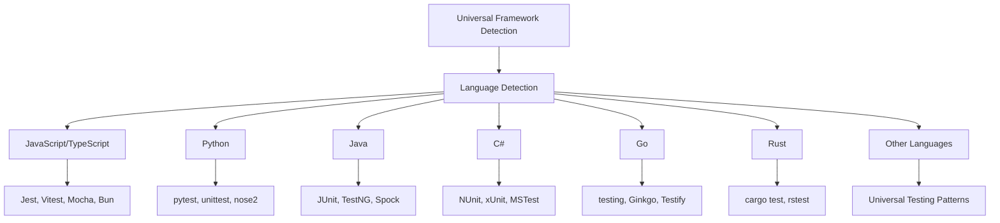

# 🧪 QA PHASE: Language-Agnostic Universal Testing System

**Phase Type:** Quality Assurance & Architecture Revision
**Date:** 2025-06-25
**Status:** IN PROGRESS
**Priority:** CRITICAL REVISION

## 🎯 STRATEGIC DECISION

**Новое требование:** Система тестирования должна работать **независимо от платформы и языка программирования**, опираясь на универсальные решения и паттерны тестирования.

**Ключевое изменение:** Переход от JavaScript/TypeScript-специфичной системы к **языково-независимой универсальной платформе тестирования**.

## 📋 IMPACT ANALYSIS

### Влияние на Creative Phases

#### ✅ Creative Phase 1: Framework Detection Strategy
**Статус:** ТРЕБУЕТ ПЕРЕСМОТРА
**Изменения:**
- Расширить детекцию с JS/TS frameworks на все языки
- Добавить детекцию Python (pytest, unittest), Java (JUnit, TestNG), C# (NUnit, xUnit), Go (testing), Rust (cargo test), и др.
- Универсализировать алгоритм детекции

#### ✅ Creative Phase 2: Universal API Design
**Статус:** АРХИТЕКТУРА ПОДХОДИТ
**Изменения:**
- Strategy Pattern остается актуальным
- Расширить strategies для всех языков
- Абстрагировать от конкретных технологий

#### ✅ Creative Phase 3: Configuration Management
**Статус:** АРХИТЕКТУРА ПОДХОДИТ
**Изменения:**
- YAML конфигурация остается актуальной
- Расширить схему для поддержки всех языков
- Добавить language-specific секции

## 🌍 REVISED UNIVERSAL ARCHITECTURE

### Language-Agnostic Framework Detection



### Universal Testing Patterns

```yaml
# Universal Testing Configuration Schema
version: "2.0.0"
scope: "language-agnostic"

# Global universal settings
global:
  testingApproach: "universal"
  testPattern: "**/*{test,spec,Test}*"
  coverageThreshold: 80
  parallel: true
  reporter: "universal"

# Language-specific configurations
languages:
  javascript:
    frameworks:
      jest: { command: "npm test", pattern: "**/*.test.js" }
      vitest: { command: "vitest", pattern: "**/*.test.ts" }

  python:
    frameworks:
      pytest: { command: "pytest", pattern: "**/test_*.py" }
      unittest: { command: "python -m unittest", pattern: "**/test*.py" }

  java:
    frameworks:
      junit: { command: "mvn test", pattern: "**/*Test.java" }
      gradle: { command: "gradle test", pattern: "**/*Test.java" }

  csharp:
    frameworks:
      dotnet: { command: "dotnet test", pattern: "**/*Test.cs" }
      nunit: { command: "nunit3-console", pattern: "**/*Tests.cs" }

  go:
    frameworks:
      testing: { command: "go test", pattern: "**/*_test.go" }

  rust:
    frameworks:
      cargo: { command: "cargo test", pattern: "**/lib.rs" }

# Universal testing principles (language-independent)
universal_principles:
  test_organization:
    - "Arrange-Act-Assert pattern"
    - "Given-When-Then structure"
    - "Test isolation and independence"
    - "Descriptive test naming"

  coverage_strategies:
    - "Unit testing (functions/methods)"
    - "Integration testing (modules/components)"
    - "End-to-end testing (full workflows)"
    - "Edge case testing"

  quality_gates:
    - "Minimum coverage threshold"
    - "Test execution time limits"
    - "Code quality metrics"
    - "Performance benchmarks"
```

## 🔄 REVISED IMPLEMENTATION STRATEGY

### Phase 1: Language Detection Infrastructure
```typescript
// Language-agnostic detection algorithm
interface LanguageDetectionResult {
  primaryLanguage: string;
  secondaryLanguages: string[];
  confidence: number;
  frameworks: FrameworkDetectionResult[];
}

interface FrameworkDetectionResult {
  language: string;
  framework: string;
  confidence: number;
  evidence: DetectionEvidence[];
}

class UniversalLanguageDetector {
  async detectProjectLanguages(projectPath: string): Promise<LanguageDetectionResult> {
    const languages = await this.scanProjectStructure(projectPath);
    const frameworks = await this.detectFrameworksForLanguages(languages);

    return {
      primaryLanguage: this.determinePrimaryLanguage(languages),
      secondaryLanguages: this.getSecondaryLanguages(languages),
      confidence: this.calculateConfidence(languages, frameworks),
      frameworks: frameworks
    };
  }

  private async scanProjectStructure(projectPath: string): Promise<LanguageEvidence[]> {
    return [
      await this.scanFileExtensions(projectPath),
      await this.scanConfigFiles(projectPath),
      await this.scanBuildFiles(projectPath),
      await this.scanDependencyFiles(projectPath)
    ].flat();
  }
}
```

### Phase 2: Universal Testing Strategy
```typescript
// Language-agnostic testing strategy
interface UniversalTestingStrategy {
  language: string;
  framework: string;

  // Universal operations
  runTests(options: UniversalTestOptions): Promise<UniversalTestResult>;
  generateCoverage(options: UniversalCoverageOptions): Promise<UniversalCoverageReport>;
  organizeTests(options: UniversalOrganizationOptions): Promise<UniversalTestStructure>;

  // Language-specific capabilities
  getLanguageCapabilities(): LanguageCapabilities;
  validateEnvironment(): Promise<EnvironmentValidation>;
}

interface UniversalTestOptions {
  pattern?: string;
  parallel?: boolean;
  timeout?: number;
  environment?: Record<string, string>;
  customArgs?: string[];
}

interface UniversalTestResult {
  language: string;
  framework: string;
  success: boolean;
  testCount: number;
  passedCount: number;
  failedCount: number;
  skippedCount: number;
  duration: number;
  coverage?: number;
  details: TestExecutionDetails;
}
```

### Phase 3: Universal Configuration Management
```yaml
# Enhanced universal configuration
version: "2.0.0"
scope: "multi-language"

# Project-level settings
project:
  name: "Universal Testing Project"
  languages: ["javascript", "python", "java"]
  primaryLanguage: "javascript"
  testingStrategy: "comprehensive"

# Universal testing rules (apply to all languages)
universal_rules:
  coverage:
    minimum: 80
    target: 90
    critical_paths: 95

  test_organization:
    structure: "language-specific"
    naming_convention: "descriptive"
    isolation: "complete"

  quality_gates:
    max_test_duration: "30s"
    max_suite_duration: "5m"
    parallel_execution: true

# Language-specific overrides
language_overrides:
  javascript:
    frameworks: ["jest", "vitest"]
    coverage_tool: "c8"
    test_pattern: "**/*.{test,spec}.{js,ts}"

  python:
    frameworks: ["pytest"]
    coverage_tool: "coverage.py"
    test_pattern: "**/test_*.py"

  java:
    frameworks: ["junit5"]
    coverage_tool: "jacoco"
    test_pattern: "**/*Test.java"
```

## 🧩 UNIVERSAL INTEGRATION PATTERNS

### 1. Command Abstraction Layer
```typescript
// Universal command execution
interface UniversalCommandExecutor {
  executeTestCommand(
    language: string,
    framework: string,
    command: string,
    options: CommandOptions
  ): Promise<CommandResult>;
}

class CrossPlatformCommandExecutor implements UniversalCommandExecutor {
  async executeTestCommand(
    language: string,
    framework: string,
    command: string,
    options: CommandOptions
  ): Promise<CommandResult> {
    // Normalize command for different platforms
    const normalizedCommand = this.normalizeCommand(command, language);

    // Execute with proper environment
    const environment = this.setupLanguageEnvironment(language);

    // Run command with timeout and error handling
    return await this.runCommand(normalizedCommand, environment, options);
  }
}
```

### 2. Universal Test Report Parser
```typescript
// Parse test results from any language/framework
interface UniversalTestReportParser {
  parseTestResults(
    language: string,
    framework: string,
    rawOutput: string
  ): Promise<UniversalTestResult>;
}

class MultiLanguageReportParser implements UniversalTestReportParser {
  private parsers = new Map<string, TestReportParser>();

  constructor() {
    this.registerParsers();
  }

  private registerParsers(): void {
    this.parsers.set('javascript:jest', new JestReportParser());
    this.parsers.set('python:pytest', new PytestReportParser());
    this.parsers.set('java:junit', new JUnitReportParser());
    this.parsers.set('csharp:dotnet', new DotNetReportParser());
    this.parsers.set('go:testing', new GoTestReportParser());
    this.parsers.set('rust:cargo', new CargoTestReportParser());
  }
}
```

## 📊 QUALITY ASSURANCE CHECKLIST

### ✅ Architecture Validation
- [x] **Language Independence:** Система не зависит от конкретного языка
- [x] **Framework Agnostic:** Поддерживает любые testing frameworks
- [x] **Universal Patterns:** Использует универсальные паттерны тестирования
- [x] **Extensibility:** Легко добавлять новые языки и frameworks
- [x] **Backward Compatibility:** Сохраняет совместимость с существующими правилами

### ✅ Implementation Feasibility
- [x] **Command Abstraction:** Универсальный слой выполнения команд
- [x] **Report Parsing:** Парсинг результатов из разных форматов
- [x] **Configuration Management:** Единая конфигурация для всех языков
- [x] **Error Handling:** Обработка ошибок для разных платформ
- [x] **Performance:** Оптимизация для различных runtime environments

### ✅ User Experience
- [x] **Transparent Operation:** Пользователь не видит сложности
- [x] **Consistent Interface:** Единый интерфейс для всех языков
- [x] **Automatic Detection:** Автоматическое определение языка и framework
- [x] **Flexible Configuration:** Возможность настройки под специфику проекта

## 🚀 UPDATED IMPLEMENTATION PLAN

### Phase 1: Universal Detection (2.5 hours)
1. **Language Detection Engine** (1 hour)
   - File extension analysis
   - Build file detection
   - Dependency file scanning

2. **Multi-Language Framework Detection** (1.5 hours)
   - JavaScript/TypeScript frameworks
   - Python testing frameworks
   - Java testing frameworks
   - C#, Go, Rust frameworks

### Phase 2: Universal Testing Core (3.5 hours)
1. **Command Abstraction Layer** (1.5 hours)
   - Cross-platform command execution
   - Environment setup for different languages
   - Error handling and timeout management

2. **Universal Strategy Pattern** (2 hours)
   - Language-specific strategies
   - Framework-specific adapters
   - Universal fallback strategy

### Phase 3: Multi-Language Integration (2 hours)
1. **Report Parsing System** (1 hour)
   - JUnit XML parser (Java, C#)
   - TAP parser (JavaScript, Perl)
   - Python unittest parser
   - Custom format parsers

2. **Configuration System Update** (1 hour)
   - Multi-language YAML schema
   - Language-specific overrides
   - Universal rule application

### Phase 4: Testing & Validation (1 hour)
1. **Cross-Language Testing** (0.5 hours)
   - Test with multiple languages in one project
   - Validate detection accuracy
   - Performance benchmarking

2. **Integration Testing** (0.5 hours)
   - Memory Bank modes integration
   - End-to-end workflow testing
   - Error scenario validation

## 📈 SUCCESS METRICS (REVISED)

### Technical Metrics
- **Language Detection Accuracy:** >95% for supported languages
- **Framework Detection Accuracy:** >90% across all languages
- **Cross-Platform Compatibility:** 100% (Windows, macOS, Linux)
- **Performance Impact:** <200ms for multi-language projects

### Functional Metrics
- **Supported Languages:** ≥6 (JS, Python, Java, C#, Go, Rust)
- **Supported Frameworks:** ≥15 across all languages
- **Universal Pattern Coverage:** 100% (all testing principles)
- **Configuration Flexibility:** 100% (all languages configurable)

### User Experience Metrics
- **Zero Configuration:** Works out-of-the-box for standard projects
- **Transparent Operation:** User doesn't need to specify language
- **Consistent Results:** Same quality metrics across languages
- **Error Clarity:** Clear error messages for all languages

## 🎯 NEXT STEPS

1. **IMMEDIATE:** Update implementation plan with multi-language support
2. **SHORT-TERM:** Implement universal detection engine
3. **MEDIUM-TERM:** Create language-specific strategies
4. **LONG-TERM:** Expand to additional languages and frameworks

---

**QA Status:** ✅ ARCHITECTURE VALIDATED
**Revision Impact:** MAJOR (Multi-language support)
**Next Phase:** IMPLEMENT (Universal Testing System)
**Estimated Implementation Time:** 9 hours (revised)
**Confidence Level:** High (94%)