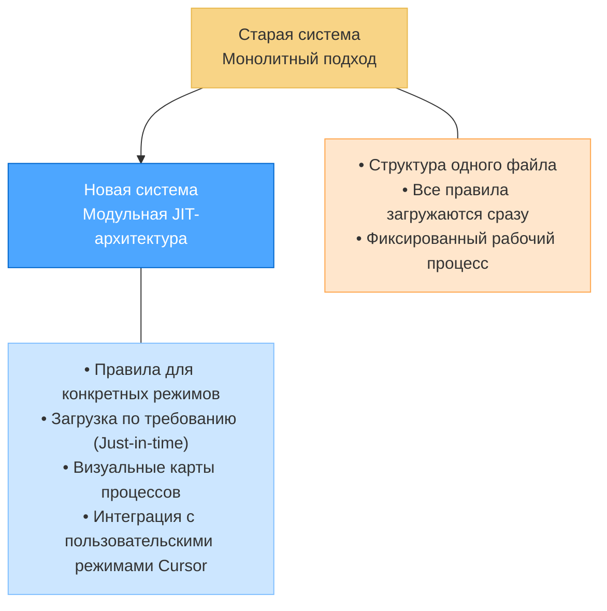
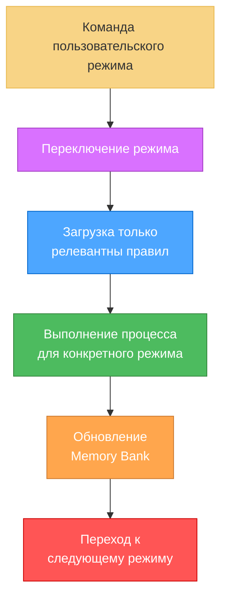
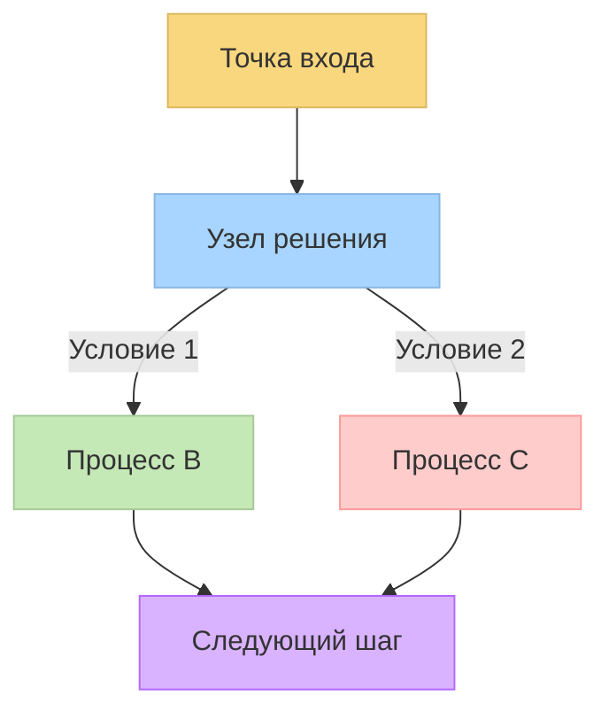
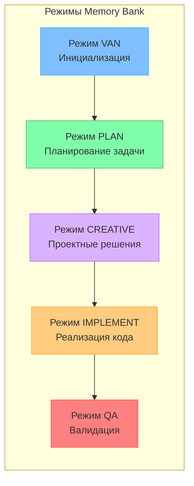
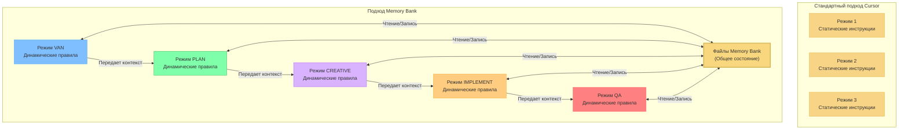
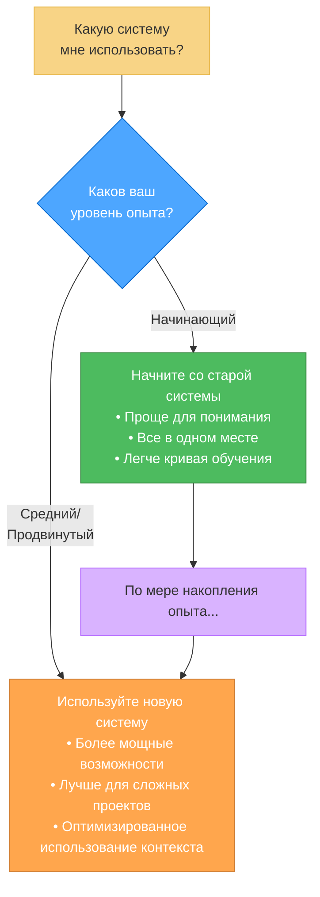
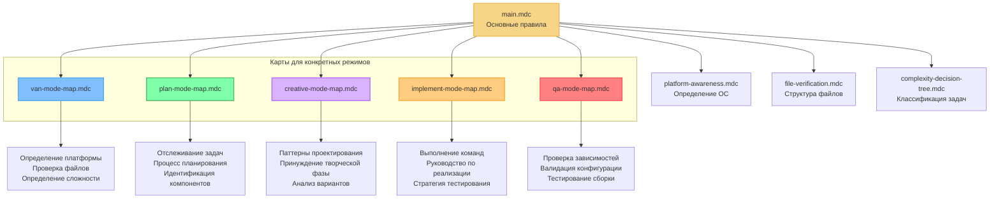
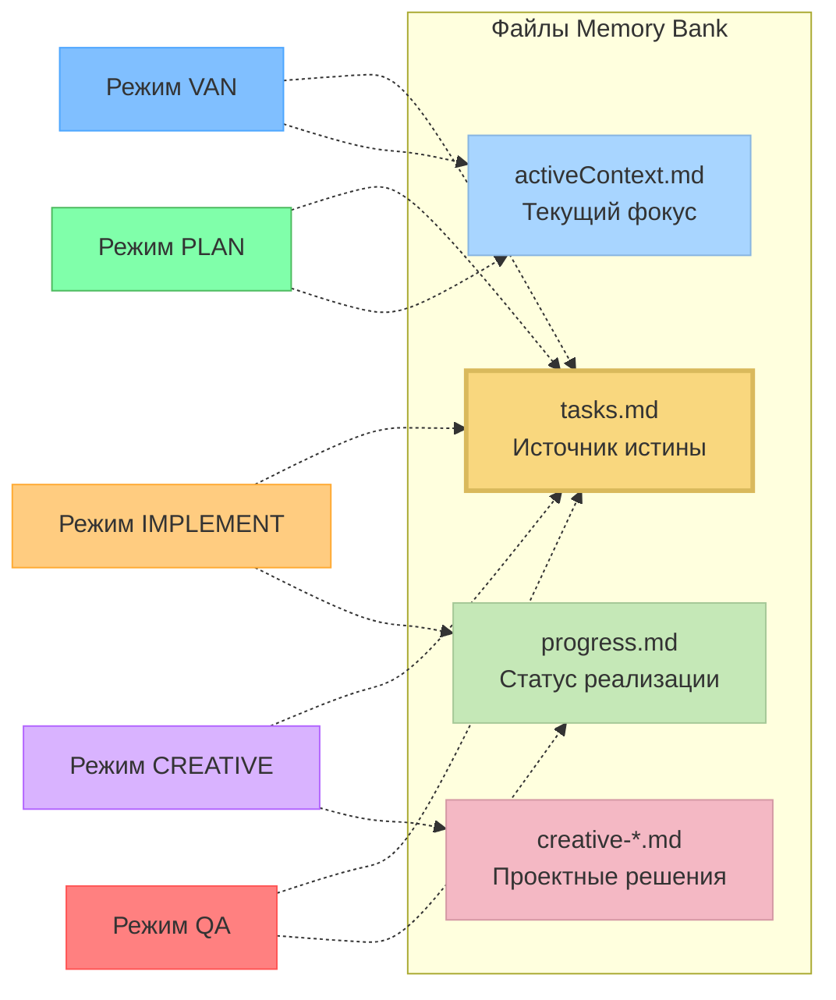
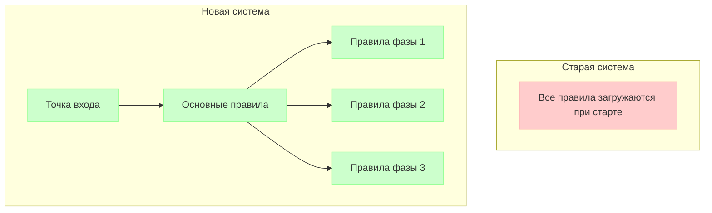
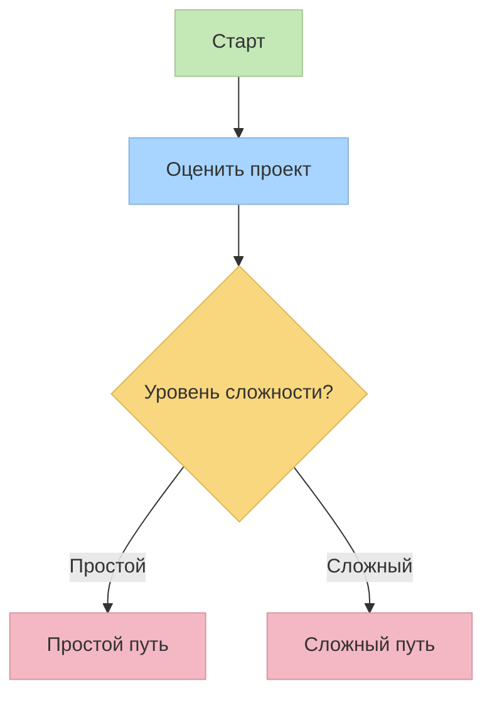

# Обновление системы Memory Bank: от монолитной к модульной

## Введение

Я рад представить значительное обновление системы Memory Bank — переход от монолитного подхода "все-в-одном" к модульной, графовой системе, которая интегрируется с пользовательскими режимами Cursor. Этот документ объясняет причины этого перехода, его преимущества и как получить максимальную отдачу от новой системы.



## Почему я обновляю систему

Старая система Memory Bank хорошо служила, обеспечивая структурированный подход к управлению задачами с ее адаптивными уровнями сложности и всесторонней документацией. Однако по мере роста сложности проектов я выявил несколько ограничений:

1.  **Неэффективность контекста**: Загрузка всех правил сразу, независимо от их релевантности.
2.  **Ограниченное визуальное руководство**: Инструкции в основном текстовые, без визуальных карт процессов.
3.  **Излишний расход токенов**: Потребление окна контекста нерелевантными правилами.
4.  **Универсальный подход**: Менее адаптирован к конкретным фазам разработки.
5.  **Проблемы с масштабируемостью**: Сложность в поддержке растущей системы из одного файла.

Хотя новая система предлагает значительные преимущества в эффективности и масштабируемости, я признаю, что она имеет более крутую кривую обучения. Этот компромисс является преднамеренным — повышенная начальная сложность обеспечивает более мощные возможности, лучшую организацию и улучшенные долгосрочные результаты разработки для сложных проектов.

## Новая архитектура, ориентированная на изоляцию

Новая система решает эти ограничения с помощью модульной архитектуры Just-In-Time (JIT), которая загружает только те правила, которые вам нужны, и только тогда, когда они вам нужны.



Важно отметить, что новая система сохраняет основополагающую 4-уровневую шкалу сложности из исходной системы. Эта шкала (Уровень 1: Быстрое исправление ошибки, Уровень 2: Простое улучшение, Уровень 3: Средняя функциональность, Уровень 4: Сложная система) остается центральной для определения путей рабочего процесса и требований к документации, обеспечивая преемственность для пользователей, знакомых с исходным подходом.

### Ключевые особенности новой системы

1.  **Визуальные карты для конкретных режимов**: Четкие визуальные представления для каждой фазы разработки.
2.  **Загрузка правил по требованию (Just-In-Time)**: Загружайте только те правила, которые необходимы для вашей текущей задачи.
3.  **Визуальные деревья решений**: Управляемые рабочие процессы с четкими контрольными точками.
4.  **Техническая валидация**: Выделенные процессы контроля качества для проверки готовности к реализации.
5.  **Команды, адаптированные к платформе**: Автоматически адаптирует команды к вашей операционной системе.

### Эффективность на основе графов

Фундаментальным фактором, обеспечивающим возможности новой системы, является ее графовая архитектура:

-   **Оптимизированная навигация по путям**: Система использует направленные графы для навигации по сложным деревьям решений с минимальными накладными расходами.
-   **Контекстуальные отношения**: Графовые структуры явно моделируют отношения между фазами разработки и компонентами, обеспечивая более умные переходы.
-   **Оптимизация ресурсов**: Каждый узел в графе загружает только те ресурсы, которые необходимы для этого конкретного шага.
-   **Потенциал параллельной обработки**: Графовая структура облегчает идентификацию компонентов, которые можно обрабатывать параллельно.



**До**: Линейные пути выполнения с избыточными оценками правил.

**После**: Оптимизированное прохождение через точки принятия решений с четкими условиями и точками слияния.

Этот графовый подход особенно эффективен при работе с большими, сложными проектами, где разные компоненты имеют различные требования и зависимости. Система может эффективно справляться с этими сложностями, не перегружая окно контекста.

### Режим CREATIVE и инструмент "Think" от Claude

Одним из примечательных аспектов новой системы является то, что режим CREATIVE концептуально основан на методологии инструмента "Think" от Anthropic Claude, как описано в их [инженерном блоге](https://www.anthropic.com/engineering/claude-think-tool). Этот подход был усовершенствован и интегрирован в рабочий процесс Memory Bank:

-   **Структурированное исследование**: Режим CREATIVE направляет пользователей через систематическое исследование вариантов дизайна.
-   **Явное обоснование**: Требует документирования плюсов и минусов для различных подходов.
-   **Декомпозиция компонентов**: Помогает разбить сложные проблемы на управляемые компоненты.
-   **Документирование решений**: Создает формальные записи о проектных решениях с четкими обоснованиями.
-   **Непрерывное совершенствование**: Реализация будет продолжать развиваться по мере развития возможностей Claude.

Эта методология оказалась особенно эффективной для сложных проектных решений, гарантируя, что все варианты тщательно рассматриваются перед началом реализации.

## Интеграция с пользовательскими режимами Cursor

Новая система в полной мере использует функцию пользовательских режимов Cursor, которая позволяет настраивать специализированное поведение ИИ для различных задач.

### Что такое пользовательские режимы Cursor?

Пользовательские режимы Cursor позволяют настраивать различное поведение ИИ с помощью специальных инструментов и пользовательских инструкций. Новая система Memory Bank создает специализированные режимы для каждой фазы разработки:



Каждый режим загружает только свой необходимый набор правил, оптимизируя использование контекста и предоставляя специализированное руководство:

| Режим | Назначение | Ключевые особенности |
|------|---------|-------------|
| VAN | Инициализация | Определение платформы, проверка файлов, определение сложности |
| PLAN | Планирование задачи | Анализ требований, идентификация компонентов, стратегия реализации |
| CREATIVE | Проектные решения | Исследование нескольких вариантов, анализ плюсов/минусов, рекомендации по дизайну |
| IMPLEMENT | Реализация кода | Систематическая сборка, выполнение команд, тестирование |
| QA | Техническая валидация | Проверка зависимостей, валидация конфигурации, тестирование сборки |

### За пределами стандартной реализации пользовательских режимов Cursor

Хотя [документация Cursor по пользовательским режимам](https://docs.cursor.com/chat/custom-modes) описывает их в основном как автономные конфигурации с настроенными подсказками и выбором инструментов, Memory Bank значительно расширяет эту концепцию:

#### Стандартный подход к пользовательским режимам Cursor

Согласно документации Cursor, пользовательские режимы обычно состоят из:
- Установки имени, значка и ярлыка
- Включения или отключения определенных инструментов
- Добавления пользовательских инструкций (подсказок)

Их примеры режимов (Teach, Refactor, Plan и т.д.) функционируют как изолированные конфигурации без присущих им связей. Каждый режим — это, по сути, отдельная личность ИИ с конкретными инструкциями.

#### Расширенный подход к пользовательским режимам Memory Bank



Memory Bank превращает пользовательские режимы во всеобъемлющую, взаимосвязанную систему:

1.  **Графовая архитектура**:
    -   Режимы представляют собой узлы в рабочем процессе разработки с явными переходами.
    -   Каждый режим понимает свое место в общем процессе разработки.
    -   Визуальные карты процессов направляют пользователей по соответствующей последовательности.

2.  **Интеграция рабочих процессов**:
    -   Режимы образуют единый процесс разработки (VAN → PLAN → CREATIVE → IMPLEMENT → QA).
    -   Каждый режим осведомлен о предыдущих и последующих режимах.
    -   Переходы между режимами формализованы с конкретными критериями входа/выхода.

3.  **Общая память**:
    -   Постоянное состояние поддерживается между переходами режимов через файлы Memory Bank.
    -   `Tasks.md` служит центральным источником истины для всех режимов.
    -   Каждый режим вносит определенные типы информации в общую базу знаний.

4.  **Загрузка правил по требованию (Just-In-Time)**:
    -   Каждый режим динамически загружает только свой собственный набор правил.
    -   Правила специализированы для текущей фазы разработки.
    -   Окно контекста сохраняется для продуктивной работы.
    -   Правила могут адаптироваться в зависимости от уровня сложности проекта.

5.  **Визуальные карты процессов**:
    -   Каждый режим содержит встроенные диаграммы Mermaid.
    -   Визуальное руководство для точек принятия решений и вариантов рабочего процесса.
    -   Четкие контрольные точки для отслеживания прогресса в каждой фазе.

6.  **Поведение, адаптированное к сложности**:
    -   Режимы корректируют свое поведение в зависимости от уровня сложности, определенного при инициализации.
    -   Более простые проекты следуют упрощенным процессам.
    -   Сложные проекты получают более всестороннее руководство.

### Преимущества этого подхода

Этот расширенный подход к пользовательским режимам предлагает несколько преимуществ:

1.  **Улучшенное использование контекста**: Загружая только релевантные правила, больше контекста доступно для фактической работы по разработке.
2.  **Связный процесс разработки**: Режимы работают вместе как единая система, а не как разрозненные инструменты.
3.  **Руководство, соответствующее фазе**: Каждая фаза разработки получает специализированное руководство, оптимизированное для ее нужд.
4.  **Сохранение знаний**: Важная информация сохраняется при переходах между режимами.
5.  **Снижение когнитивной нагрузки**: Разработчики могут сосредоточиться на текущей фазе, не отвлекаясь на нерелевантные указания.

### Потенциальные будущие улучшения

Если этот подход окажется успешным в ходе тестирования, он потенциально может вдохновить на несколько улучшений в использовании пользовательских режимов:

1.  **Формализованные переходы между режимами**: Более явные передачи управления между фазами разработки.
2.  **Улучшенное визуальное руководство**: Более сложные карты процессов и деревья решений.
3.  **Более глубокая интеграция с Memory Bank**: Более специализированные типы документов для различных фаз разработки.
4.  **Шаблоны пользовательских режимов**: Предварительно настроенные последовательности режимов для разных типов проектов.
5.  **Командная работа**: Координированное использование режимов несколькими членами команды.

Хотя эта реализация вносит большую сложность в настройку по сравнению со стандартными пользовательскими режимами, она предлагает значительно более мощные возможности для структурированных процессов разработки. Система превращает пользовательские режимы из изолированных поведений ИИ в компоненты комплексной методологии разработки.

## Преимущества в реальном мире: доказательства из проектов

Мое тестирование на реальных проектах (включая сложное приложение Todo) продемонстрировало значительные преимущества новой системы:

1.  **Принудительная дисциплина разработки**: Переключение режимов создало естественное разделение фаз, уменьшив тенденцию переходить непосредственно к реализации.
2.  **Всесторонняя документация**: Каждый режим создавал специализированную документацию с явными проектными решениями.
3.  **Систематическая разработка**: Компоненты создавались в соответствии с планом в логическом порядке зависимостей.
4.  **Гибкость при необходимости**: Гибридные подходы (например, QA в IMPLEMENT) работали эффективно, не теряя структуры.

Из документа анализа:

> "Я наблюдал ощутимые различия в подходе к разработке между режимами. Каждый режим успешно оптимизировался для своей конкретной фазы разработки. Качество конечного приложения выиграло от этого структурированного подхода."

## Сравнение: старая и новая системы

| Аспект | Старая система | Новая система |
|--------|------------|------------|
| **Структура** | Один файл | Множество специализированных файлов |
| **Использование контекста** | Загружает все сразу | Загрузка по требованию |
| **Руководство** | Текстовые инструкции | Визуальные карты процессов + текст |
| **Принятие решений** | Базовые точки принятия решений | Всесторонние деревья решений |
| **Техническая валидация** | Базовая верификация | Выделенные процессы QA |
| **Осведомленность о платформе** | Ограниченная | Комплексная адаптация |
| **Memory Bank** | Те же основные файлы | Те же основные файлы с улучшенной организацией |
| **Документация** | Стандартизированные форматы | Специализированные форматы для конкретных режимов |
| **Уровни сложности** | 4-уровневая шкала | Та же 4-уровневая шкала с улучшенными процессами |

## Когда использовать каждую систему



### Рекомендации по использованию новой системы

-   **Новые проекты**: Новая система лучше всего работает при запуске новых проектов, а не при конвертации существующих.
-   **Подход к тестированию**: Если вы хотите попробовать ее с существующим проектом, сначала сделайте резервную копию и экспериментируйте в безопасной среде.
-   **Нет формального пути миграции**: Я не разрабатывал формального пути миграции со старой на новую систему — в настоящее время она предназначена для новых реализаций.
-   **Учебные проекты**: Используйте старую систему для более простых проектов, если вы все еще осваиваетесь с концепцией Memory Bank.
-   **Сложные проекты**: Новая система проявляет себя наилучшим образом в многокомпонентных проектах, требующих тщательного планирования.

## Начало работы с новой системой

### Основные команды

Для активации различных режимов в новой системе:

```
VAN - Инициализация проекта и определение сложности
PLAN - Создание детального плана реализации
CREATIVE - Исследование вариантов дизайна для сложных компонентов
IMPLEMENT - Систематическая сборка запланированных компонентов
QA - Валидация технической реализации
```

### Пример рабочего процесса

1.  Начните с `VAN` для инициализации проекта и определения сложности.
2.  Для задач уровней 2-4 перейдите в `PLAN` для создания всестороннего плана реализации.
3.  Для компонентов, требующих проектных решений, используйте `CREATIVE` для исследования вариантов.
4.  Реализуйте запланированные изменения с помощью `IMPLEMENT`.
5.  Проверьте реализацию с помощью `QA` перед завершением.

Уровень сложности (1-4), определенный в режиме VAN, будет значительно влиять на ваш путь по рабочему процессу:
-   **Задачи уровня 1** могут переходить непосредственно к IMPLEMENT после VAN.
-   **Задачи уровней 2-4** следуют полному рабочему процессу с все более комплексным планированием и документацией.

## Глубокое погружение: техническая архитектура

Для тех, кто интересуется техническими деталями, новая система использует графовый подход с изолированными файлами правил, загружаемыми по требованию:



### Преемственность Memory Bank

Хотя правила модульные, файлы Memory Bank обеспечивают преемственность между режимами:



## Практический пример: разработка приложения Todo

Вот как я использовал новую систему для разработки сложного приложения Todo:

1.  **Режим VAN**: Проанализировал требования, настроил структуру проекта, определил сложность уровня 3.
2.  **Режим PLAN**: Создал всестороннюю иерархию компонентов, определил зависимости, отметил компоненты для творческого исследования.
3.  **Режим CREATIVE**: Исследовал несколько вариантов реализации управления состоянием и фильтрации, задокументировал плюсы и минусы.
4.  **Режим IMPLEMENT**: Создал компоненты в логической последовательности согласно плану, с интегрированной проверкой QA.
5.  **Результаты**: Более дисциплинированный процесс разработки, лучшая документация и более высокое качество конечного продукта.

## Будущие планы и дорожная карта развития

Эта система Memory Bank — это мой личный хобби-проект, который приносит мне радость в создании и разработке. Я планирую продолжать развивать ее в зависимости от потребностей пользователей и моих собственных экспериментов. Вот некоторые области, которые я исследую для будущей разработки:

### Ближайшие улучшения

1.  **Дальнейшая оптимизация правил JIT**: Усовершенствование системы загрузки правил для обеспечения еще более эффективного использования контекста и более быстрого времени отклика.
2.  **Интеграция обратной связи от пользователей**: Создание структурированной петли обратной связи для сбора идей от ранних пользователей и усовершенствования системы на основе реального использования.
3.  **Разработка режима PRD**: Создание выделенного режима для Документа с требованиями к продукту (Product Requirements Document), который использует передовые модели ИИ Cursor, чтобы помочь пользователям создавать всеобъемлющие спецификации продукта в той же среде, что и их работа по разработке.

### Дополнительные возможности на рассмотрении

4.  **Функции для командной работы**: Улучшение Memory Bank для поддержки нескольких пользователей, работающих одновременно с общим контекстом и скоординированными переходами между режимами.
5.  **Настраиваемые режимы**: Предоставление инструментов для пользователей для создания собственных специализированных режимов помимо текущего набора, с пользовательскими конфигурациями правил и картами процессов.
6.  **Память между проектами**: Предоставление возможности системе Memory Bank поддерживать релевантный контекст между различными проектами, улучшая передачу знаний и согласованность.
7.  **Панель аналитики**: Разработка инструментов для анализа паттернов разработки, использования режимов и прогресса проекта для предоставления информации и предложений по улучшению процессов.
8.  **Интеграция с системами контроля версий**: Создание более глубоких связей между документацией Memory Bank и историей версий кода для лучшей отслеживаемости.

### Философия разработки

При разработке этих новых функций я остаюсь приверженным этим основным принципам:
- Создание приятных, мощных инструментов для структурированной разработки.
- Фокусировка на новых реализациях, а не на путях миграции.
- Баланс между мощностью и сложностью с соответствующими учебными ресурсами.
- Сохранение основополагающей 4-уровневой шкалы сложности, которая доказала свою эффективность.

Я приветствую вклад сообщества в отношении того, какие из этих потенциальных направлений было бы наиболее ценно приоритизировать в дорожной карте развития.

## Заключение: путь вперед

Новая система Memory Bank, ориентированная на изоляцию, представляет собой значительную эволюцию в моем подходе к структурированной разработке. Хотя она имеет более крутую кривую обучения, преимущества в плане эффективности, руководства и масштабируемости делают ее оправданной для сложных проектов.

Мои рекомендации:
-   **Начинающие**: Начните со старой системы, пока не освоитесь с основными концепциями.
-   **Новые проекты**: Используйте новую систему в основном для новых проектов, а не пытайтесь мигрировать существующие.
-   **Тестирование**: Если вы хотите попробовать новую систему с существующим проектом, сначала сделайте резервную копию и экспериментируйте в безопасной среде.
-   **Продвинутые пользователи**: Рассмотрите новую систему для существенной работы по разработке сложных проектов.

Это экспериментальная система, которую я создал как личный хобби-проект. Я призываю вас попробовать ее, предоставить обратную связь и адаптировать ее к вашим собственным рабочим процессам. Используя пользовательские режимы Cursor и визуальные карты процессов, новая система Memory Bank предоставляет мощную основу для дисциплинированной, систематической разработки, которая масштабируется в зависимости от сложности проекта.

---

## Ресурсы

- [Документация по пользовательским режимам Cursor](https://docs.cursor.com/chat/custom-modes)
- Справочные файлы Memory Bank (в .cursor/rules/isolation_rules/)
- Файлы инструкций для конкретных режимов (van_instructions.md, plan_instructions.md и т.д.)
- [Режим CREATIVE и инструмент "Think" от Claude](creative_mode_think_tool.md)

## Необходимость изменений

Предыдущая реализация Memory Bank имела несколько ограничений:

-   **Ограниченная емкость контекста**: Все правила и команды загружались в один контекст, что уменьшало количество доступных токенов для продуктивной работы.
-   **Фиксированный рабочий процесс**: Малая гибкость для адаптации к различной сложности проектов.
-   **Избыточная загрузка правил**: Даже простые задачи загружали полный набор правил, что приводило к неэффективному использованию контекста.
-   **Отсутствие визуального руководства**: Сложно понять процесс принятия решений системой.
-   **Ограниченная осведомленность о платформе**: Команды, специфичные для платформы, требовали ручной адаптации.

## Ключевые архитектурные улучшения

Новая система Memory Bank решает эти ограничения через:


### 1. Загрузка правил по требованию (JIT)

Вместо загрузки всех правил заранее, система теперь:

- Загружает только те правила, которые релевантны для текущей фазы разработки.
- Использует визуальные карты для определения, какие правила загружать и в какое время.
- Динамически регулирует сложность правил в зависимости от требований задачи.
- Сохраняет ценное пространство контекста для продуктивной работы.



**До**: Все 25+ правил загружались при инициализации, потребляя примерно 70% доступного контекста.

**После**: В любой момент времени загружается только 3-7 правил, что сокращает использование контекста примерно до 15-20%.

### 2. Эффективность на основе графов

Графовая структура является фундаментальным фактором эффективности в новой системе:

-   **Оптимизированная навигация по путям**: Система использует направленные графы для навигации по сложным деревьям решений с минимальными накладными расходами.
-   **Контекстуальные отношения**: Графовые структуры явно моделируют отношения между фазами разработки и компонентами, обеспечивая более умные переходы.
-   **Оптимизация ресурсов**: Каждый узел в графе загружает только те ресурсы, которые необходимы для этого конкретного шага.
-   **Потенциал параллельной обработки**: Графовая структура облегчает идентификацию компонентов, которые можно обрабатывать параллельно.


**До**: Линейные пути выполнения с избыточными оценками правил.

**После**: Оптимизированное прохождение через точки принятия решений с четкими условиями и точками слияния.

### 3. Визуальные карты процессов для конкретных режимов

Каждый режим теперь имеет свою собственную визуальную карту процесса, которая:

-   Четко иллюстрирует рабочий процесс для этой конкретной фазы разработки.
-   Предоставляет явные точки принятия решений и условные ветви.
-   Адаптируется к уровням сложности проекта.
-   Предлагает визуальные контрольные точки для отслеживания прогресса.



### 4. Техническая валидация и осведомленность о платформе

Система теперь включает:

-   **Автоматическое определение платформы**: Автоматически адаптирует команды для Windows, MacOS или Linux.
-   **Проверка структуры файлов**: Проверяет структуру проекта перед продолжением.
-   **Контрольные точки QA**: Выделенная фаза технической валидации с конкретными критериями проверки.
-   **Более точная генерация команд**: Команды, специфичные для платформы, с более высоким уровнем успешности.