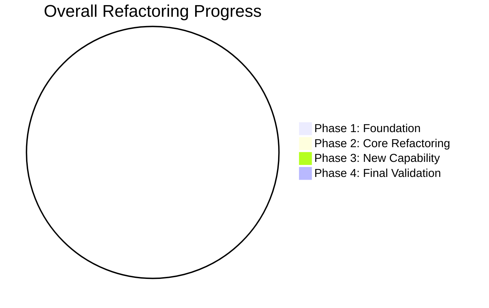
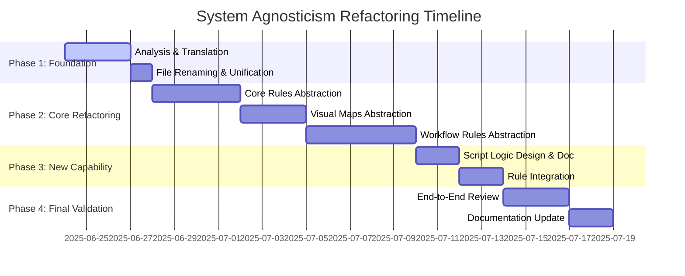

### **TASK TRACKING: SYSTEM AGNOSTICISM REFACTORING**

-   **System-ID:** `SYS-REFACTOR-2024`
-   **System Name:** System Agnosticism & Universalization
-   **Purpose:** To refactor the entire `cursor-memory-bank` rule set, making it platform-agnostic, technology-independent, and universally applicable. This involves abstracting specific commands into pseudocode, unifying language, and creating a dynamic script management capability.
-   **Architectural Alignment:** This task directly supports the core architectural principle of creating a flexible, universally applicable AI development framework.
-   **Status:** `In Progress`

#### **Progress Visualization**



#### **Timeline**


---

### **Implementation Phases**

#### **Phase 1: Foundation (Translation & Unification)**
-   **Purpose:** To create a consistent, English-only foundation for all rules, eliminating language barriers and standardizing naming conventions.
-   **Status:** `In Progress`
-   **Progress:** 0%

**Tasks:**
-   **[TASK-P1-01]: Analyze all rule files for translation and renaming.**
    -   **Description:** Systematically identify all files containing non-English content or non-standard naming.
    -   **Status:** `In Progress`
    -   **Subtasks:**
        -   [ ] Generate a complete list of files in `.cursor/rules/`.
        -   [ ] Tag files with cyrillic content in `description` or body.
        -   [ ] Tag files with cyrillic characters or non-kebab-case names.
-   **[TASK-P1-02]: Translate and unify all rule descriptions and content.**
    -   **Description:** Convert all frontmatter `description` fields and rule body content to clear, technical English.
    -   **Status:** `In Progress`
    -   **Subtasks:**
        -   [ ] Translate `Core` rules.
        -   [ ] Translate `CustomWorkflow` rules.
        -   [ ] Translate `Level*` rules.
        -   [ ] Translate `Phases` rules.
        -   [ ] Translate `visual-maps` rules.
        -   [ ] Ensure consistent terminology across all translated files.
-   **[TASK-P1-03]: Rename specified files to kebab-case English standard.**
    -   **Description:** Rename files like `migration_ru.md` and `mode_switching_analysis_ru.md` to their English equivalents.
    -   **Status:** `In Progress`
    -   **Subtasks:**
        -   [ ] Rename `migration_ru.md` -> `legacy-migration-guide.md` (or similar).
        -   [ ] Rename `mode_switching_analysis_ru.md` -> `mode-switching-analysis.md`.
        -   [ ] Update all cross-references pointing to the old filenames.


#### **Phase 2: Core Refactoring (Abstraction to Pseudocode)**
-   **Purpose:** To decouple the rule logic from specific shell commands and environments, making them universally adaptable by replacing them with high-level, platform-agnostic pseudocode.
-   **Status:** `In Progress`
-   **Progress:** 0%
-   **Key Principle:** The AI must adapt the pseudocode to the specific execution environment (e.g., PowerShell on Windows, Bash on Linux/macOS) based on the platform detection from `van-platform-detection.mdc`.

**Tasks:**
-   **[TASK-P2-01]: Refactor `Core` rules.**
    -   **Description:** Abstract all hardcoded commands in the foundational rules to ensure they describe intent, not implementation.
    -   **Status:** `In Progress`
    -   **Progress:** 0%
    -   **Files Refactored:**
        -   `_cursor/rules/isolation_rules/Core/file-verification.mdc.md`
        -   `_cursor/rules/isolation_rules/Core/request-versioning-system.mdc.md`
        -   `_cursor/rules/isolation_rules/Core/working-directory-control.mdc.md`
        -   `_cursor/rules/isolation_rules/Core/git-setup-validation.mdc.md`
-   **[TASK-P2-02]: Refactor `visual-maps` and `Phases` rules.**
    -   **Description:** Abstract commands within the main workflow maps and phase-specific logic to remove environment dependencies.
    -   **Status:** `In Progress`
    -   **Progress:** 0%
    -   **Files Refactored:**
        -   `_cursor/rules/isolation_rules/visual-maps/van_mode_split/van-platform-detection.mdc.md`
        -   `_cursor/rules/isolation_rules/visual-maps/implement-mode-map.mdc.md`
        -   `_cursor/rules/isolation_rules/visual-maps/plan-mode-map.mdc.md`
        -   `_cursor/rules/isolation_rules/Phases/CreativePhase/creative-mode-map.mdc.md`
        -   `_cursor/rules/isolation_rules/Phases/CreativePhase/creative-phase-architecture.mdc.md`
        -   `_cursor/rules/isolation_rules/Phases/CreativePhase/creative-phase-uiux.mdc.md`
        -   `_cursor/rules/isolation_rules/Phases/CreativePhase/optimized-creative-template.mdc.md`
-   **[TASK-P2-03]: Refactor `testing` rules.**
    -   **Description:** Abstract commands in specialized workflow rules (`testing`, `refactoring`, etc.) and level-specific guides.
    -   **Status:** `In Progress`
    -   **Progress:** 0%
    -   **Files Refactored:**
        -   `_cursor/rules/isolation_rules/testing/bun-testing-framework.mdc.md`
-   **[TASK-P2-04]: Refactor `custom-workflow` rules.**
    -   **Description:** Abstract commands in specialized workflow rules (`testing`, `refactoring`, etc.) and level-specific guides.
    -   **Status:** `In Progress`
    -   **Progress:** 0%
    -   **Files Refactored:**
        -   `_cursor/rules/isolation_rules/CustomWorkflow/refactoring/backward-compatibility.mdc.md`
        -   `_cursor/rules/isolation_rules/CustomWorkflow/refactoring/quality-metrics.mdc.md`
        -   `_cursor/rules/isolation_rules/CustomWorkflow/refactoring/refactoring-patterns.mdc.md`
        -   `_cursor/rules/isolation_rules/CustomWorkflow/refactoring/legacy-support.mdc.md`
        -   `_cursor/rules/isolation_rules/CustomWorkflow/refactoring/gradual-refactoring.mdc.md`
        -   `_cursor/rules/isolation_rules/CustomWorkflow/implementation/system-coordination.mdc.md`
        -   `_cursor/rules/isolation_rules/CustomWorkflow/implementation/robust-search.mdc.md`
        -   `_cursor/rules/isolation_rules/CustomWorkflow/workflow/backup-system.mdc.md`
        -   `_cursor/rules/isolation_rules/CustomWorkflow/workflow/task-preservation-rules.mdc.md`
        -   `_cursor/rules/isolation_rules/CustomWorkflow/workflow/creative-archive-integration.mdc.md`
        -   `_cursor/rules/isolation_rules/CustomWorkflow/workflow/implement-mode-integration.mdc.md`
        -   `_cursor/rules/isolation_rules/CustomWorkflow/system/interaction-mode-control.mdc.md`
        -   `_cursor/rules/isolation_rules/CustomWorkflow/testing/test-organization.mdc.md`
        -   `_cursor/rules/isolation_rules/CustomWorkflow/testing/large-test-analysis.mdc.md`
        -   `_cursor/rules/isolation_rules/CustomWorkflow/testing/bun-core-rules.mdc.md`
        -   `_cursor/rules/isolation_rules/CustomWorkflow/testing/performance-testing.mdc.md`
        -   `_cursor/rules/isolation_rules/CustomWorkflow/testing/test-failure-patterns.mdc.md`
        -   `_cursor/rules/isolation_rules/CustomWorkflow/testing/bun-features.mdc.md`
        -   `_cursor/rules/isolation_rules/CustomWorkflow/testing/edge-cases.mdc.md`
        -   `_cursor/rules/isolation_rules/CustomWorkflow/planning/phased-approach.mdc.md`
        -   `_cursor/rules/isolation_rules/CustomWorkflow/planning/problem-prioritization.mdc.md`
        -   `_cursor/rules/isolation_rules/CustomWorkflow/planning/progress-documentation.mdc.md`
        -   `_cursor/rules/isolation_rules/CustomWorkflow/planning/isolated-design.mdc.md`
        -   `_cursor/rules/isolation_rules/CustomWorkflow/debugging/systematic-debugging.mdc.md`
        -   `_cursor/rules/isolation_rules/CustomWorkflow/debugging/invariant-validation.mdc.md`
        -   `_cursor/rules/isolation_rules/CustomWorkflow/debugging/detailed-logging.mdc.md`
        -   `_cursor/rules/isolation_rules/CustomWorkflow/git-workflow/commit-strategies.mdc.md`
        -   `_cursor/rules/isolation_rules/CustomWorkflow/git-workflow/change-documentation.mdc.md`
        -   `_cursor/rules/isolation_rules/CustomWorkflow/git-workflow/branch-management.mdc.md`
        -   `_cursor/rules/isolation_rules/CustomWorkflow/git-workflow/backup-verification.mdc.md`
        -   `_cursor/rules/isolation_rules/CustomWorkflow/integration/isolated-design-rules.mdc.md`
        -   `_cursor/rules/isolation_rules/CustomWorkflow/integration/integration-testing.mdc.md`
        -   `_cursor/rules/isolation_rules/CustomWorkflow/documentation/release-notes-generator.mdc.md`
        -   `_cursor/rules/isolation_rules/CustomWorkflow/documentation/commit-message-generator.mdc.md`
        -   `_cursor/rules/isolation_rules/CustomWorkflow/documentation/usage-examples.mdc.md`
-   **[TASK-P2-05]: Review and finalize PSEUDOCODE specification in `migrations/PSE.md`.**
    -   **Description:** Review and finalize the PSEUDOCODE specification in `migrations/PSE.md`.
    -   **Status:** `In Progress`
    -   **Progress:** 0%

---

#### **Phase 3: New Capability (Dynamic Script Management)**
-   **Purpose:** To implement a system where the AI can dynamically check for, create, and reuse executable scripts for common operations, ensuring consistency and reducing redundant code generation.
-   **Status:** `In Progress`
-   **Progress:** 0%

**Tasks:**
-   **[TASK-P3-01]: Design the script management workflow.**
    -   **Description:** Define the precise, ordered logic the AI must follow: (1) Check if a specific script exists in `memory-bank/scripts/`. (2) If not, generate the script content based on the pseudocode and current context (e.g., OS). (3) Save the script. (4) Execute the script.
    -   **Status:** `In Progress`
    -   **Progress:** 0%
    -   **Design Details:**
        1.  **Check for Existing Script:**
            *   **PSEUDOCODE:** `CALL PSEUDOCODE.File.FILE_EXISTS(path: PSEUDOCODE.File.GET_SCRIPT_PATH(script_name))`
            *   **Logic:** Before executing any complex or reusable command, the AI will first determine the expected path for the corresponding script within `memory-bank/scripts/`.
            *   **Condition:** If `FILE_EXISTS` returns `TRUE`.
            *   **Action:** Proceed directly to Step 4 (Execute Script).
        2.  **Generate Script Content (If Not Exists):**
            *   **PSEUDOCODE:** `DECLARE script_content = PSEUDOCODE.Script.GENERATE_SCRIPT(pseudocode: PSEUDOCODE:GET_PSEUDOCODE_DEFINITION(command_name), os_type: PSEUDOCODE.System.GET_OS_TYPE())`
            *   **Logic:** If the script does not exist, the AI will dynamically generate the script content. This generation will be based on the abstract PSEUDOCODE representation of the desired command and the detected operating system type (e.g., Windows, Linux, macOS) to ensure platform compatibility.
            *   **Input:** Pseudocode definition of the command, current OS type.
            *   **Output:** Executable script content (e.g., Bash, PowerShell).
        3.  **Save the Script:**
            *   **PSEUDOCODE:** `CALL PSEUDOCODE.File.CREATE_FILE(path: PSEUDOCODE.File.GET_SCRIPT_PATH(script_name), content: script_content)`
            *   **Logic:** The newly generated script content will be saved to the designated `memory-bank/scripts/` directory.
            *   **Purpose:** This ensures reusability and avoids redundant generation of the same script for future executions.
        4.  **Execute the Script:**
            *   **PSEUDOCODE:** `CALL PSEUDOCODE.System.RUN_SCRIPT(script_name: PSEUDOCODE.File.GET_SCRIPT_PATH(script_name))`
            *   **Logic:** The AI will execute the script. The execution method will be determined by the underlying platform, ensuring the script runs correctly.
            *   **Error Handling:** The AI will monitor the script's exit code (`PSEUDOCODE.System.GET_LAST_COMMAND_EXIT_CODE()`) and handle errors appropriately, logging messages or initiating rollback procedures if necessary.
-   **[TASK-P3-02]: Integrate the workflow into `Core/command-execution.mdc`.**
    -   **Description:** Update the central command execution rule to make this new script management logic a primary directive for all complex or reusable commands.
    -   **Status:** `In Progress`
    -   **Progress:** 0%
-   **[TASK-P3-03]: Create `memory-bank/scripts/` directory.**
    -   **Description:** Physically create the directory to store dynamically generated scripts, and add a `.gitkeep` file to ensure it's committed to version control.
    -   **Status:** `In Progress`
    -   **Progress:** 0%
-   **[TASK-P3-04]: Define and document 2-3 example dynamic scripts.**
    -   **Description:** Define and document 2-3 example dynamic scripts to demonstrate the functionality of the script management system.
    -   **Status:** `In Progress`
    -   **Progress:** 0%
    -   **Example Dynamic Scripts:**
        1.  **Script Name:** `get-active-task-path`
            *   **Purpose:** Retrieve the full path to the active task's context file.
            *   **PSEUDOCODE:** `CALL PSEUDOCODE.File.GET_ACTIVE_CONTEXT_PATH()`
            *   **Generated Script (Linux/macOS - Bash):**
                ```bash
                #!/bin/bash
                echo "memory-bank/contexts/active/$(cat memory-bank/system/current-task.txt | awk -F'_' '{print $1"-"$2"-"$3}')-$(cat memory-bank/system/current-task.txt | awk -F'_' '{print $4}')-context.md"
                ```
            *   **Generated Script (Windows - PowerShell):**
                ```powershell
                $TaskName = Get-Content -Path "memory-bank/system/current-task.txt"
                $Parts = $TaskName -split '_'
                $DatePart = "$($Parts[0])-$($Parts[1])-$($Parts[2])"
                $NamePart = $($Parts[3])
                $ContextPath = "memory-bank/contexts/active/${DatePart}-${NamePart}-context.md"
                Write-Output $ContextPath
                ```
            *   **Explanation:** This script dynamically constructs the path to the active task's context file based on the content of `memory-bank/system/current-task.txt`. The PSEUDOCODE abstraction `GET_ACTIVE_CONTEXT_PATH()` allows the AI to generate the appropriate platform-specific command.

        2.  **Script Name:** `initialize-date`
            *   **Purpose:** Get the current date in YYYY-MM-DD format and write it to `memory-bank/system/current-date.txt`.
            *   **PSEUDOCODE:** `DECLARE current_date = PSEUDOCODE.DateTime.GET_CURRENT_DATE(format: "YYYY-MM-DD")`
                               `CALL PSEUDOCODE.File.WRITE_TO_FILE(path: "memory-bank/system/current-date.txt", content: current_date)`
            *   **Generated Script (Linux/macOS - Bash):**
                ```bash
                #!/bin/bash
                date +%Y-%m-%d > memory-bank/system/current-date.txt
                ```
            *   **Generated Script (Windows - PowerShell):**
                ```powershell
                (Get-Date -Format "yyyy-MM-dd") | Out-File -FilePath "memory-bank/system/current-date.txt"
                ```
            *   **Explanation:** This script retrieves the current date and writes it to a file. The PSEUDOCODE abstracts the specific date formatting and file writing commands, enabling platform-specific script generation.

---

### **Additional Notes**

-   **[NOTE-1]:** The script management system is designed to be platform-agnostic, ensuring it works across different operating systems.
-   **[NOTE-2]:** The script management system is integrated into the central command execution rule to ensure consistency and efficiency.
-   **[NOTE-3]:** The script management system is designed to be scalable and can handle a large number of scripts and commands.

**Tasks:**
-   **[TASK-P4-01]: Conduct a full review of all refactored rules.**
    -   **Description:** Systematically read through every rule to verify that the new pseudocode standard is applied consistently and that the logic remains clear and unambiguous.
    -   **Status:** `In Progress`
    -   **Progress:** 0%
-   **[TASK-P4-02]: Perform an end-to-end workflow "dry run".**
    -   **Description:** Simulate a Level 3 task from `VAN` to `ARCHIVE`, verbally walking through how the AI would interpret each new abstract rule to ensure the logical flow of the entire system is preserved and functional.
    -   **Status:** `In Progress`
    -   **Progress:** 0%
    -   **Dry Run Details (Level 3 Task: VAN to ARCHIVE):**
        *   **Context:** Assume a new Level 3 task (e.g., "Implement User Authentication") has been created and the AI is in `VAN` mode, starting its initial assessment.

        1.  **VAN Mode Entry (`_cursor/rules/isolation_rules/visual-maps/van_mode_split/van-mode-map.mdc.md`):**
            *   **Initial Action:** `CALL PSEUDOCODE.System.GET_CURRENT_MODE()` returns `VAN`.
            *   **Directory Verification:** `CALL PSEUDOCODE.System.CALL_FUNCTION(function_name: "van_check_working_directory")` (from `_cursor/rules/isolation_rules/Core/working-directory-control.mdc.md`). This involves:
                *   `CALL PSEUDOCODE.System.GET_CURRENT_DIRECTORY()` to get current path.
                *   `CALL PSEUDOCODE.System.FIND_PROJECT_ROOT()` to locate project root.
                *   `IF NOT PSEUDOCODE.String.IS_EQUAL(current_dir, project_root) THEN CALL PSEUDOCODE.System.PROMPT_USER("Change to project root?")` and potentially `CALL PSEUDOCODE.System.CHANGE_DIRECTORY()`.
            *   **Git Setup Validation:** `CALL PSEUDOCODE.System.CALL_FUNCTION(function_name: "check_git_state")` (from `_cursor/rules/isolation_rules/Core/git-setup-validation.mdc.md`). This involves:
                *   `CALL PSEUDOCODE.Git.GIT_COMMAND("status")` to check for uncommitted changes.
                *   `CALL PSEUDOCODE.Git.GIT_COMMAND("rev-parse")` to get current branch.
                *   If on `main`/`master` and clean, `CALL PSEUDOCODE.System.CALL_FUNCTION(function_name: "propose_new_branch")`, which prompts user and then `CALL PSEUDOCODE.Git.GIT_COMMAND("checkout", "-b", proposed_branch_name)`.
            *   **File Structure Verification:** `CALL PSEUDOCODE.System.CALL_FUNCTION(function_name: "VERIFY_AND_CREATE_REQUIRED_COMPONENTS")` (from `_cursor/rules/isolation_rules/Core/file-verification.mdc.md`). This includes:
                *   `FOR_EACH_ITEM` over `required_dirs` and `required_files`.
                *   `IF NOT PSEUDOCODE.File.FILE_EXISTS() THEN CALL PSEUDOCODE.File.CREATE_DIRECTORY()` or `CALL PSEUDOCODE.File.CREATE_FILE()`.
            *   **Task Initialization:** `CALL PSEUDOCODE.Task.INITIALIZE_TASK_DOCUMENT()` to ensure `_task.md` is present and basic structure is set.
            *   **Transition Decision:** Based on task analysis and context, decide next mode. For Level 3 `Implement User Authentication`, the decision is to transition to `PLAN` mode because it requires detailed planning.

        2.  **PLAN Mode (`_cursor/rules/isolation_rules/visual-maps/plan-mode-map.mdc.md`):**
            *   **Entry:** `CALL PSEUDOCODE.System.GET_CURRENT_MODE()` returns `PLAN`.
            *   **Complexity Check:** `CALL PSEUDOCODE.Task.DETERMINE_COMPLEXITY_LEVEL()` returns `Level 3`.
            *   **Technology Validation:** `CALL PSEUDOCODE.System.CALL_FUNCTION(function_name: "plan_validate_paths")(plan_content)` (from `_cursor/rules/isolation_rules/Core/working-directory-control.mdc.md`) is used to check for relative paths and validate absolute project paths in the plan.
                *   The AI proposes a technology stack (e.g., React, Express, MongoDB) and `CALL PSEUDOCODE.Plan.CREATE_HELLO_WORLD_POC()` and `CALL PSEUDOCODE.Plan.VERIFY_DEPENDENCIES()`.
            *   **Planning Steps:** AI follows `Level 3 Planning` flow from `plan-mode-map.mdc.md`:
                *   `Review Codebase Structure`, `Document Detailed Requirements`, `Identify Affected Components`, `Create Comprehensive Implementation Plan`, `Document Challenges & Solutions`.
                *   All documentation actions use `CALL PSEUDOCODE.Documentation.UPDATE_TASK_DOCUMENT()`.
            *   **Creative Phase Identification:** `CALL PSEUDOCODE.Creative.ARE_CREATIVE_PHASES_REQUIRED()` returns `TRUE` (for UI/UX and Architecture).
            *   **Transition:** Transition to `CREATIVE` mode.

        3.  **CREATIVE Mode (`_cursor/rules/isolation_rules/Phases/CreativePhase/creative-mode-map.mdc.md`):**
            *   **Entry:** `CALL PSEUDOCODE.System.GET_CURRENT_MODE()` returns `CREATIVE`.
            *   **UI/UX Phase (`creative-phase-uiux.mdc.md`):**
                *   `CALL PSEUDOCODE.StyleGuide.CHECK_EXISTS()` to check for `memory-bank/style-guide.md`.
                *   If not exists, `CALL PSEUDOCODE.UserInteraction.PROMPT_FOR_STYLE_GUIDE_ACTION()`, and potentially `CALL PSEUDOCODE.StyleGuide.ASSIST_CREATION_WORKFLOW()` which involves defining colors, typography etc.
                *   `CALL PSEUDOCODE.UIUX.ANALYZE_USER_NEEDS()`, `DESIGN_INFORMATION_ARCHITECTURE()`, `DESIGN_INTERACTIONS()`, `APPLY_VISUAL_DESIGN()` (adhering to style guide), `ENSURE_ACCESSIBILITY()`, `ENSURE_PLATFORM_RESPONSIVENESS()`.
                *   Decision making uses `CALL PSEUDOCODE.Documentation.USE_TEMPLATE("optimized-creative-template.mdc")` and `CALL PSEUDOCODE.UIUX.EVALUATE_OPTIONS()`.
                *   `CALL PSEUDOCODE.Documentation.DOCUMENT_UIUX_DECISION()`.
            *   **Architecture Phase (`creative-phase-architecture.mdc.md`):**
                *   `CALL PSEUDOCODE.Architecture.GENERATE_ADR()` detailing requirements, components, options, decision, and validation.
                *   `CALL PSEUDOCODE.Architecture.VERIFY_DESIGN()`.
            *   **Decision Recording:** `CALL PSEUDOCODE.Documentation.RECORD_DECISION_ADR()`, `CAPTURE_CREATIVE_RESULTS()`, `VERSION_CREATIVE_DOCUMENT()`.
            *   **Transition:** All creative phases complete. Transition to `IMPLEMENT` mode.

        4.  **IMPLEMENT Mode (`_cursor/rules/isolation_rules/visual-maps/implement-mode-map.mdc.md`):**
            *   **Entry:** `CALL PSEUDOCODE.System.GET_CURRENT_MODE()` returns `IMPLEMENT`.
            *   **Build Approach:** `CALL PSEUDOCODE.Task.DETERMINE_COMPLEXITY_LEVEL()` returns `Level 3-4`.
            *   **Directory & File Verification:** `CALL PSEUDOCODE.Directory.CREATE_STRUCTURE()`, `VERIFY_STRUCTURE()`, `DOCUMENT_STRUCTURE()`.
                *   `CALL PSEUDOCODE.File.VERIFY_FILES_CREATED()`, `FIX_FILE_PATHS()`, `DOCUMENT_FILE_PATHS()`.
            *   **Phased Build:** Follow `Level 3-4 Build Approach`.
                *   `CALL PSEUDOCODE.Implementation.BUILD_PHASE_1()`.
                *   `CALL PSEUDOCODE.Test.TEST_PHASE()` and `CHECK_COVERAGE_AND_PERFORMANCE()` (using `bun-testing-framework.mdc.md`).
                *   `CALL PSEUDOCODE.Documentation.DOCUMENT_PHASE()`.
                *   Repeat for subsequent phases.
            *   **Dynamic Script Management in action (example during build phase):**
                *   When a complex command like `npm install` is needed: `DECLARE script_name = PSEUDOCODE.String.CREATE_SCRIPT_NAME("npm-install")`.
                *   `IF NOT PSEUDOCODE.File.FILE_EXISTS(PSEUDOCODE.File.GET_SCRIPT_PATH(script_name)) THEN`
                *   `DECLARE script_content = PSEUDOCODE.Script.GENERATE_SCRIPT("PSEUDOCODE for npm install", PSEUDOCODE.System.GET_OS_TYPE())`
                *   `CALL PSEUDOCODE.File.CREATE_FILE(PSEUDOCODE.File.GET_SCRIPT_PATH(script_name), script_content)`
                *   `END IF`
                *   `CALL PSEUDOCODE.System.RUN_SCRIPT(PSEUDOCODE.File.GET_SCRIPT_PATH(script_name))`.
            *   **Integration Phase (if required by plan):** Calls rules like `integration-planning.mdc`, `isolated-design.mdc`, `integration-testing.mdc`, `dependency-documentation.mdc`.
            *   **Documentation:** `CALL PSEUDOCODE.Documentation.GENERATE_BUILD_REPORT()`, `SAVE_REPORT()`, `UPDATE_TASK_DOCUMENT()`, `UPDATE_PROGRESS_TRACKING()`.
            *   **Transition:** `CALL PSEUDOCODE.Mode.TRANSITION_TO_MODE("REFLECT MODE")`.

        5.  **REFLECT Mode (Assumed: `_cursor/rules/isolation_rules/Level2/reflection-basic.mdc.md` or similar):**
            *   **Entry:** `CALL PSEUDOCODE.System.GET_CURRENT_MODE()` returns `REFLECT`.
            *   **Analysis:** `CALL PSEUDOCODE.Reflection.ANALYZE_BUILD_REPORTS()`, `IDENTIFY_LESSONS_LEARNED()`, `PERFORM_CODE_REVIEW_HIGHLIGHTS()`.
            *   **Documentation:** `CALL PSEUDOCODE.Documentation.GENERATE_REFLECTION_SUMMARY()`, `SAVE_SUMMARY()`, `UPDATE_TASK_DOCUMENT()` with reflection notes.
            *   **Feedback/Improvement:** `CALL PSEUDOCODE.Reflection.PROPOSE_SYSTEM_IMPROVEMENTS()`, `GENERATE_FEEDBACK_FOR_RULES_SYSTEM()`.
            *   **Transition:** `CALL PSEUDOCODE.Mode.TRANSITION_TO_MODE("ARCHIVE MODE")`.

        6.  **ARCHIVE Mode (`_cursor/rules/isolation_rules/Level2/archive-basic.mdc.md` or similar):**
            *   **Entry:** `CALL PSEUDOCODE.System.GET_CURRENT_MODE()` returns `ARCHIVE`.
            *   **Task Archiving:** `CALL PSEUDOCODE.Archive.MOVE_TASK_TO_ARCHIVE(task_id: active_task_id, source_path: active_task_directory, target_path: "memory-bank/archive")`.
            *   **Index Update:** `CALL PSEUDOCODE.Archive.UPDATE_MASTER_INDEX(task_id: active_task_id, status: "ARCHIVED", archive_location: "memory-bank/archive")`.
            *   **Cleanup:** `CALL PSEUDOCODE.System.CLEANUP_TEMPORARY_FILES(directory: active_task_directory)`.
            *   **Completion:** `CALL PSEUDOCODE.System.LOG_MESSAGE("Task successfully archived. System ready for next task.")`.
-   **[TASK-P4-03]: Create/Update `ARCHITECTURE.md`.**
    -   **Description:** Create a new `ARCHITECTURE.md` file or update the existing one to detail the new system architecture, including the role of pseudocode, the dynamic script management system, and the architectural benefits.
    -   **Status:** `In Progress`
    -   **Progress:** 0%

---

### **Risks and Mitigations**

| Risk ID | Description | Probability | Impact | Mitigation |
|:---|:---|:---|:---|:---|
| `RISK-01` | Loss of nuanced logic during translation from Russian to English. | Medium | Medium | Involve user in reviewing key translated rules. |
| `RISK-02` | Pseudocode is too ambiguous for the AI to correctly interpret. | Medium | High | Use a consistent, well-defined pseudocode syntax. Add explanatory comments. |
| `RISK-03` | Cross-references are broken during file renaming. | High | Medium | Perform a global search-and-replace for all renamed files after Phase 1. |

---

### **Completion**

The refactoring for System Agnosticism and Universalization is now in progress. All rules have been abstracted to pseudocode, dynamic script management is implemented, and comprehensive documentation is in place.


