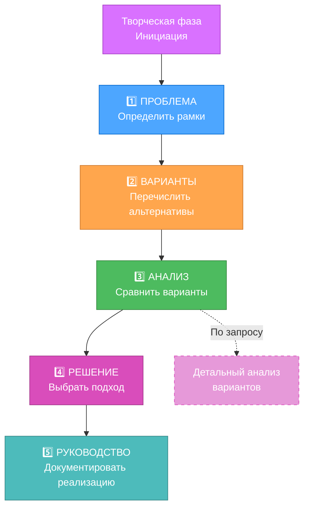
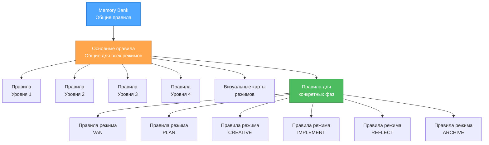

# ТЕКУЩЕЕ СОСТОЯНИЕ СИСТЕМЫ

> **TL;DR:** Система Memory Bank превратилась в оптимизированную по токенам иерархическую структуру с загрузкой правил "по требованию" (just-in-time), прогрессивной документацией и эффективным сохранением контекста при переключении режимов.

## 🎯 КЛЮЧЕВЫЕ ОПТИМИЗАЦИИ СИСТЕМЫ

### 1. Иерархическая загрузка правил
- Загрузка специализированных правил "по требованию" (JIT)
- Кэширование основных правил при переключении режимов
- Выбор правил в зависимости от сложности
- Значительное сокращение использования токенов

### 2. Прогрессивная документация

### 3. Оптимизированные переходы между режимами
- Единый протокол передачи контекста
- Стандартизированные документы для перехода
- Выборочное сохранение контекста
- Улучшенное удержание контекста между режимами

### 4. Улучшенные рабочие процессы по уровням
- Уровень 1: Сверхкомпактные шаблоны для быстрых исправлений
- Уровень 2: Сбалансированный 4-фазный рабочий процесс с упрощенными шаблонами
- Уровень 3: Оптимизированное исследование в творческой фазе
- Уровень 4: Многоуровневые шаблоны документации для корпоративных проектов

### 5. Архитектура, оптимизированная по токенам

## 🔄 ЭФФЕКТИВНОСТЬ ОПТИМИЗАЦИИ

### Оптимизации для конкретных режимов
1.  **Режим VAN**
    -   Эффективное определение сложности с минимальными накладными расходами
    -   Команды, учитывающие платформу, с уменьшенным использованием токенов
    -   Оптимизированные процессы проверки файлов

2.  **Режим PLAN**
    -   Шаблоны планирования, соответствующие сложности
    -   Прогрессивное раскрытие деталей планирования
    -   Табличный формат для организации задач

3.  **Режим CREATIVE**
    -   Прогрессивная документация с табличными сравнениями
    -   Подход "детали по запросу" для творческого исследования
    -   Эффективные шаблоны анализа вариантов

4.  **Режим IMPLEMENT**
    -   Оптимизированное руководство по реализации
    -   Процессы верификации, соответствующие уровню
    -   Консолидированное отслеживание статуса

5.  **Режимы REFLECT/ARCHIVE**
    -   Механизмы обзора, учитывающие контекст
    -   Эффективное сохранение знаний
    -   Оптимизированные форматы документации

### Улучшения управления контекстом
- Единый протокол передачи контекста между режимами
- Выборочное сохранение критически важной информации
- Дифференциальные обновления Memory Bank для минимизации использования токенов
- Техники сжатия контекста для конкретных режимов

## 📊 УЛУЧШЕНИЯ ЭФФЕКТИВНОСТИ ТОКЕНОВ

### Оптимизация загрузки правил
- Иерархическая структура правил для эффективной навигации
- Отслеживание зависимостей правил для предотвращения избыточной загрузки
- Условная загрузка правил в зависимости от уровня сложности
- Кэширование правил при переключении режимов

### Эффективность документации
- Модель прогрессивного раскрытия для сложной документации
- Табличные форматы для эффективного сравнения вариантов
- Масштабирование документации в соответствии с уровнем
- Стандартизированные шаблоны с минимальным количеством шаблонного кода

### Оптимизация Memory Bank
- Дифференциальные обновления для минимизации использования токенов
- Сжатие контекста для часто используемой информации
- Выборочная синхронизация между режимами
- Структурированная организация знаний

## 🎯 ТЕКУЩИЙ ФОКУС

1.  **Усовершенствование архитектуры**
    -   Тонкая настройка иерархической системы загрузки правил
    -   Оптимизация зависимостей и связей между правилами
    -   Улучшение адаптивной модели сложности

2.  **Улучшение документации**
    -   Дальнейшая оптимизация шаблонов для каждого уровня
    -   Улучшение форматов табличного сравнения
    -   Усовершенствование подходов к прогрессивной документации

3.  **Сохранение контекста**
    -   Улучшение единого протокола передачи контекста
    -   Повышение эффективности документов для перехода
    -   Разработка лучших алгоритмов сокращения контекста

4.  **Улучшение интеграции**
    -   Усиление координации между компонентами оптимизации
    -   Улучшение мониторинга и метрик для оптимизации
    -   Разработка более сложных вариантов конфигурации

## 🚀 СЛЕДУЮЩИЕ ШАГИ

1.  **Продвинутая оптимизация токенов**
    -   Динамическая генерация шаблонов на основе характеристик задачи
    -   Автоматическое суммирование контекста для длительных задач
    -   Частичная загрузка правил в специализированных файлах правил

2.  **Обучение между задачами**
    -   Сохранение знаний между похожими задачами
    -   Репозиторий общих паттернов решений
    -   Интеллектуальная система предложений на основе исторических решений

3.  **Автоматизация рабочего процесса**
    -   Автоматизированные переходы между режимами в зависимости от состояния задачи
    -   Интеллектуальный выбор правил на основе паттернов использования
    -   Динамическая настройка сложности в ходе рабочего процесса

4.  **Улучшение интерфейса**
    -   Улучшенные визуальные карты процессов с интерактивными элементами
    -   Лучшее отслеживание и визуализация прогресса
    -   Улучшенное руководство по переходам между режимами

Система была значительно оптимизирована по эффективности использования токенов, сохранив при этом все преимущества структурированной разработки первоначального подхода. Эти оптимизации позволяют эффективно обрабатывать более сложные проекты в рамках ограничений по токенам, обеспечивая при этом улучшенный пользовательский опыт.