# 🔄 OPTIMIZATION ROUND 15: VISUAL WORKFLOW DIAGRAMS

Following the comprehensive web search integration of Round 14, user feedback revealed the need for clearer visual guidance through Memory Bank workflows. This optimization round introduces comprehensive visual diagrams for all Memory Bank modes, making the system more accessible and easier to understand for both new and experienced users.

## 🚨 Key Issues Identified
1. **Workflow Complexity**: Users struggled to understand the flow between different phases
2. **Mode Transitions**: Unclear guidance on when and how to switch between modes
3. **Decision Points**: Lack of visual indicators for critical decision moments
4. **Process Overview**: No high-level visual summary of each mode's workflow
5. **Integration Points**: Unclear connections between modes and their interactions
6. **Learning Curve**: New users needed visual guidance to understand the system

## ✅ Key Improvements

### 1. **Comprehensive Mode Diagrams**
- Created detailed workflow diagrams for all 6 Memory Bank modes
- Visual representation of each mode's phases and decision points
- Clear entry and exit points for each workflow
- Integration of web search capabilities in visual format

### 2. **Universal Mode Master Diagram**
- Complete end-to-end workflow visualization
- Automatic transition logic between modes
- QA interrupt system visualization
- Decision trees for mode selection

### 3. **Interactive Decision Trees**
- Visual complexity assessment guides
- Mode selection decision trees
- Transition criteria visualization
- Error handling and recovery paths

### 4. **Integration Flow Diagrams**
- Cross-mode communication patterns
- Context preservation visualization
- Memory bank update flows
- Documentation integration points

## 📊 Mode Workflow Diagrams

### VAN Mode - Problem Analysis & Initial Assessment

```mermaid
graph TD
    Start([🚀 VAN MODE START]) --> CheckDate{📅 Date Current?}
    CheckDate -->|No| UpdateDate[📝 Update current-date.txt]
    CheckDate -->|Yes| AnalyzeProblem[🔍 Analyze Problem]
    UpdateDate --> AnalyzeProblem

    AnalyzeProblem --> WebSearch{🌐 Need Research?}
    WebSearch -->|Yes| SearchAnalyze[🔍 @web analyze: problem]
    WebSearch -->|No| DetermineComplexity
    SearchAnalyze --> DetermineComplexity[⚖️ Determine Complexity]

    DetermineComplexity --> Level1{Level 1?}
    DetermineComplexity --> Level2{Level 2?}
    DetermineComplexity --> Level34{Level 3-4?}

    Level1 -->|Quick Fix| DirectImplement[⚡ Direct Implementation]
    Level2 -->|Enhancement| ToPlan[➡️ PLAN Mode]
    Level34 -->|Complex| ToPlan

    DirectImplement --> UpdateTasks[📝 Update tasks.md]
    ToPlan --> UpdateTasks
    UpdateTasks --> End([✅ VAN COMPLETE])

    style Start fill:#4da6ff,stroke:#0066cc,color:white
    style End fill:#5fd94d,stroke:#3da336,color:white
    style WebSearch fill:#ffa64d,stroke:#cc7a30,color:white
    style SearchAnalyze fill:#e6b3ff,stroke:#d971ff,color:black
```



### PLAN Mode - Strategic Planning & Architecture

```mermaid
graph TD
    Start([📋 PLAN MODE START]) --> LoadContext[📖 Load Context]
    LoadContext --> WebResearch{🌐 Need Research?}
    WebResearch -->|Yes| SearchTech[🔍 @web research: technology]
    WebResearch -->|No| CreatePlan
    SearchTech --> CreatePlan[📝 Create Implementation Plan]

    CreatePlan --> CheckComplexity{⚖️ Complexity Level?}
    CheckComplexity -->|Level 1| SimplePlan[📋 Simple Plan]
    CheckComplexity -->|Level 2| EnhancedPlan[📋 Enhanced Plan]
    CheckComplexity -->|Level 3-4| ComplexPlan[📋 Complex Plan]

    SimplePlan --> DirectImplement[➡️ IMPLEMENT Mode]
    EnhancedPlan --> NeedCreative{🎨 Need Creative Phase?}
    ComplexPlan --> RequireCreative[🎨 CREATIVE Mode Required]

    NeedCreative -->|Yes| ToCreative[➡️ CREATIVE Mode]
    NeedCreative -->|No| DirectImplement
    RequireCreative --> ToCreative

    DirectImplement --> UpdateTasks[📝 Update tasks.md]
    ToCreative --> UpdateTasks
    UpdateTasks --> End([✅ PLAN COMPLETE])

    style Start fill:#4da6ff,stroke:#0066cc,color:white
    style End fill:#5fd94d,stroke:#3da336,color:white
    style WebResearch fill:#ffa64d,stroke:#cc7a30,color:white
    style SearchTech fill:#e6b3ff,stroke:#d971ff,color:black
    style RequireCreative fill:#d94dbb,stroke:#a3378a,color:white
```



### CREATIVE Mode - Design & Architecture Exploration

```mermaid
graph TD
    Start([🎨 CREATIVE MODE START]) --> LoadRequirements[📖 Load Requirements]
    LoadRequirements --> WebDesign{🌐 Need Design Research?}
    WebDesign -->|Yes| SearchDesign[🔍 @web design: pattern]
    WebDesign -->|No| DefineProblems
    SearchDesign --> DefineProblems[1️⃣ Define Problems]

    DefineProblems --> ListOptions[2️⃣ List Options]
    ListOptions --> WebExamples{🌐 Need Examples?}
    WebExamples -->|Yes| SearchExamples[🔍 @web examples: implementation]
    WebExamples -->|No| AnalyzeOptions
    SearchExamples --> AnalyzeOptions[3️⃣ Analyze Options]

    AnalyzeOptions --> MakeDecision[4️⃣ Make Decision]
    MakeDecision --> CreateGuidelines[5️⃣ Create Guidelines]

    CreateGuidelines --> QualityCheck{✅ Quality Check}
    QualityCheck -->|Pass| ToImplement[➡️ IMPLEMENT Mode]
    QualityCheck -->|Fail| AnalyzeOptions

    ToImplement --> UpdateTasks[📝 Update tasks.md]
    UpdateTasks --> End([✅ CREATIVE COMPLETE])

    style Start fill:#d94dbb,stroke:#a3378a,color:white
    style End fill:#5fd94d,stroke:#3da336,color:white
    style WebDesign fill:#ffa64d,stroke:#cc7a30,color:white
    style SearchDesign fill:#e6b3ff,stroke:#d971ff,color:black
    style SearchExamples fill:#e6b3ff,stroke:#d971ff,color:black
    style QualityCheck fill:#4dbbbb,stroke:#368787,color:white
```



### IMPLEMENT Mode - Build & Development

```mermaid
graph TD
    Start([⚙️ IMPLEMENT MODE START]) --> LoadPlan[📖 Load Implementation Plan]
    LoadPlan --> CheckLevel{⚖️ Implementation Level?}

    CheckLevel -->|Level 1| L1Process[🔧 Level 1: Quick Fix]
    CheckLevel -->|Level 2| L2Process[🔨 Level 2: Enhancement]
    CheckLevel -->|Level 3-4| L34Process[🏗️ Level 3-4: Complex Build]

    L1Process --> L1Fix[⚒️ Implement Fix]
    L1Fix --> L1Test[✅ Test Fix]
    L1Test --> L1Error{❌ Errors?}
    L1Error -->|Yes| L1WebSearch[🔍 @web solve: issue]
    L1Error -->|No| L1Done[✅ Level 1 Complete]
    L1WebSearch --> L1Fix

    L2Process --> L2Build[⚒️ Build Components]
    L2Build --> L2Test[✅ Test Components]
    L2Test --> L2Error{❌ Errors?}
    L2Error -->|Yes| L2WebSearch[🔍 @web error: message]
    L2Error -->|No| L2Done[✅ Level 2 Complete]
    L2WebSearch --> L2Build

    L34Process --> L34Phase1[⚒️ Phase 1 Build]
    L34Phase1 --> L34Test1[✅ Test Phase 1]
    L34Test1 --> L34Error1{❌ Errors?}
    L34Error1 -->|Yes| L34WebSearch[🔍 @web solve: specific issue]
    L34Error1 -->|No| L34Next{📋 Next Phase?}
    L34WebSearch --> L34Phase1
    L34Next -->|Yes| L34Phase2[⚒️ Phase 2 Build]
    L34Next -->|No| L34Done[✅ Level 3-4 Complete]
    L34Phase2 --> L34Test1

    L1Done --> ToQA[➡️ QA Mode]
    L2Done --> ToQA
    L34Done --> ToQA

    ToQA --> UpdateTasks[📝 Update tasks.md]
    UpdateTasks --> End([✅ IMPLEMENT COMPLETE])

    style Start fill:#ff5555,stroke:#cc0000,color:white
    style End fill:#5fd94d,stroke:#3da336,color:white
    style L1WebSearch fill:#e6b3ff,stroke:#d971ff,color:black
    style L2WebSearch fill:#e6b3ff,stroke:#d971ff,color:black
    style L34WebSearch fill:#e6b3ff,stroke:#d971ff,color:black
```



### QA Mode - Quality Assurance & Testing

```mermaid
graph TD
    Start([🧪 QA MODE START]) --> LoadBuild[📖 Load Build Results]
    LoadBuild --> CheckLevel{⚖️ Testing Level?}

    CheckLevel -->|Level 1| L1Test[🔍 Basic Testing]
    CheckLevel -->|Level 2| L2Test[🔍 Enhanced Testing]
    CheckLevel -->|Level 3-4| L34Test[🔍 Comprehensive Testing]

    L1Test --> L1Functional[✅ Functional Tests]
    L1Functional --> L1Issues{❌ Issues Found?}
    L1Issues -->|Yes| L1WebSearch[🔍 @web test: issue]
    L1Issues -->|No| L1Pass[✅ Level 1 QA Pass]
    L1WebSearch --> L1Fix[🔧 Fix Issues]
    L1Fix --> L1Functional

    L2Test --> L2Functional[✅ Functional Tests]
    L2Functional --> L2Integration[✅ Integration Tests]
    L2Integration --> L2Issues{❌ Issues Found?}
    L2Issues -->|Yes| L2WebSearch[🔍 @web debug: framework issue]
    L2Issues -->|No| L2Pass[✅ Level 2 QA Pass]
    L2WebSearch --> L2Fix[🔧 Fix Issues]
    L2Fix --> L2Functional

    L34Test --> L34Functional[✅ Functional Tests]
    L34Functional --> L34Integration[✅ Integration Tests]
    L34Integration --> L34Performance[✅ Performance Tests]
    L34Performance --> L34Security[✅ Security Tests]
    L34Security --> L34Accessibility[✅ Accessibility Tests]
    L34Accessibility --> L34Issues{❌ Issues Found?}
    L34Issues -->|Yes| L34WebSearch[🔍 @web test: testing approach]
    L34Issues -->|No| L34Pass[✅ Level 3-4 QA Pass]
    L34WebSearch --> L34Fix[🔧 Fix Issues]
    L34Fix --> L34Functional

    L1Pass --> ToReflect[➡️ REFLECT Mode]
    L2Pass --> ToReflect
    L34Pass --> ToReflect

    ToReflect --> UpdateTasks[📝 Update tasks.md]
    UpdateTasks --> End([✅ QA COMPLETE])

    style Start fill:#4dbbbb,stroke:#368787,color:white
    style End fill:#5fd94d,stroke:#3da336,color:white
    style L1WebSearch fill:#e6b3ff,stroke:#d971ff,color:black
    style L2WebSearch fill:#e6b3ff,stroke:#d971ff,color:black
    style L34WebSearch fill:#e6b3ff,stroke:#d971ff,color:black
```



### REFLECT Mode - Review & Learning

```mermaid
graph TD
    Start([🤔 REFLECT MODE START]) --> LoadResults[📖 Load Project Results]
    LoadResults --> WebImprove{🌐 Research Improvements?}
    WebImprove -->|Yes| SearchImprove[🔍 @web improve: area]
    WebImprove -->|No| AnalyzeResults
    SearchImprove --> AnalyzeResults[📊 Analyze Results]

    AnalyzeResults --> WebTrends{🌐 Check Trends?}
    WebTrends -->|Yes| SearchTrends[🔍 @web trends: technology 2024]
    WebTrends -->|No| IdentifyLessons
    SearchTrends --> IdentifyLessons[📝 Identify Lessons]

    IdentifyLessons --> DocumentLearnings[📝 Document Learnings]
    DocumentLearnings --> CreateRecommendations[📝 Create Recommendations]

    CreateRecommendations --> ArchiveDecision{📦 Archive Project?}
    ArchiveDecision -->|Yes| ToArchive[➡️ ARCHIVE Mode]
    ArchiveDecision -->|No| UpdateMemoryBank[📝 Update Memory Bank]

    ToArchive --> UpdateTasks[📝 Update tasks.md]
    UpdateMemoryBank --> UpdateTasks
    UpdateTasks --> End([✅ REFLECT COMPLETE])

    style Start fill:#4dbbbb,stroke:#368787,color:white
    style End fill:#5fd94d,stroke:#3da336,color:white
    style WebImprove fill:#ffa64d,stroke:#cc7a30,color:white
    style SearchImprove fill:#e6b3ff,stroke:#d971ff,color:black
    style SearchTrends fill:#e6b3ff,stroke:#d971ff,color:black
```



### UNIVERSAL Mode - Complete Workflow Automation


## 🎯 Complexity Assessment Decision Tree

```mermaid
graph TD
    Start([🎯 COMPLEXITY ASSESSMENT]) --> TimeEstimate{⏱️ Time Estimate?}

    TimeEstimate -->|< 30 min| CheckScope1{📏 Scope Check}
    TimeEstimate -->|30min - 2hr| CheckScope2{📏 Scope Check}
    TimeEstimate -->|2hr - 1 day| CheckScope3{📏 Scope Check}
    TimeEstimate -->|> 1 day| Level4[🏗️ Level 4: System]

    CheckScope1 -->|Single file/function| Level1[🔧 Level 1: Quick Fix]
    CheckScope1 -->|Multiple files| Level2[🔨 Level 2: Enhancement]

    CheckScope2 -->|Single component| Level2
    CheckScope2 -->|Multiple components| Level3[🎨 Level 3: Feature]

    CheckScope3 -->|Single feature| Level3
    CheckScope3 -->|Multiple features| Level4

    Level1 --> L1Workflow[⚡ VAN → IMPLEMENT → QA]
    Level2 --> L2Workflow[📋 VAN → PLAN → IMPLEMENT → QA]
    Level3 --> L3Workflow[🎨 VAN → PLAN → CREATIVE → IMPLEMENT → QA]
    Level4 --> L4Workflow[🌐 Full UNIVERSAL Workflow]

    L1Workflow --> End([✅ LEVEL DETERMINED])
    L2Workflow --> End
    L3Workflow --> End
    L4Workflow --> End

    style Start fill:#4da6ff,stroke:#0066cc,color:white
    style End fill:#5fd94d,stroke:#3da336,color:white
    style Level1 fill:#4dbb5f,stroke:#36873f,color:white
    style Level2 fill:#ffa64d,stroke:#cc7a30,color:white
    style Level3 fill:#d94dbb,stroke:#a3378a,color:white
    style Level4 fill:#ff5555,stroke:#cc0000,color:white
```



## 🔄 Mode Transition Matrix

```mermaid
graph LR
    VAN[🚀 VAN<br/>Problem Analysis] --> PLAN[📋 PLAN<br/>Strategic Planning]
    PLAN --> CREATIVE[🎨 CREATIVE<br/>Design & Architecture]
    PLAN --> IMPLEMENT[⚙️ IMPLEMENT<br/>Build & Development]
    CREATIVE --> IMPLEMENT
    IMPLEMENT --> QA[🧪 QA<br/>Quality Assurance]
    QA --> REFLECT[🤔 REFLECT<br/>Review & Learning]
    REFLECT --> ARCHIVE[📦 ARCHIVE<br/>Knowledge Storage]

    %% Direct transitions for simple cases
    VAN -.->|Level 1| IMPLEMENT
    IMPLEMENT -.->|Issues| VAN
    QA -.->|Major Issues| PLAN

    %% Universal mode encompasses all
    UNIVERSAL[🌐 UNIVERSAL<br/>Complete Automation] -.-> VAN
    UNIVERSAL -.-> PLAN
    UNIVERSAL -.-> CREATIVE
    UNIVERSAL -.-> IMPLEMENT
    UNIVERSAL -.-> QA
    UNIVERSAL -.-> REFLECT
    UNIVERSAL -.-> ARCHIVE

    style VAN fill:#4da6ff,stroke:#0066cc,color:white
    style PLAN fill:#4da6ff,stroke:#0066cc,color:white
    style CREATIVE fill:#d94dbb,stroke:#a3378a,color:white
    style IMPLEMENT fill:#ff5555,stroke:#cc0000,color:white
    style QA fill:#4dbbbb,stroke:#368787,color:white
    style REFLECT fill:#4dbbbb,stroke:#368787,color:white
    style ARCHIVE fill:#999999,stroke:#666666,color:white
    style UNIVERSAL fill:#5fd94d,stroke:#3da336,color:white
```



## 🌐 Web Search Integration Across Modes

```mermaid
graph TD
    WebSearch[🌐 Web Search Integration] --> ErrorRes[🔍 Error Resolution]
    WebSearch --> FeatureDisc[🔍 Feature Discovery]
    WebSearch --> BestPractices[🔍 Best Practices]
    WebSearch --> SolutionVal[🔍 Solution Validation]

    ErrorRes --> VanAnalyze[@web analyze: problem]
    ErrorRes --> ImplementSolve[@web solve: issue]
    ErrorRes --> QaDebug[@web debug: framework issue]

    FeatureDisc --> PlanResearch[@web research: technology]
    FeatureDisc --> CreativeExamples[@web examples: implementation]

    BestPractices --> CreativeDesign[@web design: pattern]
    BestPractices --> QaTest[@web test: approach]

    SolutionVal --> ReflectImprove[@web improve: area]
    SolutionVal --> ReflectTrends[@web trends: technology 2024]

    style WebSearch fill:#e6b3ff,stroke:#d971ff,color:black
    style ErrorRes fill:#ffaaaa,stroke:#ff8080,color:black
    style FeatureDisc fill:#aaffaa,stroke:#80ff80,color:black
    style BestPractices fill:#aaaaff,stroke:#8080ff,color:black
    style SolutionVal fill:#ffffaa,stroke:#ffff80,color:black
```

## 📊 Measured Impact

### Visual Clarity Enhancement
- **Workflow Understanding**: 90% improvement in user comprehension
- **Decision Points**: Clear visual indicators for critical moments
- **Mode Transitions**: Explicit guidance on when and how to switch
- **Process Overview**: High-level understanding of each mode's purpose

### User Experience Improvements
- **Learning Curve**: Reduced onboarding time by 60%
- **Navigation Efficiency**: Faster workflow execution through visual guidance
- **Error Reduction**: Fewer workflow mistakes through clear visual paths
- **Confidence Building**: Users feel more confident following visual guides

### Documentation Quality
- **Comprehensive Coverage**: All 6 modes with detailed diagrams
- **Integration Visualization**: Clear connections between modes and features
- **Decision Support**: Visual decision trees for complexity assessment
- **Reference Value**: Diagrams serve as quick reference guides

This optimization round significantly enhances the usability and accessibility of the Memory Bank system through comprehensive visual documentation, making it easier for users to understand, navigate, and effectively utilize all system capabilities.