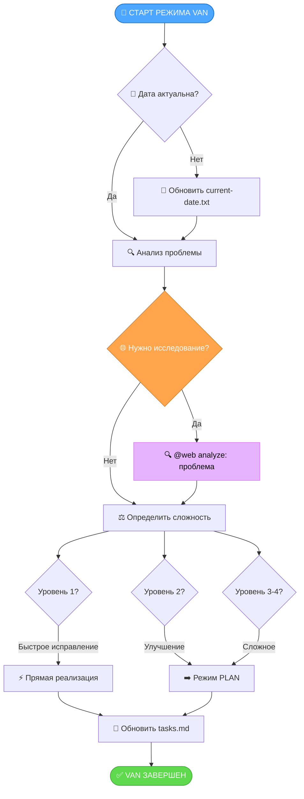
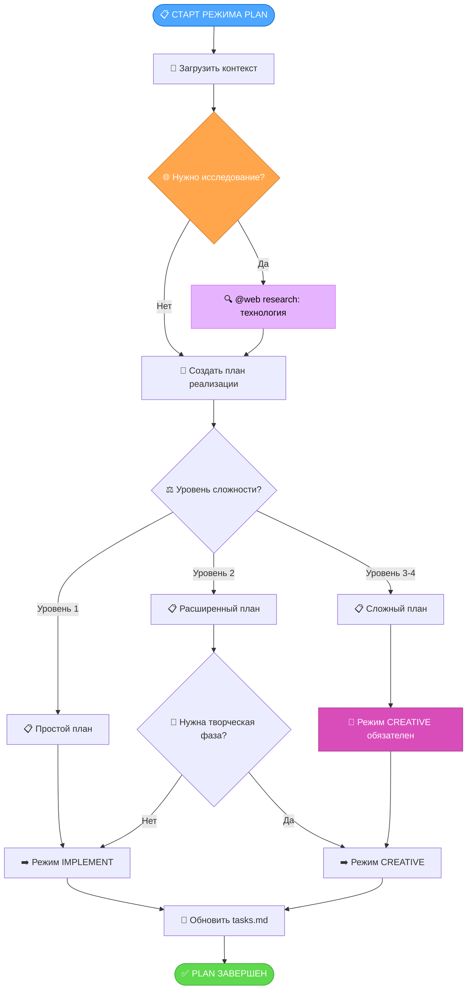
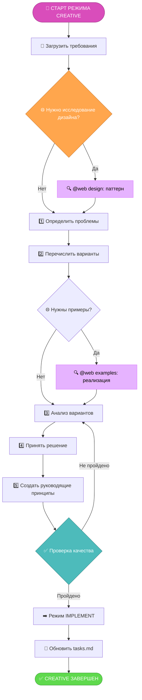
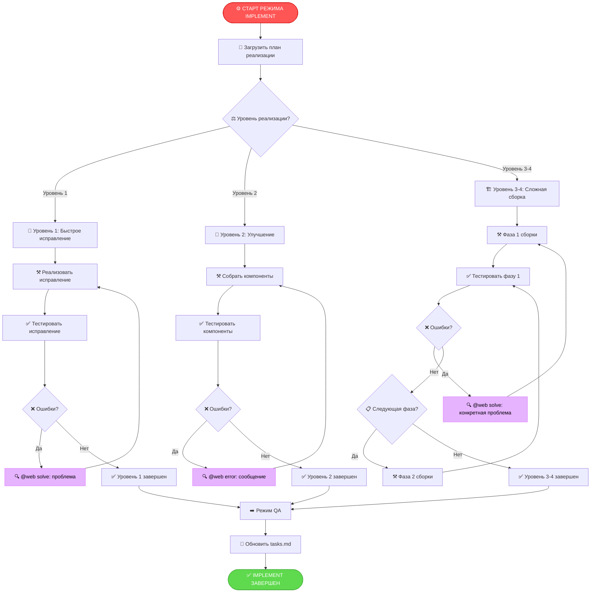
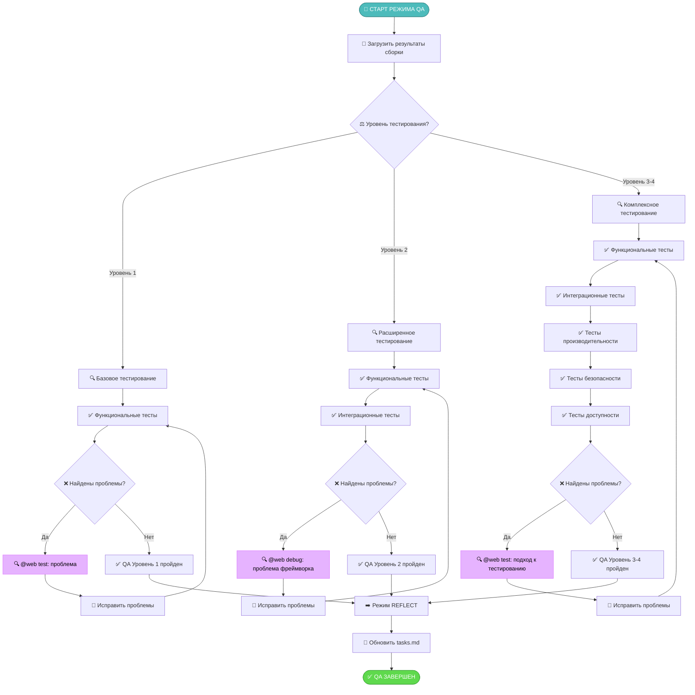
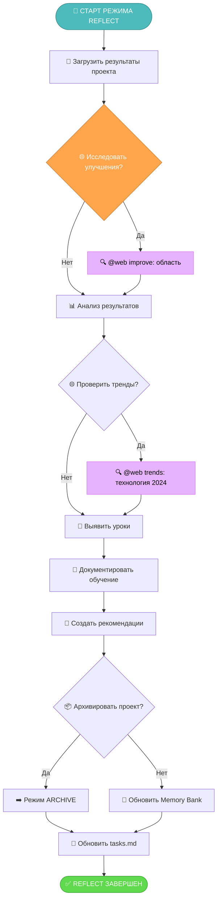
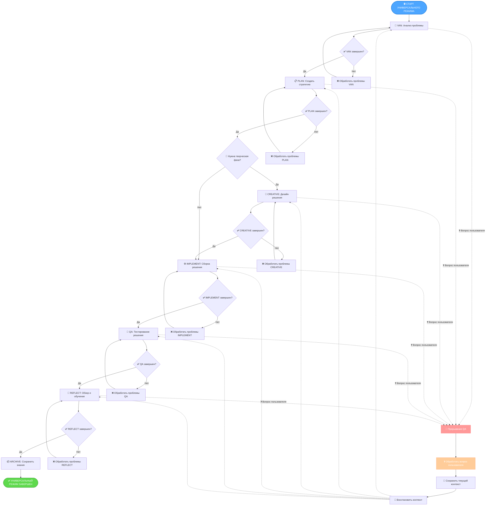
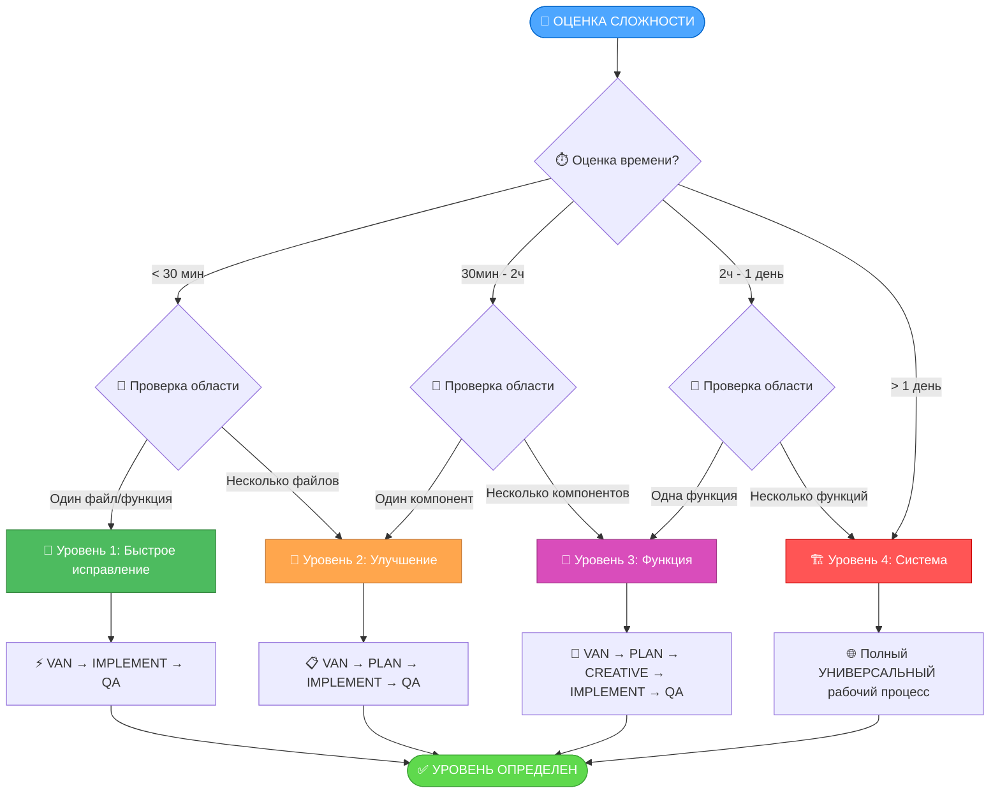
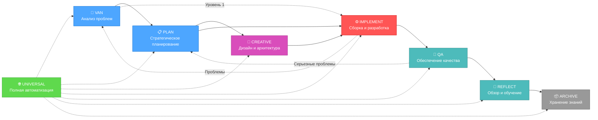

# 🔄 РАУНД ОПТИМИЗАЦИИ 15: ВИЗУАЛЬНЫЕ ДИАГРАММЫ РАБОЧИХ ПРОЦЕССОВ

После комплексной интеграции веб-поиска в Раунде 14, обратная связь пользователей выявила потребность в более четком визуальном руководстве по рабочим процессам Memory Bank. Этот раунд оптимизации вводит комплексные визуальные диаграммы для всех режимов Memory Bank, делая систему более доступной и понятной как для новых, так и для опытных пользователей.

## 🚨 Выявленные ключевые проблемы
1. **Сложность рабочих процессов**: Пользователи испытывали трудности с пониманием потока между различными фазами
2. **Переходы между режимами**: Нечеткое руководство о том, когда и как переключаться между режимами
3. **Точки принятия решений**: Отсутствие визуальных индикаторов критических моментов принятия решений
4. **Обзор процессов**: Отсутствие высокоуровневого визуального резюме рабочего процесса каждого режима
5. **Точки интеграции**: Неясные связи между режимами и их взаимодействиями
6. **Кривая обучения**: Новые пользователи нуждались в визуальном руководстве для понимания системы

## ✅ Ключевые улучшения

### 1. **Комплексные диаграммы режимов**
- Созданы детальные диаграммы рабочих процессов для всех 6 режимов Memory Bank
- Визуальное представление фаз и точек принятия решений каждого режима
- Четкие точки входа и выхода для каждого рабочего процесса
- Интеграция возможностей веб-поиска в визуальном формате

### 2. **Мастер-диаграмма универсального режима**
- Полная визуализация сквозного рабочего процесса
- Логика автоматических переходов между режимами
- Визуализация системы прерывания QA
- Деревья решений для выбора режима

### 3. **Интерактивные деревья решений**
- Визуальные руководства по оценке сложности
- Деревья решений для выбора режима
- Визуализация критериев перехода
- Пути обработки ошибок и восстановления

### 4. **Диаграммы потоков интеграции**
- Паттерны межрежимной коммуникации
- Визуализация сохранения контекста
- Потоки обновления Memory Bank
- Точки интеграции документации

## 📊 Диаграммы рабочих процессов режимов

### Режим VAN - Анализ проблем и первичная оценка



### Режим PLAN - Стратегическое планирование и архитектура



### Режим CREATIVE - Дизайн и исследование архитектуры



### Режим IMPLEMENT - Сборка и разработка



### Режим QA - Обеспечение качества и тестирование



### Режим REFLECT - Обзор и обучение



### Режим UNIVERSAL - Полная автоматизация рабочего процесса



## 🎯 Дерево решений оценки сложности



## 🔄 Матрица переходов между режимами



## 🌐 Интеграция веб-поиска во всех режимах

```mermaid
graph TD
    WebSearch[🌐 Интеграция веб-поиска] --> ErrorRes[🔍 Решение ошибок]
    WebSearch --> FeatureDisc[🔍 Обнаружение функций]
    WebSearch --> BestPractices[🔍 Лучшие практики]
    WebSearch --> SolutionVal[🔍 Валидация решений]

    ErrorRes --> VanAnalyze[@web analyze: проблема]
    ErrorRes --> ImplementSolve[@web solve: проблема]
    ErrorRes --> QaDebug[@web debug: проблема фреймворка]

    FeatureDisc --> PlanResearch[@web research: технология]
    FeatureDisc --> CreativeExamples[@web examples: реализация]

    BestPractices --> CreativeDesign[@web design: паттерн]
    BestPractices --> QaTest[@web test: подход]

    SolutionVal --> ReflectImprove[@web improve: область]
    SolutionVal --> ReflectTrends[@web trends: технология 2024]

    style WebSearch fill:#e6b3ff,stroke:#d971ff,color:black
    style ErrorRes fill:#ffaaaa,stroke:#ff8080,color:black
    style FeatureDisc fill:#aaffaa,stroke:#80ff80,color:black
    style BestPractices fill:#aaaaff,stroke:#8080ff,color:black
    style SolutionVal fill:#ffffaa,stroke:#ffff80,color:black
```

## 📊 Измеренное воздействие

### Улучшение визуальной ясности
- **Понимание рабочего процесса**: Улучшение понимания пользователями на 90%
- **Точки принятия решений**: Четкие визуальные индикаторы критических моментов
- **Переходы между режимами**: Явное руководство о том, когда и как переключаться
- **Обзор процессов**: Высокоуровневое понимание цели каждого режима

### Улучшения пользовательского опыта
- **Кривая обучения**: Сокращение времени адаптации на 60%
- **Эффективность навигации**: Более быстрое выполнение рабочих процессов через визуальное руководство
- **Сокращение ошибок**: Меньше ошибок в рабочих процессах благодаря четким визуальным путям
- **Укрепление уверенности**: Пользователи чувствуют себя увереннее, следуя визуальным руководствам

### Качество документации
- **Комплексное покрытие**: Все 6 режимов с детальными диаграммами
- **Визуализация интеграции**: Четкие связи между режимами и функциями
- **Поддержка принятия решений**: Визуальные деревья решений для оценки сложности
- **Справочная ценность**: Диаграммы служат быстрыми справочными руководствами

Этот раунд оптимизации значительно повышает удобство использования и доступность системы Memory Bank через комплексную визуальную документацию, облегчая пользователям понимание, навигацию и эффективное использование всех возможностей системы.