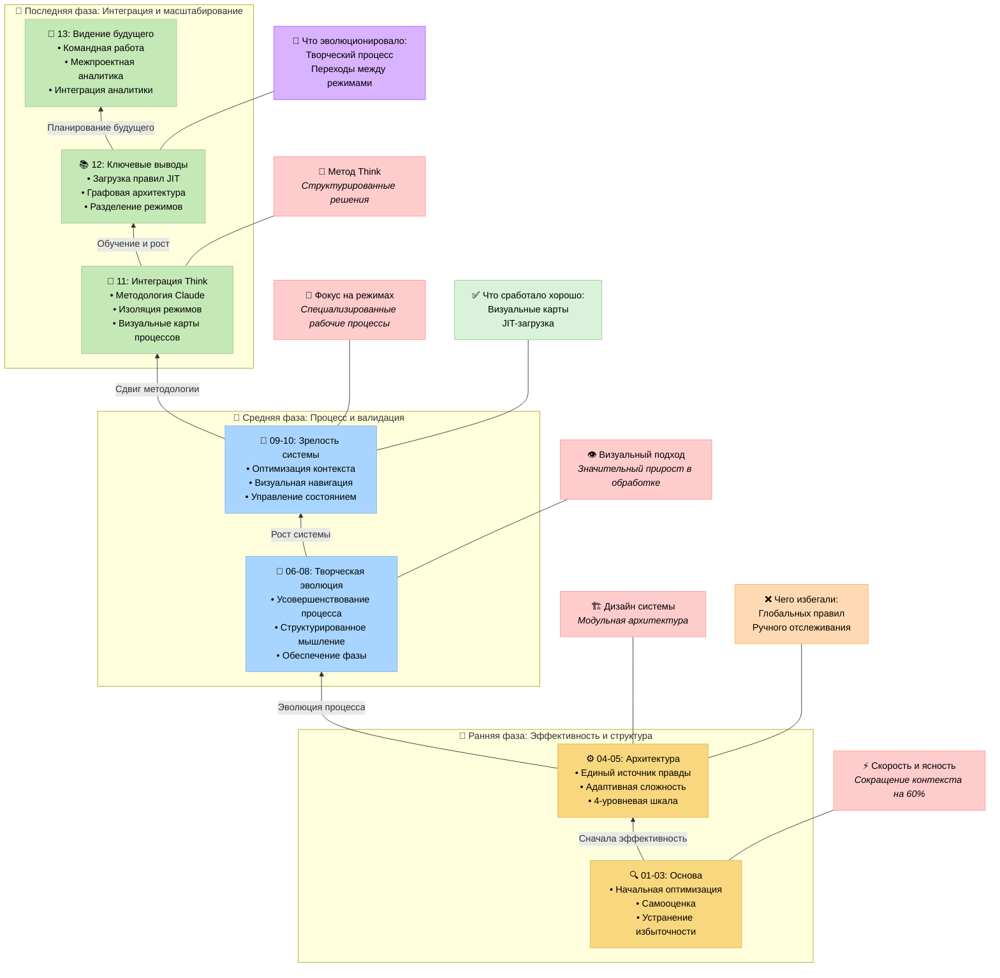

# СИСТЕМА MEMORY BANK: ПУТЬ ОПТИМИЗАЦИИ

> **TL;DR:** Система Memory Bank прошла несколько раундов оптимизации, от начальных улучшений эффективности до методологической интеграции с инструментом "Think" от Claude. Система теперь обладает изоляцией для конкретных режимов, визуальными картами процессов и модульной архитектурой, которая обеспечивает масштабируемую, систематическую разработку при сохранении эффективности контекста.

## 📑 ОГЛАВЛЕНИЕ

| Документ | Описание |
|---|---|
| [00-introduction_ru.md](00-introduction_ru.md) | Введение и цель системы |
| [01-efficiency-and-clarity_ru.md](01-efficiency-and-clarity_ru.md) | Раунд оптимизации 1: Эффективность и ясность |
| [02-system-self-assessment_ru.md](02-system-self-assessment_ru.md) | Раунд оптимизации 2: Самооценка системы |
| [03-redundancy-elimination_ru.md](03-redundancy-elimination_ru.md) | Раунд оптимизации 3: Устранение избыточности |
| [04-single-source-of-truth_ru.md](04-single-source-of-truth_ru.md) | Раунд оптимизации 4: Внедрение единого источника правды |
| [05-adaptive-complexity-model_ru.md](05-adaptive-complexity-model_ru.md) | Раунд оптимизации 5: Адаптивная модель сложности |
| [06-self-assessment-recommendations_ru.md](06-self-assessment-recommendations_ru.md) | Раунд оптимизации 6: Рекомендации по результатам самооценки |
| [07-structured-creative-thinking_ru.md](07-structured-creative-thinking_ru.md) | Раунд оптимизации 7: Структурированное творческое мышление |
| [08-creative-phase-enforcement_ru.md](08-creative-phase-enforcement_ru.md) | Раунд оптимизации 8: Обеспечение творческой фазы и метрики |
| [09-context-optimization_ru.md](09-context-optimization_ru.md) | Раунд оптимизации 9: Оптимизация контекста через визуальную навигацию |
| [10-current-system-state_ru.md](10-current-system-state_ru.md) | Текущее состояние системы |
| [11-methodological-integration_ru.md](11-methodological-integration_ru.md) | Интеграция с методологией Think от Claude |
| [12-key-lessons_ru.md](12-key-lessons_ru.md) | Основные извлеченные уроки |
| [13-future-directions_ru.md](13-future-directions_ru.md) | Будущие направления и видение масштабирования |

## 📋 ОБЗОР ПУТИ ОПТИМИЗАЦИИ

Эта документация подробно описывает эволюцию системы Memory Bank через несколько ключевых фаз:

### Ранняя оптимизация (Раунды 1-5)
1.  **Эффективность и ясность**: Устранение многословности и улучшение визуальной иерархии.
2.  **Самооценка системы**: Добавление механизмов верификации и улучшение отслеживания.
3.  **Устранение избыточности**: Создание централизованного реестра задач и разделения доменов.
4.  **Единый источник правды**: Внедрение истинного единого источника для отслеживания задач.
5.  **Адаптивная модель сложности**: Введение четырех уровней сложности для разных задач.

### Усовершенствование процесса (Раунды 6-9)
6.  **Рекомендации по самооценке**: Улучшение обработки творческой фазы и оптимизация процессов.
7.  **Структурированное творческое мышление**: Введение обязательных творческих фаз для задач Уровня 3-4.
8.  **Обеспечение творческой фазы**: Внедрение жестких шлюзов и метрик качества.
9.  **Оптимизация контекста**: Добавление выборочной загрузки документов и визуальной навигации.

### Последние разработки (Раунды 10-13)
10. **Оценка состояния системы**: Комплексная оценка оптимизаций.
11. **Методологическая интеграция**: Согласование с методологией инструмента Think от Claude.
12. **Консолидация ключевых уроков**: Синтез критически важных идей.
13. **Будущие направления**: Видение масштабирования и сотрудничества.

## 🔍 ПОСЛЕДНИЕ ДОСТИЖЕНИЯ СИСТЕМЫ

Самые последние разработки привели к значительным улучшениям:

-   **Методологическая интеграция**: Согласование с методологией инструмента "Think" от Claude.
-   **Изоляция режимов**: Строгое ограничение правил в рамках конкретных режимов.
-   **Визуальные карты процессов**: Комплексное руководство на всех этапах разработки.
-   **Загрузка "по требованию" (Just-In-Time)**: Оптимизированное использование контекста за счет выборочной загрузки правил.
-   **Архитектура на основе графов**: Эффективная навигация по дереву решений и оптимизация ресурсов.

## 🧠 ОСНОВНЫЕ ПРИНЦИПЫ СИСТЕМЫ MEMORY BANK

Система теперь придерживается этих усовершенствованных основных принципов:

1.  **Методологическая основа**: Структурированный подход, основанный на проверенных методологиях.
2.  **Изоляция для конкретных режимов**: Четкое разделение ответственности через специализированные режимы.
3.  **Визуальная обработка**: Комплексные карты процессов и деревья решений.
4.  **Эффективность "по требованию"**: Загружайте только то, что нужно, и только тогда, когда это нужно.
5.  **Непрерывная эволюция**: Регулярная оценка и улучшение системы.

## ОБЗОР ФАЗ РАЗРАБОТКИ

### Ранний фокус (Главы 1-5)
-   Закладка основополагающих принципов эффективности.
-   Разработка систематического подхода к разработке.
-   Создание основной архитектуры и модели сложности.

### Средняя фаза (Главы 6-10)
-   Усовершенствование творческих процессов и их обеспечение.
-   Внедрение техник визуальной обработки.
-   Достижение значительной оптимизации контекста.

### Последняя фаза (Главы 11-13)
-   Интеграция с методологией "Think" от Claude.
-   Внедрение строгой изоляции для конкретных режимов.
-   Формирование видения для будущего масштабирования.

Система Memory Bank продолжает развиваться как личный хобби-проект, с фокусом на создании мощных инструментов для структурированной разработки, сохраняя при этом основную 4-уровневую шкалу сложности, которая доказала свою эффективность на протяжении всей ее эволюции.