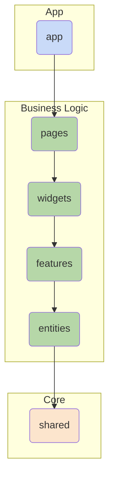
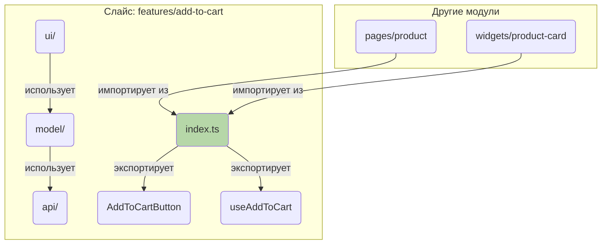
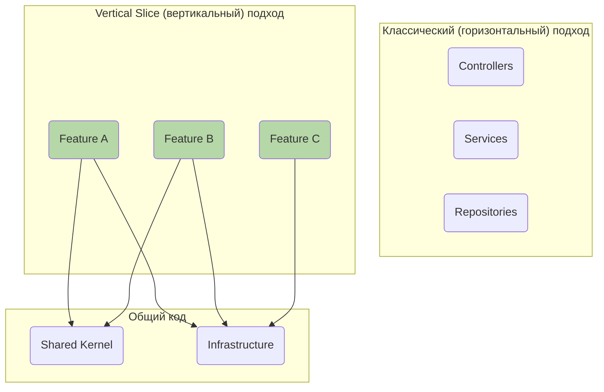
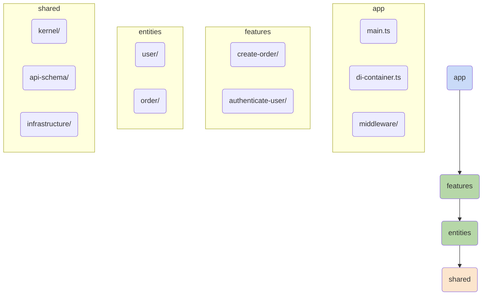
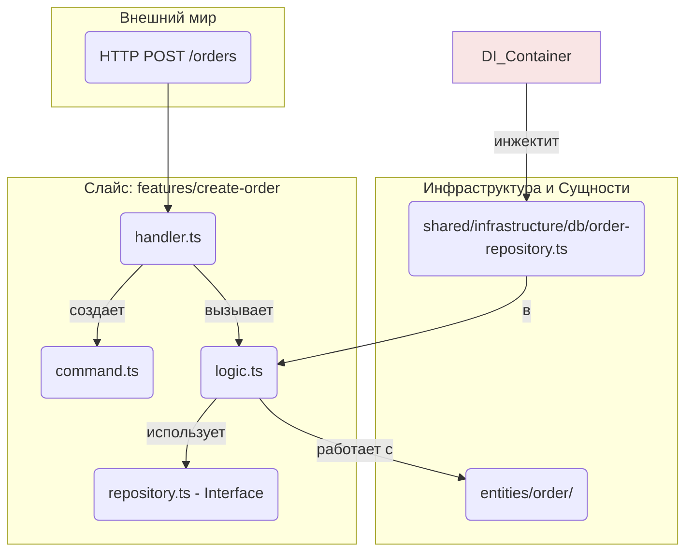
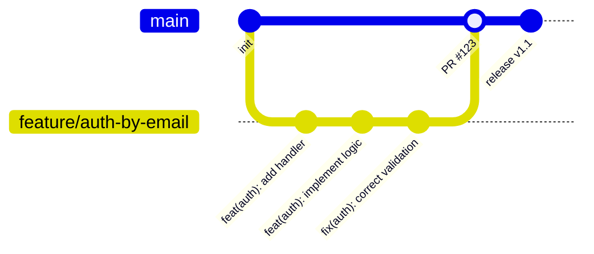
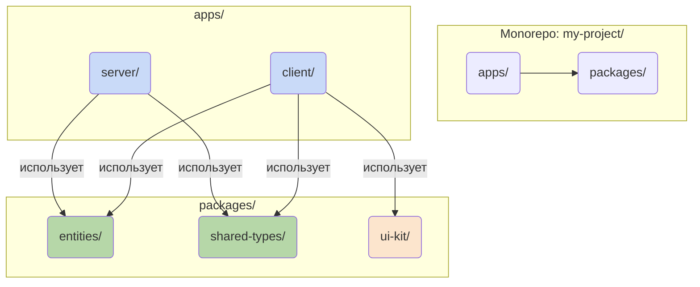

Отлично, давай углубимся в Feature-Sliced Design (FSD) и представим его как полноценное руководство для UI-разработчиков. Мы рассмотрим все аспекты, которые ты затронул, от архитектуры до влияния технологий.

### Руководство по архитектуре Feature-Sliced Design

#### Введение

Это руководство предназначено для команд и разработчиков, стремящихся внедрить методологию Feature-Sliced Design в свои проекты. Цель — создать масштабируемую, поддерживаемую и понятную кодовую базу, которая легко адаптируется к изменениям бизнес-требований. FSD — это не фреймворк, а набор правил и соглашений по организации кода.

---

### 1. Архитектура: Слои, Слайсы, Сегменты

В основе FSD лежит трехуровневая структура: **Слои (Layers)** -> **Слайсы (Slices)** -> **Сегменты (Segments)**.

#### 1.1. Слои (Layers)

Слои — это высокоуровневое разделение приложения по степени ответственности и удаленности от бизнес-логики. **Главное правило: слой может импортировать только из слоев, находящихся строго под ним.** Это обеспечивает однонаправленный поток данных и предотвращает циклические зависимости.



1.  **`app`**: Самый верхний слой. Здесь находится инициализация приложения, корневой роутинг, подключение глобальных стилей и сторов. Он знает обо всех остальных слоях.
2.  **`pages`**: Композиционный слой для страниц приложения. Одна страница — один слайс. Собирает вместе виджеты, фичи и сущности для отображения конкретного URL. Не содержит бизнес-логики.
3.  **`widgets`**: Композиционный слой для самостоятельных блоков интерфейса (например, шапка сайта, сайдбар, форма обратной связи). Собирает фичи и сущности в единый блок.
4.  **`features`**: Функциональность, имеющая ценность для пользователя (User Story). Например: `auth-by-password`, `add-to-cart`, `search-product`. Содержит бизнес-логику и управляет взаимодействием пользователя с сущностями.
5.  **`entities`**: Бизнес-сущности, с которыми работает приложение. Например: `user`, `product`, `order`. Не содержат сложной логики, в основном хранят данные и компоненты для их отображения.
6.  **`shared`**: Самый нижний слой. Переиспользуемый код, не имеющий никакой привязки к бизнес-логике проекта. Например: UI-кит (кнопки, инпуты), утилиты (форматтеры дат), конфигурации API.

#### 1.2. Слайсы (Slices)

Большинство слоев (кроме `app` и `shared`) делятся на **слайсы**. Слайс — это модуль, сгруппированный по предметной области. Это ключевое отличие от классической слоеной архитектуры, где код группируется по техническому типу (`components`, `hooks`, `services`).

*   **Пример:** Вместо папки `services` с файлами `authService.ts` и `cartService.ts`, у нас будут слайсы `features/auth-by-password` и `features/add-to-cart`, каждый со своей логикой.

#### 1.3. Сегменты (Segments)

Каждый слайс делится на стандартные подпапки — **сегменты**. Они группируют код внутри слайса по назначению.

*   `ui`: Компоненты и все, что связано с их отображением (стили, Storybook-истории).
*   `model`: Бизнес-логика (сторы, хуки с логикой, селекторы, экшены).
*   `api`: Логика взаимодействия с внешними API (инстансы, функции запросов).
*   `lib`: Вспомогательные утилиты для данного конкретного слайса.
*   `config`: Конфигурация для конкретного слайса.

**Каждый слайс обязан иметь Public API (`index.ts`)**, который экспортирует только то, что можно использовать извне. Внутренние компоненты и логика должны оставаться инкапсулированными.



---

### 2. Стадии и стили разработки

#### 2.1. Стадии разработки фичи

Разработка новой функциональности обычно идет **снизу вверх**:

1.  **Анализ требования:** Определить, какие **сущности (`entities`)** затрагивает новая фича. Если сущности нет — создать ее (например, `entities/comment`).
2.  **Создание фичи:** В слое `features` создать новый слайс (например, `features/add-comment`). Реализовать в нем всю логику:
    *   **`api`**: Запрос на добавление комментария.
    *   **`model`**: Стор для управления состоянием формы, обработка загрузки/ошибки.
    *   **`ui`**: Компонент формы с кнопкой "Отправить".
3.  **Интеграция в виджеты:** Если фича является частью более крупного блока (например, "Блок комментариев"), она добавляется в соответствующий **виджет (`widgets/comments-block`)**.
4.  **Сборка страницы:** Готовый виджет или фича размещается на нужной **странице (`pages/post`)**.

#### 2.2. Стили разработки

*   **Bottom-Up (Снизу-вверх):** Классический и рекомендуемый подход. Разработка начинается с `shared` и `entities` и движется вверх к `pages`.
    *   **Плюсы:** Надежность, предсказуемость, минимум рефакторинга.
    *   **Минусы:** Может быть медленнее на старте, так как требует проработки основы.
*   **Top-Down (Сверху-вниз):** Разработка начинается с создания заглушек на уровне `pages` и `widgets`, а затем детализация спускается вниз.
    *   **Плюсы:** Быстрое прототипирование, наглядный результат с первых шагов.
    *   **Минусы:** Высока вероятность необходимости рефакторинга нижних слоев, когда станет понятна полная картина.

---

### 3. Особенности и "Почему именно так?"

*   **Почему слои, а не просто папки `features`, `entities`?**
    *   **Контроль зависимостей.** Строгая иерархия слоев — это "железное" правило, которое линтер может проверять автоматически. Это предотвращает превращение проекта в "спагетти", где модуль виджета вдруг начинает зависеть от другой страницы.

*   **Почему группировка по фичам (слайсы), а не по типам (`components`, `hooks`)?**
    *   **Когнитивная легкость.** Когда нужно исправить баг в корзине, вы идете в одно место — `features/cart`. Вся логика, UI и API, связанные с корзиной, находятся там. Это значительно ускоряет поиск и понимание кода.

*   **Зачем нужен Public API (`index.ts`) для каждого слайса?**
    *   **Стабильность и инкапсуляция.** Слайс — это "черный ящик". Он предоставляет наружу только стабильный контракт. Вы можете полностью переписать его внутреннюю реализацию, и если Public API не изменился, остальная часть приложения не сломается.

---

### 4. Связь с другими подходами

*   **Agile/Scrum:** FSD идеально ложится на Agile. Одна **User Story** ("Как пользователь, я хочу иметь возможность добавлять товар в корзину") практически всегда соответствует одному **фича-слайсу** (`features/add-to-cart`). Это делает декомпозицию задач простой и понятной.

*   **Test-Driven Development (TDD):** Изоляция модулей упрощает тестирование.
    *   Юнит-тесты для утилит лежат в `shared/lib/tests`.
    *   Тесты для бизнес-логики фичи (например, Redux-стор) лежат в `features/add-to-cart/model/tests`.
    *   Компонентные тесты (React Testing Library, Vitest) лежат в `features/add-to-cart/ui/tests`.
    *   E2E-тесты (Cypress, Playwright) обычно лежат в корне проекта, но могут быть привязаны к `pages`.

*   **Model-Driven Design / Domain-Driven Design (DDD):** FSD можно считать практической реализацией DDD на фронтенде.
    *   **`entities`** в FSD — это **Entities/Aggregates** из DDD.
    *   **`features`** — это **Application Services / Use Cases**.
    *   **`shared`** — это **Infrastructure / Framework** в DDD.

---

### 5. Влияние технологий на применение FSD

Принципы FSD универсальны, но их реализация зависит от технологического стека.

*   **Vue / React / Svelte:**
    *   Это "родная" среда для FSD.
    *   **`ui`**: Содержит компоненты (`.jsx`, `.tsx`, `.vue`, `.svelte`).
    *   **`model`**: Содержит хуки (`useSomething`), сторы (Redux Toolkit, Zustand, Pinia, Svelte Stores).
    *   **Особенность:** Современные фреймворки поощряют компонентный подход, который идеально сочетается с делением на `features` и `widgets`.

*   **Qwik:**
    *   **Особенность:** Qwik построен на идее "resumability" и ленивой загрузки мельчайших частей кода.
    *   **Влияние:** FSD **помогает** Qwik. Границы слайсов (`features`, `widgets`) являются естественными кандидатами на ленивую загрузку (`$`). Например, можно лениво загрузить весь виджет `widgets/comments-block` по мере его появления на экране, и Qwik подтянет только необходимый JS. Структура FSD делает эти границы очевидными.

*   **Hypermedia (HTMX, data-star):**
    *   **Особенность:** "Тонкий" фронтенд. Основная логика и рендеринг HTML происходят на бэкенде. Фронтенд получает готовые куски HTML.
    *   **Влияние:** FSD применяется, но **на бэкенде**. Код, который генерирует эти HTML-фрагменты, может быть структурирован по FSD.
        *   `features/update-profile` на бэкенде будет обрабатывать POST-запрос и рендерить HTML-шаблон с формой профиля (который, по сути, является `ui`-сегментом).
        *   На фронтенде останется очень простая структура: `app` для инициализации, `pages` для CSS-бандлов на страницу и `shared` для глобальных стилей и крошечных JS-скриптов.

*   **Native Applications (SwiftUI, Jetpack Compose, Flutter):**
    *   **Особенность:** Другая платформа, но те же проблемы с организацией кода.
    *   **Влияние:** Принципы полностью переносимы.
        *   Слои остаются теми же.
        *   **`ui`**: Содержит SwiftUI Views, Jetpack Composables или Flutter Widgets.
        *   **`model`**: Содержит ViewModels, BLoCs, Riverpod Providers.
        *   **`api`**: Содержит сервисы для работы с сетью.
    *   Названия папок могут адаптироваться под конвенции платформы, но суть разделения на фичи, сущности и виджеты остается неизменной и столь же полезной.

---

### 6. Руководящие правила (Правила для линтера и Code Review)

1.  **Соблюдай иерархию слоев:** Модуль может импортировать только из слоев, лежащих строго ниже него. `features` не могут импортировать из `widgets` или `pages`. (Можно настроить через `eslint-plugin-import`).
2.  **Весь код должен находиться в слайсах:** Слои `pages`, `widgets`, `features`, `entities` должны содержать только слайсы. Запрещено создавать файлы напрямую в этих папках.
3.  **Каждый слайс имеет Public API:** Взаимодействие между слайсами происходит только через их `index.ts`. Запрещены глубокие импорты (`import from 'features/add-to-cart/ui/Button.tsx'`).
4.  **Код без бизнес-логики — в `shared`:** Если утилита или UI-компонент не привязаны к предметной области проекта (например, `formatDate` или `Button`), их место в `shared`.
5.  **Бизнес-сущности — в `entities`:** Если код описывает ключевую бизнес-сущность проекта (Пользователь, Продукт), он должен быть в слое `entities`.
6.  **Действия пользователя — в `features`:** Если код реализует сценарий взаимодействия пользователя с приложением (авторизация, отправка формы), он должен быть в слое `features`.
7.  **Комбинация модулей — в `widgets` и `pages`:** Слои `widgets` и `pages` не должны содержать сложной бизнес-логики. Их задача — композиция и компоновка модулей из нижних слоев.

### Руководство по архитектуре Feature-Sliced Design (Часть 2)

Продолжаем наше руководство, фокусируясь на серверной разработке и организации командной работы.

### 7. FSD на Сервере: Прагматичный DDD и Vertical Slice Architecture

На бэкенде принципы FSD находят свое отражение в подходе, известном как **Vertical Slice Architecture (Вертикальная слоеная архитектура)**. Он, как и FSD, является прямым антиподом классического "горизонтального" подхода, где код группируется по техническим типам (`/controllers`, `/services`, `/repositories`).

**Основная сложность классического подхода:** Чтобы изменить одну фичу, разработчику приходится "прыгать" по всему проекту, затрагивая множество папок. Это повышает когнитивную нагрузку и риск внести ошибку.

**Решение Vertical Slice:** Группировать весь код, относящийся к одной фиче (одному бизнес-сценарию), в одном месте — в "вертикальном срезе".



#### 7.1. Аналоги и архитектурные принципы

FSD и Vertical Slices — это практические реализации более фундаментальных архитектурных паттернов:

*   **Clean Architecture:** Идея разделения на слои, где бизнес-логика (Use Cases, Entities) находится в центре и не зависит от внешних деталей (база данных, фреймворк).
*   **Hexagonal Architecture (Ports & Adapters):** Ядро приложения (бизнес-логика) взаимодействует с внешним миром через "порты" (интерфейсы). Конкретные реализации (например, REST-контроллер или SQL-репозиторий) являются "адаптерами", которые подключаются к этим портам.

**Прагматичный подход:** Мы не будем создавать десятки файлов для одной простой операции. Мы возьмем идею изоляции, но реализуем ее с минимальной многословностью.

#### 7.2. Структура серверного приложения

Структура папок на сервере будет очень похожа на фронтенд-версию FSD, что создает единый ментальный каркас для всей команды.



*   **`app`**: Точка входа приложения. Настройка веб-сервера (Express, Fastify), подключение глобальных middleware, запуск DI-контейнера.
*   **`features`**: Каждый слайс — это один Use Case или эндпоинт API. Например, `features/create-order`.
*   **`entities`**: Бизнес-сущности и их основная логика, не зависящая от конкретных фич. Например, `entities/order` может содержать логику расчета общей стоимости.
*   **`shared`**: Общий код.
    *   **`kernel`**: Фундаментальные типы и интерфейсы, не привязанные к инфраструктуре.
    *   **`api-schema`**: Схемы валидации запросов и ответов (Zod, Joi).
    *   **`infrastructure`**: Конкретные реализации для работы с внешним миром: подключение к БД (PostgreSQL, Mongo), клиенты для других сервисов, брокеры сообщений (RabbitMQ).

#### 7.3. Внутренняя структура фича-слайса на сервере

Рассмотрим слайс `features/create-order`:

```
features/create-order/
├── index.ts          # Public API: экспортирует только обработчик (handler)
├── handler.ts        # Обработчик HTTP-запроса (адаптер). Парсит запрос, вызывает command, отдает ответ.
├── command.ts        # Команда или DTO (Data Transfer Object). Описывает намерение.
├── logic.ts          # Основная бизнес-логика фичи. Не знает о HTTP.
└── repository.ts     # Порт (интерфейс) для работы с данными.
```

**Поток управления внутри слайса:**


**Почему это не многословно?** Для простого CRUD-сценария `handler.ts` и `logic.ts` могут быть объединены в один файл. Главное — сохранить разделение между кодом, знающим о фреймворке (`handler`), и чистой логикой (`logic`).

---

### 8. Организация работы с Git в стиле FSD

Структура FSD напрямую влияет на то, как команда работает с системой контроля версий, делая процесс более прозрачным и управляемым.

#### 8.1. Стратегия ветвления: Feature Branches

Это самая естественная стратегия для FSD.

*   **Одно задание (Task) = Одна ветка = Один фича-слайс.**
*   Название ветки напрямую отражает суть работы.

**Пример:** Задача "Реализовать аутентификацию по email" -> Ветка `feature/auth-by-email` -> Основные изменения происходят в слайсе `features/auth-by-email`.



#### 8.2. Pull Requests (PRs) и Code Review

*   **Фокусированные PRs:** Благодаря FSD, PR становится сфокусированным на одной конкретной фиче. Ревьюеру не нужно анализировать изменения, разбросанные по всему проекту.
*   **Понятная структура:** Файловая структура в PR сразу показывает, что было затронуто: "Ага, добавлена новая фича `create-comment`, затронута сущность `user` (добавился счетчик комментариев) и добавлен компонент `Avatar` в `shared/ui`".

#### 8.3. Монорепозиторий: Синергия Фронтенда и Бэкенда

FSD и Vertical Slices раскрывают свой полный потенциал в монорепозитории.


**Преимущества:**

1.  **Общие сущности и типы:** Слайсы из `packages/entities` и типы из `packages/shared-types` могут переиспользоваться и на клиенте, и на сервере. Это **гарантирует консистентность** данных во всей системе.
2.  **Сквозные изменения:** Если в сущности `User` добавляется новое поле, вы меняете его в одном месте (`packages/entities/user`), и TypeScript сразу подсвечивает все места на фронтенде и бэкенде, которые нужно обновить.
3.  **Атомарные PRs:** Один Pull Request может содержать реализацию фичи на всех уровнях: от изменения схемы в БД до кнопки в UI.

#### 8.4. Conventional Commits и CODEOWNERS

*   **Conventional Commits:** Соглашение по именованию коммитов, которое идеально ложится на FSD.
    *   `feat(auth): implement password recovery logic`
    *   `fix(cart): correct total price calculation`
    *   `refactor(shared-ui): move Button to new file`
    *   **Scope (`auth`, `cart`)** часто является названием слайса.

*   **CODEOWNERS:** Файл в Git-репозитории (GitHub, GitLab), который автоматически назначает ревьюеров для PR в зависимости от измененных файлов.
    *   **Пример файла `.github/CODEOWNERS`:**
        ```
        # Все, что связано с платежами, ревьюит финтех-команда
        /apps/server/src/features/payment/ @fintech-team
        /apps/client/src/features/payment/ @fintech-team

        # За общий UI-кит отвечает дизайн-система команда
        /packages/ui-kit/ @design-system-team
        ```    Это формализует зоны ответственности, которые естественным образом вытекают из архитектуры.