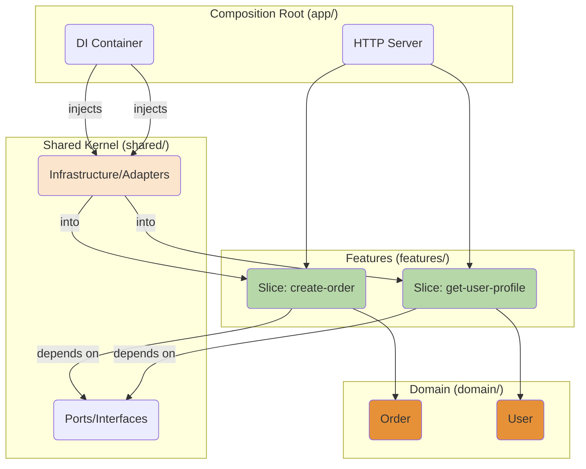
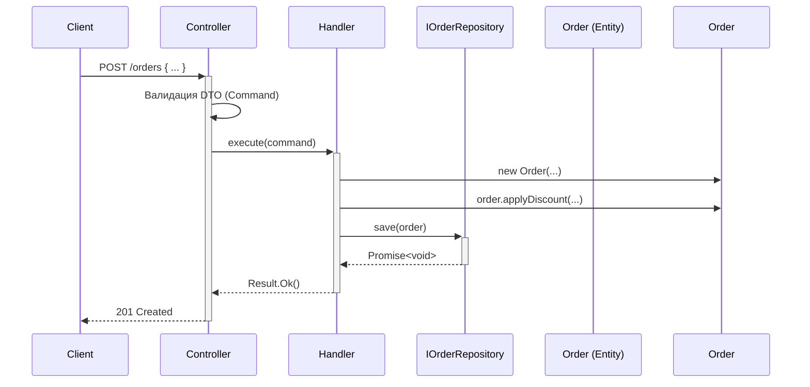

Конечно. Это идеальное продолжение нашего разговора. Перенесем фокус с FSD (который является его фронтенд-родственником) на чистую серверную архитектуру, основанную на тех же принципах.

### Руководство по архитектуре: Прагматичный DDD и Vertical Slice Architecture

#### Введение

Это руководство предназначено для команд серверной разработки, которые ищут золотую середину между хаосом "большого кома грязи" и чрезмерной сложностью "академического" Domain-Driven Design (DDD). Мы сфокусируемся на подходе **Vertical Slice Architecture** как на прагматичной реализации идей DDD и Clean Architecture.

Основная цель — создавать код, который легко понять, поддерживать и расширять, группируя его не по техническим слоям, а по бизнес-возможностям.

---

### 1. Философия: От горизонтальных слоев к вертикальным срезам

#### 1.1. Проблема: Классические "горизонтальные" слои

Традиционная слоеная архитектура на сервере группирует код по его технической роли:

*   `controllers/`: Принимают HTTP-запросы.
*   `services/`: Содержат бизнес-логику.
*   `repositories/` или `dal/`: Работают с базой данных.
*   `models/`: Описывают структуры данных.

**Недостаток:** Для реализации одной фичи (например, "Оформить заказ") разработчику приходится вносить изменения в 3-4 разные папки, разбросанные по всему проекту. Это увеличивает когнитивную нагрузку и затрудняет понимание того, какой код относится к какой фиче.

#### 1.2. Решение: Vertical Slice Architecture

Этот подход предлагает кардинально изменить способ группировки.

**Основной принцип: весь код, необходимый для реализации одного бизнес-сценария (Use Case), должен находиться вместе.**

Такой модуль называется **вертикальным срезом (Vertical Slice)**, потому что он "прорезает" все технические слои (от контроллера до базы данных) для одной конкретной фичи.

```mermaid
graph TD
    subgraph "Горизонтальный подход"
        direction LR
        C(Controllers) --> S(Services) --> R(Repositories)
        subgraph "Фича 'Создать пользователя'"
            C1(UserController)
            S1(UserService)
            R1(UserRepository)
        end
        subgraph "Фича 'Обновить профиль'"
            C2(UserController)
            S2(UserService)
            R2(UserRepository)
        end
        C1 --& S1 --& R1
        C2 --& S2 --& R2
    end

    subgraph "Вертикальный подход (Vertical Slice)"
        direction TB
        F1(Feature 'Создать пользователя')
        F2(Feature 'Обновить профиль')
        Shared(Общее ядро / Инфраструктура)
        F1 --> Shared
        F2 --> Shared
    end

    style F1 fill:#b6d7a8
    style F2 fill:#b6d7a8
    style Shared fill:#fce5cd
```
В результате, чтобы понять, как работает фича "Создать пользователя", вам нужно посмотреть только в одну папку.

---

### 2. Архитектура: Структура приложения

Архитектура строится на принципах **Clean Architecture** и **Hexagonal Architecture (Ports & Adapters)**, где ядро бизнес-логики не зависит от внешних деталей, таких как фреймворки и базы данных.



#### 2.1. Компоненты архитектуры

*   **`features/` (Вертикальные срезы):** Ядро приложения. Каждый подкаталог — это отдельная фича.
*   **`domain/` (Домен):** Бизнес-модель. Здесь живут **Сущности (Entities)** и **Объекты-значения (Value Objects)** из DDD. Этот слой содержит логику, которая является универсальной для сущности, независимо от сценария использования (например, у объекта `Order` может быть метод `calculateTotalPrice()`). Он не знает ни о базах данных, ни о HTTP.
*   **`shared/` (Общее ядро):**
    *   **`ports/` или `abstractions/`**: "Порты" — это интерфейсы (абстракции), которые определяют контракты для взаимодействия с внешним миром (`IOrderRepository`, `IEmailService`). Бизнес-логика зависит только от этих интерфейсов.
    *   **`infrastructure/`**: "Адаптеры" — это конкретные реализации портов (`PostgresOrderRepository`, `SendGridEmailService`). Этот слой знает все о внешних инструментах.
*   **`app/` (Корень композиции):** Точка входа. Здесь происходит "сборка" приложения: настраивается веб-сервер, создается DI-контейнер, который "склеивает" интерфейсы из `ports` с их реализациями из `infrastructure` и внедряет их в фичи.

#### 2.2. Внутренняя структура среза (Slice)

Каждый срез — это мини-приложение со своей четкой задачей. Он реализует паттерн **Command/Query Responsibility Segregation (CQRS)** в его простейшем виде.

```
features/create-order/
├── index.ts          # Public API: экспортирует только контроллер/эндпоинт
├── CreateOrder.Command.ts   # DTO, описывающий входящие данные
├── CreateOrder.Handler.ts   # Основной обработчик, содержащий бизнес-логику use-case
└── CreateOrder.Controller.ts# Адаптер для HTTP, валидирует запрос и вызывает Handler
```

**Поток выполнения внутри среза `create-order`:**


Этот подход **прагматичен**, потому что для очень простых срезов (например, `get-user-by-id`) все эти файлы можно объединить в один, сохранив логическое разделение внутри него.

---

### 3. Руководящие правила (Guidance)

1.  **Группируй по фичам, а не по типам.** Это главный принцип.
2.  **Срезы не должны зависеть друг от друга.** Если фичам нужна общая логика, она выносится либо в `domain` (если это бизнес-логика сущности), либо в `shared` (если это утилитарная логика). Прямой импорт `from '../another-feature'` запрещен.
3.  **Бизнес-логика зависит от абстракций, а не от деталей.** Ваши фичи и домен не должны содержать `import { pg } from 'pg'`. Они должны импортировать `IOrderRepository` из `shared/ports`. Это делает логику независимой от БД и легко тестируемой.
4.  **Корень композиции (`app`) соединяет все вместе.** Это единственное место в приложении, которое знает и о бизнес-логике, и о конкретных реализациях инфраструктуры.
5.  **Начинайте с простого домена.** Не создавайте сложные иерархии сущностей и Value Objects с самого начала. Начните с "анемичной" доменной модели (простые структуры данных) и добавляйте в нее поведение по мере того, как оно становится очевидным и необходимым. Это и есть **прагматичный DDD**.

Этот подход превращает разработку из хаотичного изменения кода по всему проекту в предсказуемый процесс добавления или модификации изолированных, сфокусированных и понятных модулей.