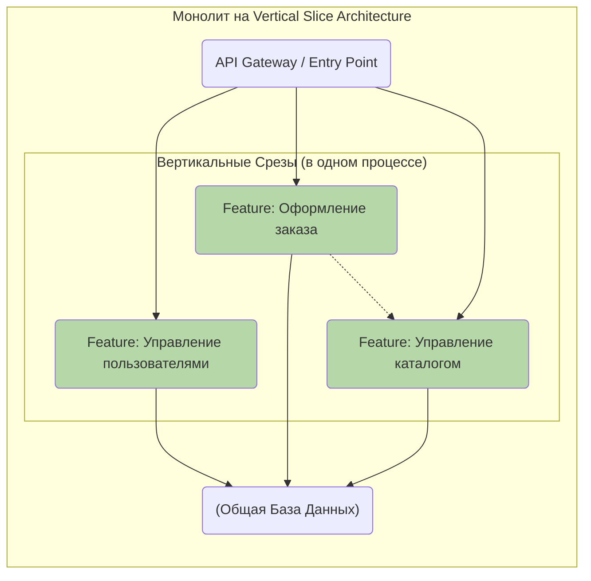
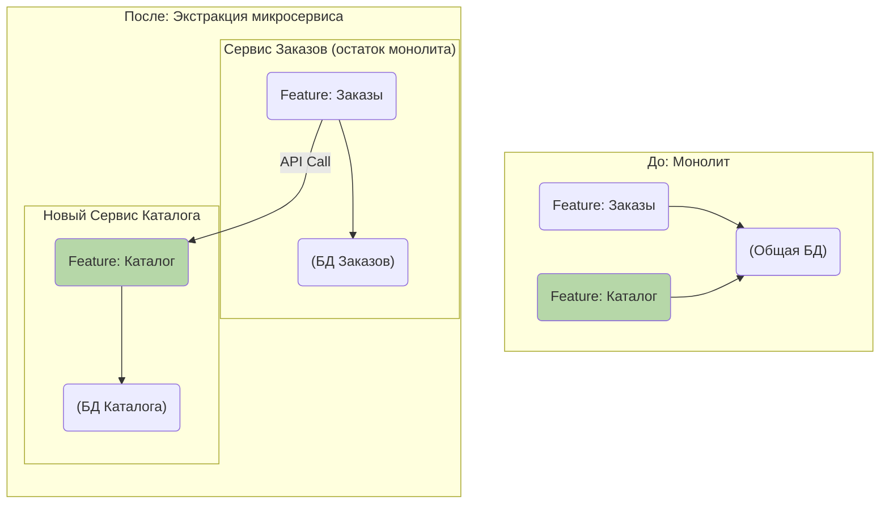

Отличный вопрос, он затрагивает самую суть стратегических преимуществ этого подхода.

Краткий ответ: **эта архитектура идеально подходит для разработки монолитов и, что более важно, она является лучшим способом построить монолит, который при необходимости можно будет легко и безболезненно распилить на микросервисы.**

Давай разберем это подробно.

---

### Vertical Slice Architecture: Для монолитов или микросервисов?

#### 1. Идеальный Монолит: "Монолит, который не болит"

Vertical Slice Architecture (VSA) — это, в первую очередь, стратегия для построения **хорошо структурированного, поддерживаемого монолита**.

Традиционные монолиты часто превращаются в "Большой ком грязи" (Big Ball of Mud), потому что у них отсутствуют внутренние границы. Изменение в одной части системы каскадом вызывает проблемы в других. VSA решает эту проблему, создавая строгие внутренние границы между фичами.

**Как это выглядит в монолите:**

*   **Единая кодовая база и развертывание:** Все фичи находятся в одном репозитории и развертываются как единое приложение.
*   **Внутренние границы:** Несмотря на то что все работает в одном процессе, фичи изолированы друг от друга. Фича `create-order` не может напрямую импортировать и вызывать код из фичи `update-user-profile`.
*   **Коммуникация:** Если фичам нужно взаимодействовать, они делают это опосредованно, через общие абстракции или, в более сложных случаях, через внутреннюю шину событий (in-memory message bus).
*   **Общая база данных:** Как правило, все фичи работают с одной базой данных, но каждая фича может отвечать за "свои" таблицы, минимизируя пересечения.

**Ключевое преимущество для монолита:** Вы получаете простоту развертывания и разработки монолита, избегая при этом его главной проблемы — высокой связанности (coupling) и превращения в хаос. Команды могут работать над разными фичами параллельно с минимальным риском затронуть друг друга.

---

### 2. Идеальный Путь к Микросервисам: "Стратегия выхода"

Самая большая ошибка при переходе к микросервисам — это пытаться распилить на части уже существующий "Большой ком грязи". Это почти всегда приводит к провалу.

Vertical Slice Architecture дает вам **стратегический путь для эволюции**. Ваш монолит уже внутренне разделен на кандидатов в микросервисы.

**Как происходит переход от VSA-монолита к микросервисам:**

1.  **Идентификация кандидата:** Вы замечаете, что фича "Управление каталогом" требует независимого масштабирования или разрабатывается отдельной командой. Поскольку весь ее код уже изолирован в срезе `features/catalog`, она — идеальный кандидат на выделение.
2.  **Экстракция среза:** Вы буквально копируете папку `features/catalog` в новый, отдельный репозиторий. Она становится основой для нового микросервиса `catalog-service`.
3.  **Замена коммуникации:**
    *   **База данных:** Самая сложная часть. Вы должны выделить таблицы, принадлежащие каталогу, в отдельную базу данных для нового сервиса.
    *   **Взаимодействие:** Если раньше фича "Оформление заказа" получала информацию о товаре прямым запросом к общей БД, то теперь она будет делать это через сетевой вызов (REST API или gRPC) к новому `catalog-service`. Поскольку исходная фича зависела от интерфейса (`IProductRepository`), вам нужно просто подменить реализацию: `PostgresProductRepository` заменяется на `ApiProductRepository`.
4.  **Развертывание:** Вы развертываете `catalog-service` как независимое приложение.

**Ключевое преимущество для микросервисной стратегии:** Вы не обязаны переходить на микросервисы с первого дня, принимая на себя всю их сложность (оркестрация, мониторинг, распределенные транзакции). Вы начинаете с монолита, но строите его таким образом, что **сохраняете за собой право выбора**. Переход становится не революцией, а плановой эволюцией.

---

### Сводная таблица

| Аспект | Применение в Монолите | Применение для Микросервисов |
| :--- | :--- | :--- |
| **Основная цель** | Избежать "Большого кома грязи", организовать код. | Служить стратегией миграции, определять границы сервисов. |
| **Границы** | Логические, внутри одного процесса. Контролируются линтером и соглашениями. | Физические, между разными процессами/сервисами. Контролируются сетью. |
| **Коммуникация** | Прямые вызовы методов (через интерфейсы), in-memory шина событий. | Сетевые вызовы (REST, gRPC), брокеры сообщений (RabbitMQ, Kafka). |
| **Данные** | Обычно общая база данных, возможно разделение на уровне схем. | Отдельная база данных для каждого сервиса (Database per Service). |
| **Преимущество** | Высокая скорость разработки, простота развертывания, низкая связанность кода. | Позволяет извлекать сервисы постепенно, снижая риски и затраты на рефакторинг. |

### Вердикт

**Vertical Slice Architecture — это не выбор "или/или". Это архитектурный подход, который отлично работает для монолитов и одновременно является лучшей подготовкой к будущему переходу на микросервисы.**

Начинать проект с VSA-монолита — это прагматичное и стратегически верное решение для большинства систем. Вы получаете хорошо организованное приложение сегодня и сохраняете гибкость для завтрашних вызовов.